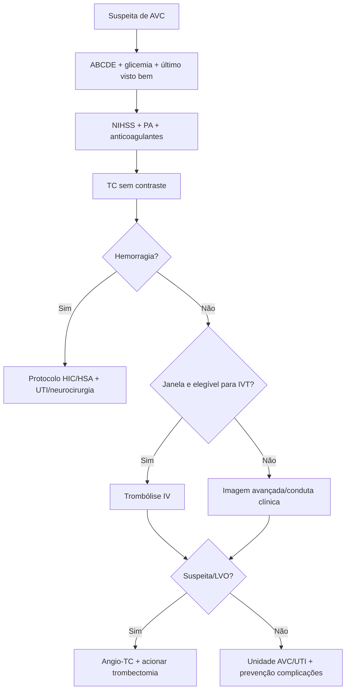
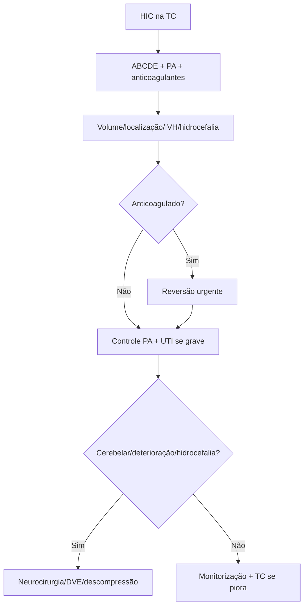

# 📊 Escalas e Algoritmos — AVC Agudo

## 1. NIHSS

Avalia gravidade neurológica: consciência, perguntas, comandos, olhar, campo visual, face, força, ataxia, sensibilidade, linguagem, disartria e negligência.

**Uso prático:** comunicação, decisão, evolução e prognóstico.  
**Pegadinha:** NIHSS baixo não exclui déficit incapacitante, especialmente afasia, hemianopsia, circulação posterior.

## 2. ASPECTS

Escala tomográfica para sinais precoces de isquemia no território da artéria cerebral média.

- Começa em 10.
- Perde pontos conforme áreas acometidas.
- Ajuda a estimar core isquêmico em TC inicial.

## 3. mRS — Modified Rankin Scale

Mede incapacidade funcional. Importante para:

- estado prévio;
- prognóstico;
- definição de metas;
- desfechos de estudos.

## 4. ICH Score

Componentes clássicos:

- Glasgow.
- Volume do hematoma.
- Hemorragia intraventricular.
- Localização infratentorial.
- Idade.

**Uso:** estimar gravidade; nunca usar isoladamente para negar cuidado.

## 5. ABCD2

Risco após AIT:

- Age.
- Blood pressure.
- Clinical features.
- Duration.
- Diabetes.

**Limitação:** não substitui investigação etiológica e imagem vascular.

---

# Algoritmo rápido — AVC isquêmico

# Algoritmo rápido — HIC

