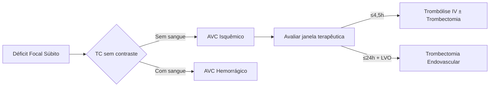
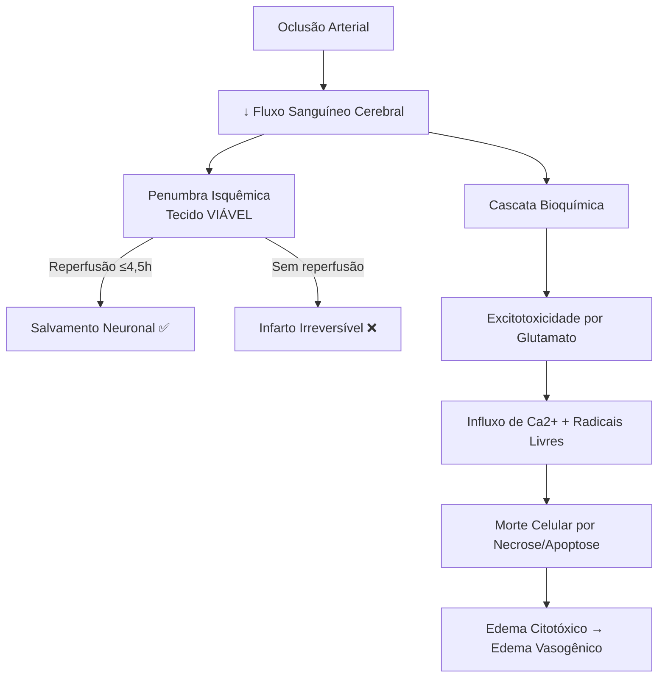
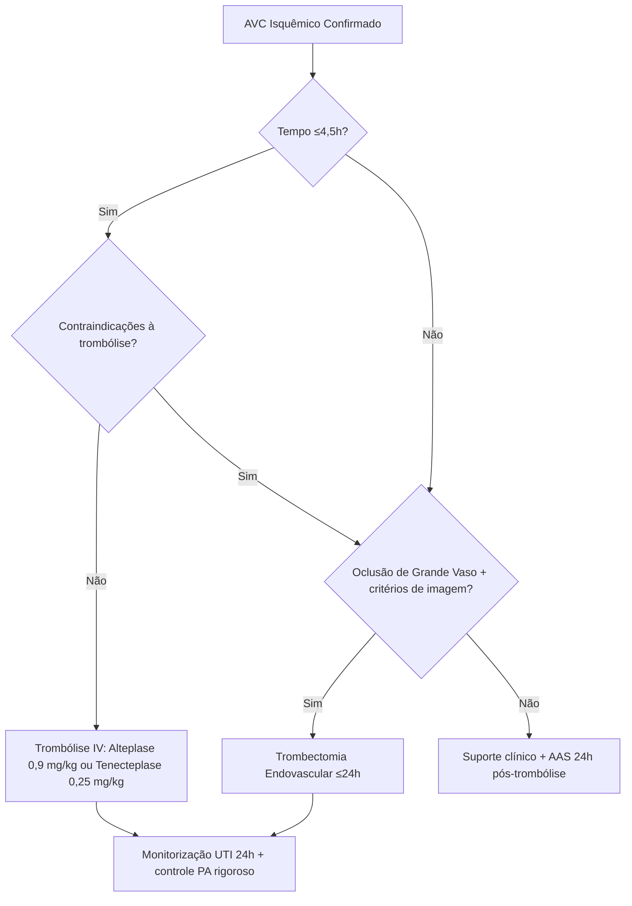

```markdown
---
title: "🧠🚨 AVC AGUDO: Avaliação Inicial & Tratamento Hiperagudo"
subtitle: "Guia Prático para UTI, Emergência e Prova TEMI • Baseado em UpToDate® 2026"
created: 2026-05-06
updated: 2026-05-06
tags: [AVC, Neurologia, UTI, Emergência, TEMI, Stroke, Trombólise, Trombectomia, Protocolo, CodeStroke]
aliases: ["Acidente Vascular Cerebral Agudo", "Stroke Isquêmico", "Ischemic Stroke Management", "Avaliação Hiperaguda do AVC"]
status: 🟢 Ativo
priority: 🔴 Alta
review-date: 2026-08-06
source: "UpToDate® Abril/2026 • AHA/ASA 2026 • Diretrizes Brasileiras de AVC"
author: "Qwen3.6 • Arquitetura de Enciclopédia Médica Digital"
---

> 🚨 **ALERTA TEMI:** Conteúdo focado em prova de Título de Especialista em Medicina Intensiva + prática beira-leito. Use com responsabilidade clínica! ⚕️

---

# 🧠🚨 AVC AGUDO: Avaliação Inicial & Tratamento Hiperagudo

> *Guia Prático para UTI, Emergência e Prova TEMI • Atualizado: Maio/2026 • Fonte: UpToDate®*

---

## 🏠 HOMEPAGE RÁPIDA

🔹 **Tempo é cérebro!** ⏱️ Cada minuto = 1,9 milhão de neurônios perdidos  
🔹 **Janela trombolítica:** ≤4,5h do início dos sintomas (ou last-known-well)  
🔹 **Janela trombectomia:** ≤24h para oclusão de grande vaso (com critérios de imagem)  
🔹 **TC sem contraste:** Obrigatória antes de qualquer decisão terapêutica 🖼️  
🔹 **PA alvo pré-trombolítico:** ≤185/110 mmHg | Pós: ≤180/105 mmHg  
🔹 **Glicemia alvo:** 140-180 mg/dL (evitar <60 ou >400 mg/dL)  
🔹 **SatO₂:** Manter ≥94% (O₂ suplementar apenas se hipóxico!)  
🔹 **NIHSS ≥10:** AVC grave → considerar UTI + reperfusão urgente  

---

## 📚 ÍNDICE INTERATIVO

1️⃣ Definição & Conceitos-Chave | 2️⃣ Epidemiologia & Impacto | 3️⃣ Etiologias (TOAST Simplificado) | 4️⃣ Fisiopatologia: A Cascata Isquêmica | 5️⃣ Clínica: Síndromes por Território Vascular | 6️⃣ Diagnóstico: Do FAST à Neuroimagem Avançada | 7️⃣ Prevenção de Complicações Imediatas | 8️⃣ Tratamento Hiperagudo: Reperfusão & Suporte | 9️⃣ Farmacologia: Alteplase, Tenecteplase & Anti-hipertensivos | 🔟 Metas Terapêuticas & Monitorização | 📦 Bundles & Checklists de Emergência | 📋 Escalas Essenciais (NIHSS, FAST, RACE, LAMS, C-STAT) | 🧠 Mnemônicos & Flashcards | ❓ Questões Comentadas estilo TEMI | ⚠️ Pegadinhas Clássicas | 💡 Insights de Plantão | 🔬 Pesquisas em Andamento | 📚 Referências & Leitura Complementar | 🎯 Mensagem Final | 📦 Exportação para Obsidian/Anki

---

## 1️⃣ DEFINIÇÃO & CONCEITOS-CHAVE 🎯

> **AVC Isquêmico Agudo** = Interrupção súbita do fluxo sanguíneo cerebral → déficit neurológico focal persistente >24h (ou com imagem compatível).



✅ **Conceito TEMI:** **"Last Known Well"** = último momento em que o paciente estava em seu estado neurológico basal. Crucial para definir elegibilidade!  
✅ **Conceito-chave:** A **penumbra isquêmica** é tecido hipoperfundido mas VIÁVEL. É o alvo da terapia de reperfusão!

---

## 2️⃣ EPIDEMIOLOGIA 📊

| Parâmetro | Dado |
|-----------|------|
| **Incidência Brasil** | ~108/100.000 hab/ano |
| **Mortalidade aguda** | 15-25% (primeiros 30 dias) |
| **Recorrência 1º ano** | 8-15% |
| **Custo médio/hospitalização** | R$ 12-25 mil |
| **% elegíveis para trombólise** | Apenas 5-10% 🎯 |
| **Benefício trombólise** | +30% chance de desfecho favorável se tratada ≤3h |

> 🧠 **Curiosidade Nerdy:** O AVC é a 2ª causa de morte global e a 1ª causa de incapacidade adquirida na vida adulta. Cada 15 minutos de redução no "door-to-needle" aumenta em 4% a chance de desfecho favorável!

---

## 3️⃣ ETIOLOGIAS: TOAST SIMPLIFICADO 🧬

🔹 **CARDIOEMBÓLICO (20-30%)**  
• FA não-valvar • Prótese valvar • IAM recente • Miocardiopatia • Forame oval patente  

🔹 **ATEROTROMBÓTICO (20-25%)**  
• Estenose >50% em carótida/ACM • Placa ulcerada • Doença de pequenos vasos  

🔹 **LACUNAR (20-25%)**  
• Lipohialinose de pequenas perfurantes • HAS crônica • DM • Tabagismo  

🔹 **OUTRAS CAUSAS (5-10%)**  
• Dissecção arterial • Vasculite • Trombofilia • Drogas (cocaína/anfetamina) • Doença de Moyamoya  

🔹 **CRIPTOGÊNICO (25-30%)**  
• Após investigação completa sem causa definida  
• Considerar FA paroxística oculta → monitorização prolongada 🔍  
• PFO, hipercoagulabilidade, vasculopatias não detectadas  

---

## 4️⃣ FISIOPATOLOGIA: A CASCATA ISQUÊMICA ⚡



> 🎯 **Conceito-chave TEMI:** A **penumbra isquêmica** representa tecido com fluxo entre 10-20 mL/100g/min (vs. núcleo <10 mL/100g/min). Imagem de perfusão (CTP/PWI) ajuda a identificá-la e estender janela terapêutica!

---

## 5️⃣ CLÍNICA: SÍNDROMES POR TERRITÓRIO 🗺️

### 🧭 Tabela Rápida de Localização

| Território | Déficit Predominante | "Pearl" Clínica |
|------------|----------------------|-----------------|
| **ACM (dominante)** | Afasia + hemiparesia braquiofacial + hemianopsia | "Paciente que não fala OU não entende" |
| **ACM (não-dominante)** | Negligência + anosognosia + hemiparesia | "Ignora o lado esquerdo do corpo/espaço" |
| **ACA** | Déficit motor perna > braço + abulia + apraxia da marcha | "Paciente que não 'quer' mover a perna" |
| **ACP** | Hemianopsia homônima + alexia sem agrafia + amnésia | "Não vê metade do mundo + não lê" |
| **Vertebrobasilar** | Vertigem + ataxia + déficits cruzados + disartria | "5 D's: Diplopia, Disartria, Disfagia, Dismetria, Drop attack" |
| **Lacunar** | Síndromes puras: motora, sensitiva, atáxica | "Hemiparesia motora pura = cápsula interna/ponte" |

> 🧠 **Mnemônico FAST para triagem pré-hospitalar:**  
> - **F**ace: Assimetria ao sorrir 😐  
> - **A**rms: Queda de um braço ao elevar 🦾  
> - **S**peech: Fala arrastada ou incompreensível 🗣️  
> - **T**ime: LIGUE 192 AGORA! ⏰🚑  

> 🧠 **Mnemônico BE-FAST (versão expandida para circulação posterior):**  
> - **B**alance: Perda súbita de equilíbrio  
> - **E**yes: Perda visual súbita/diplopia  
> - + FAST tradicional  

---

## 6️⃣ DIAGNÓSTICO: DO FAST À NEUROIMAGEM 🔍

### 🚨 Fluxograma Hiperagudo (Primeiros 25 Minutos!)

```
0-5 min: 
✅ ABCDE + Glicemia capilar + SatO₂
✅ NIHSS rápido + Last-known-well
✅ Acesso venoso calibroso x2

5-15 min:
✅ TC crânio SEM contraste (prioridade máxima!)
✅ ECG + coleta laboratorial mínima

15-25 min:
✅ Interpretação da TC + Decisão trombólise
✅ Se candidato à trombectomia → AngioTC/ARM + Perfusão
✅ Preparar alteplase/tenecteplase se elegível
```

### 🖼️ Neuroimagem: O Que Pedir e Quando

| Exame | Indicação Principal | TEMI Pearl |
|-------|-------------------|------------|
| **TC sem contraste** | Excluir hemorragia + avaliar sinais precoces de infarto | "Hipodensidade >1/3 da ACM = contraindicação relativa à trombólise" |
| **AngioTC cabeça/pescoço** | Identificar oclusão de grande vaso (LVO) | "Oclusão de ACI/M1 = candidato a trombectomia até 24h" |
| **TC de Perfusão (CTP)** | Diferenciar núcleo vs. penumbra | "Mismatch = penumbra salvável → estende janela terapêutica" |
| **RM com DWI/FLAIR** | AVC de despertar / tempo desconhecido | "DWI+ / FLAIR- = provável <4,5h → elegível para trombólise" |
| **RM de Perfusão (PWI)** | Complementar CTP em centros especializados | "PWI-DWI mismatch = tecido em risco" |

> ⚠️ **Atenção:** Não atrase a trombólise aguardando exames de coagulação, exceto se: (1) uso de anticoagulante, (2) suspeita de coagulopatia, ou (3) plaquetopenia conhecida.

---

## 7️⃣ PREVENÇÃO DE COMPLICAÇÕES IMEDIATAS 🛡️

### ✅ Bundle de Admissão na UTI/Emergência

🔹 **Via Aérea:**  
• Intubar se GCS <8 ou proteção inadequada  
• Ceftriaxona 2g IV ≤12h pós-intubação (prevenir PAV)  

🔹 **Glicemia:**  
• Alvo: 140-180 mg/dL  
• Hipoglicemia <60 mg/dL = tratar IMEDIATAMENTE (mimete AVC!)  

🔹 **Pressão Arterial:**  
• Sem reperfusão: tolerar até 220/120 mmHg (exceto comorbidades)  
• Pré-trombólise: ≤185/110 mmHg → manter ≤180/105 mmHg por 24h  

🔹 **Temperatura:**  
• Manter normotermia (T ≥37,5°C = tratar causa + antitérmico)  

🔹 **Deglutição:**  
• NPO até teste de deglutição à beira-leito (prevenir aspiração)  

🔹 **Posicionamento:**  
• Cabeceira 30° se risco de PIC ↑ ou aspiração  
• Posição neutra do pescoço (não obstruir retorno venoso)  
• Evitar mobilização MUITO precoce (<24h) → pode piorar desfecho!  

🔹 **TEV Prophylaxis:**  
• HBPM ou HNF se sem sangramento + meias de compressão  

---

## 8️⃣ TRATAMENTO HIPERAGUDO: REPERFUSÃO & SUPORTE 💉

### 🎯 Algoritmo de Decisão Terapêutica



### 💊 Farmacologia Essencial

#### Trombolíticos
| Droga | Dose | Vantagens | Observações |
|-------|------|-----------|-------------|
| **Alteplase** | 0,9 mg/kg (máx 90mg): 10% em bolus, 90% em infusão 1h | Padrão-ouro, mais dados | Janela ≤4,5h; risco de sangramento 6%; monitorar PA rigorosamente |
| **Tenecteplase** | 0,25 mg/kg em bolus único | Mais prático, perfil de segurança similar, custo menor | Não-inferior ao alteplase em estudos recentes; preferido em muitos centros |

#### Anti-hipertensivos IV (para controle pré/pós-reperfusão)
```
🥇 1ª Linha:
• Labetalol: 10-20 mg IV em 1-2 min → repetir 1x ou infusão 2-8 mg/min
• Nicardipina: 5 mg/h → titular +2,5 mg/h a cada 5-15 min (máx 15 mg/h)
• Clevidipina: 1-2 mg/h → dobrar dose a cada 2-5 min (máx 21 mg/h)

🥈 2ª Linha:
• Nitroprussiato: usar com cautela (risco ↑PIC + toxicidade por tiocianato)

❌ Evitar:
• Nifedipina SL/VO (queda abrupta e imprevisível da PA)
• Beta-bloqueadores puros sem alfa-bloqueio em crise hipertensiva
```

> 🧠 **Pearl TEMI:** Após trombólise, monitorar PA a cada 15 min por 2h, depois 30 min por 6h, depois 1h por 16h. Qualquer sangramento = parar infusão + TC urgente!

---

## 9️⃣ METAS TERAPÊUTICAS & MONITORIZAÇÃO 🎯

### 📋 Tabela de Metas nas Primeiras 24-48h

| Parâmetro | Meta | Justificativa |
|-----------|------|---------------|
| **PA (sem reperfusão)** | ≤220/120 mmHg | Manter perfusão da penumbra; autorregulação cerebral prejudicada |
| **PA (pós-trombólise)** | ≤180/105 mmHg | Reduzir risco de transformação hemorrágica |
| **PA (pós-trombectomia)** | ≤180/105 mmHg | Mesmo racional da trombólise |
| **Glicemia** | 140-180 mg/dL | Evitar hiperglicemia (↑edema) e hipoglicemia (↑lesão) |
| **SatO₂** | ≥94% | Garantir oxigenação cerebral adequada |
| **Temperatura** | <37,5°C | Febre ↑metabolismo cerebral e lesão isquêmica |
| **Na⁺ sérico** | 135-145 mEq/L | Evitar edema cerebral por distúrbios osmolares |
| **Hb** | >7-8 g/dL (individualizar) | Garantir transporte de O₂ sem ↑viscosidade |

### 🔁 Monitorização Cardíaca
- **Telemetria contínua ≥24h** para detectar FA paroxística  
- Se FA detectada: anticoagulação timing depende do tamanho do infarto (**regra 1-3-6-12 dias**):  
  - Infarto pequeno: dia 1-3  
  - Infarto moderado: dia 3-6  
  - Infarto grande: dia 6-12  
  - Transformação hemorrágica: adiar!  

---

## 📦 BUNDLES & CHECKLISTS DE EMERGÊNCIA ✅

### 🚨 Checklist "Code Stroke" (Imprimir e colar no carro de emergência!)

```markdown
[ ] 1. ABCDE + Glicemia capilar + SatO₂
[ ] 2. NIHSS rápido + documentar "last-known-well"
[ ] 3. TC crânio SEM contraste solicitada (prioridade máxima!)
[ ] 4. Acesso venoso calibroso x2 + coleta laboratorial mínima
[ ] 5. ECG realizado (não atrasar TC!)
[ ] 6. Avaliar critérios para trombólise (Tabela 2 UpToDate)
[ ] 7. Se candidato: pesar paciente + preparar alteplase/tenecteplase
[ ] 8. Controlar PA pré-trombólise se >185/110 mmHg
[ ] 9. Pós-trombólise: UTI + monitorização PA rigorosa + repetir TC 24h
[ ] 10. Se LVO suspeito: acionar neurointervencionista + angioTC
[ ] 11. NPO até avaliação de deglutição
[ ] 12. Profilaxia TEV iniciada (se sem contraindicação)
[ ] 13. AAS 160-325 mg planejado para 24h pós-trombólise
[ ] 14. Estatina alta intensidade prescrita
```

### 🎒 Bundle de Prevenção de Complicações (Primeiras 72h)
```
🔹 Profilaxia TEV: HBPM ou heparina não-fracionada (se sem sangramento)
🔹 AAS 160-325 mg: iniciar 24h pós-trombólise (ou imediatamente se sem trombólise)
🔹 Estatina alta intensidade: atorvastatina 80 mg ou rosuvastatina 40 mg
🔹 Avaliação fonoaudiológica: deglutição antes de qualquer via oral
🔹 Mobilização: iniciar após 24-48h se estável (evitar mobilização MUITO precoce <24h)
🔹 Controle glicêmico: alvo 140-180 mg/dL, evitar hipoglicemia
🔹 Normotermia: tratar febre ≥37,5°C
🔹 Prevenção de úlcera por pressão: mudança de decúbito q2h
```

---

## 📋 ESCALAS ESSENCIAIS (NIHSS, FAST, RACE, LAMS, C-STAT) 📏

### 🧠 NIHSS Resumido para Plantão (Pontos-Chave)

```
0-4: AVC leve → considerar alta precoce se sem déficits incapacitantes
5-9: AVC moderado → internação + investigação etiológica
≥10: AVC grave → UTI + avaliar trombólise/trombectomia

⚠️ Itens mais preditivos de AVC agudo:
• Paralisia facial (item 4)
• Déficit motor braço (itens 5a/5b)
• Linguagem/Disartria (itens 9-10)

❗ NIHSS NÃO avalia bem circulação posterior! Paciente com vertigem + ataxia + disartria pode ter NIHSS baixo mas AVC grave de tronco.
```

### 🔍 Escalas de Triagem para Oclusão de Grande Vaso (LVO)

| Escala | Itens Principais | Ponto de Corte para LVO | Sensibilidade |
|--------|-----------------|------------------------|---------------|
| **RACE** | Face, braço, perna, olhar, afasia/agnosia | ≥5 | ~85% |
| **LAMS** | Face, braço, força de preensão | ≥4 | ~80% |
| **C-STAT** | Olhar, consciência, força braço | ≥3 | ~78% |
| **FAST-ED** | Face, braço, fala, desvio olhar, neglência | ≥4 | ~82% |

> 🎯 **Dica TEMI:** Use essas escalas no pré-hospitalar para triagem de trombectomia!

---

## 🧠 MNEMÔNICOS & FLASHCARDS 🗂️

### 🎴 Flashcard 1: Contraindicações ABSOLUTAS à Trombólise
```
🔴 SANGRA ATIVO?
• TC com hemorragia
• Sangramento interno ativo
• História de HIC prévia

🔴 CIRURGIA RECENTE?
• Neurocirurgia/TCE grave <14 dias
• Cirurgia intracraniana/raquiana <3 meses

🔴 COAGULOPATIA?
• Plaquetas <100.000
• INR >1,7 ou TTPa >40s (sem anticoagulante)
• Uso de DOAC com teste de coagulação alterado

🔴 PA INCONTROLÁVEL?
• PAS ≥185 ou PAD ≥110 mmHg apesar de tratamento

🔴 IMAGEM CRÍTICA?
• Hipodensidade >1/3 da ACM na TC
```

### 🎴 Flashcard 2: Mnemônico "AVC TEMPO"
```
A - Avaliar ABCDE + Glicemia
V - Verificar "last-known-well"
C - CT sem contraste URGENTE

T - Tempo ≤4,5h? → considerar trombólise
E - Excluir contraindicações (Tabela 2)
M - Monitorar PA pré e pós-trombólise
P - Preparar medicação + pesar paciente
O - Observar em UTI 24h + repetir TC
```

### 🎴 Flashcard 3: Controle de PA Pré-Trombólise
```
🎯 Meta: ≤185/110 mmHg

💊 1ª Escolha:
• Labetalol 10-20 mg IV → repetir 1x
• OU Nicardipina 5 mg/h → titular

🔄 Se não controlar:
• Clevidipina 1-2 mg/h → titular rápido
• OU Nitroprussiato (2ª linha, com cautela)

❌ Não usar: Nifedipina SL/VO!

📊 Monitoração pós-trombólise:
• q15min x2h → q30min x6h → q1h x16h
```

### 🎴 Flashcard 4: Regra 1-3-6-12 para Anticoagulação em FA
```
Infarto PEQUENO (NIHSS <8, sem transformação): 
→ Anticoagular dia 1-3

Infarto MODERADO (NIHSS 8-15): 
→ Anticoagular dia 3-6

Infarto GRANDE (NIHSS >15, edema, transformação): 
→ Anticoagular dia 6-12

❗ Sempre repetir TC antes de iniciar anticoagulação!
```

---

## ❓ QUESTÕES COMENTADAS ESTILO TEMI 📝

### Questão 1 (Nível TEMI)
> Paciente de 68 anos, hipertenso, chega ao PS 2h após início de hemiparesia direita e afasia. NIHSS 14. PA 190/105 mmHg. Glicemia 110 mg/dL. TC sem contraste: sem hemorragia, sem hipodensidade extensa. Qual a conduta IMEDIATA?

<details>
<summary>💡 Clique para ver a resposta comentada</summary>

✅ **Resposta:** Controlar PA para ≤185/110 mmHg e iniciar trombólise IV com alteplase.

🔍 **Comentário:**  
- Janela terapêutica: 2h < 4,5h ✅  
- Déficit incapacitante (afasia + hemiparesia) ✅  
- TC sem hemorragia ✅  
- PA >185/110 → precisa controlar ANTES da trombólise  
- Labetalol ou nicardipina IV são opções de 1ª linha  
- Após controle da PA, iniciar alteplase sem atrasar!  

❌ Erros comuns:  
- Aguardar exames de coagulação (não necessário sem anticoagulante)  
- Tratar PA de forma agressiva para <140/90 (risco de hipoperfusão da penumbra)  
- Considerar "melhora espontânea" como contraindicação (déficit PERSISTENTE = tratar)  
</details>

### Questão 2 (Pegadinha Clássica)
> Paciente com AVC isquêmico, PA 210/115 mmHg, sem indicação para trombólise/trombectomia. Qual a conduta para a PA?

<details>
<summary>💡 Clique para ver a resposta comentada</summary>

✅ **Resposta:** Observar, sem tratamento anti-hipertensivo agudo (a menos que comorbidades).

🔍 **Comentário:**  
- Sem reperfusão planejada: tolerar PA até 220/120 mmHg nas primeiras 24-48h  
- Autorregulação cerebral prejudicada → PA elevada pode manter perfusão da penumbra  
- Tratar apenas se: HAS extrema (>220/120), ou comorbidades (IAM, IC, dissecção, encefalopatia)  
- Se tratar: reduzir apenas ~15% nas primeiras 24h (evitar queda abrupta!)  

🎯 **Pearl TEMI:** A relação entre PA e desfecho no AVC isquêmico é em "U": tanto PA muito alta quanto muito baixa pioram o prognóstico. Pacientes hipertensos crônicos têm curva de autorregulação DESLOCADA PARA A DIREITA.  
</details>

### Questão 3 (Circulação Posterior)
> Paciente de 55 anos chega com vertigem súbita, disartria, ataxia e diplopia. NIHSS = 4. TC sem contraste normal. Qual a conduta?

<details>
<summary>💡 Clique para ver a resposta comentada</summary>

✅ **Resposta:** Solicitar angioTC de crânio/pescoço + considerar RM com DWI; avaliar para trombectomia se oclusão de artéria basilar/vertebral.

🔍 **Comentário:**  
- Sintomas sugestivos de circulação posterior (5 D's)  
- NIHSS baixo NÃO exclui AVC grave em tronco cerebral!  
- TC pode ser normal nas primeiras horas em circulação posterior  
- AngioTC essencial para detectar oclusão de grande vaso  
- Janela para trombectomia em basilar: até 24h com critérios de imagem  

❌ Erro fatal: "NIHSS baixo + TC normal = descartar AVC" → pode perder janela de trombectomia em basilar com alta mortalidade!  
</details>

---

## ⚠️ PEGADINHAS CLÁSSICAS 🚫

```
❌ "Paciente melhorou espontaneamente → não precisa de trombólise"
✅ Déficit PERSISTENTE e incapacitante = tratar, mesmo com melhora parcial!

❌ "Idoso >80 anos = contraindicação à trombólise"
✅ Idade NÃO é contraindicação! Avaliar benefício/risco individualizado.

❌ "AVC leve (NIHSS <5) = não tratar"
✅ Se déficit for incapacitante (ex.: afasia, hemianopsia), trombólise pode ser indicada!

❌ "Hipertensão crônica = meta de PA mais baixa no AVC agudo"
✅ Na verdade: pacientes hipertensos têm curva de autorregulação DESLOCADA PARA A DIREITA → precisam de PA mais alta para manter perfusão!

❌ "TC normal = não é AVC"
✅ TC pode ser normal nas primeiras horas! DWI/RM é mais sensível para infarto precoce.

❌ "AVC de despertar = não tratar"
✅ RM com DWI+/FLAIR- sugere início <4,5h → elegível para trombólise!

❌ "Tenecteplase é experimental"
✅ Tenecteplase 0,25 mg/kg é não-inferior ao alteplase e já é padrão em muitos centros!

❌ "Mobilização precoce (<24h) é sempre boa"
✅ Estudo AVERT: mobilização MUITO precoce (<24h) pode PIORAR desfecho! Aguardar 24-48h se estável.
```

---

## 💡 INSIGHTS DE PLANTÃO 🌟

```
🔹 "Time is Brain" mas "Tissue is More": Imagem de perfusão pode estender janela terapêutica além de 4,5h em casos selecionados!

🔹 Paciente com AVC + FA: anticoagulação timing = regra 1-3-6-12 dias (infarto pequeno a gigante). Mas: se transformação hemorrágica, adiar!

🔹 Tenecteplase vs. Alteplase: Tenecteplase tem vantagem logística (bolus único) e custo-benefício. Já é padrão em muitos centros!

🔹 Trombectomia até 24h: depende de imagem de perfusão mostrando "mismatch" (penumbra salvável). Não é só tempo!

🔹 Paciente com AVC de despertar: RM com DWI+/FLAIR- sugere início <4,5h → elegível para trombólise!

🔹 Controle glicêmico: alvo 140-180 mg/dL. Controle intensivo (<110 mg/dL) ↑ risco de hipoglicemia e NÃO melhora desfecho!

🔹 Circulação posterior: NIHSS subestima gravidade! Baixo NIHSS + sintomas de tronco = pensar em basilar → angioTC urgente!

🔹 "Last Known Well" ≠ "Hora que a família percebeu": sempre perguntar "quando ele estava NORMAL pela última vez?"

🔹 Pós-trombólise: qualquer alteração neurológica = TC urgente para excluir transformação hemorrágica!
```

---

## 🔬 PESQUISAS EM ANDAMENTO 🧪

| Estudo | Pergunta | Status/Resultado Preliminar |
|--------|----------|----------------------------|
| **TIMELESS** | Tenecteplase vs. placebo em janela estendida (4,5-24h) com imagem de perfusão | Em andamento |
| **ANGEL-ASPECT** | Trombectomia em pacientes com ASPECTS 3-5 (infarto extenso) | Sugere benefício mesmo em infartos maiores |
| **NOR-TEST 2** | Tenecteplase 0,4 mg/kg vs. 0,25 mg/kg | Dose maior não superior, mas perfil de segurança similar |
| **RESILIENT** | Controle intensivo vs. permissivo de PA no AVC agudo | Sem diferença em desfecho funcional; controle intensivo ↑ eventos adversos |
| **TENSION** | Tenecteplase vs. Alteplase em trombectomia | Tenecteplase não-inferior, com vantagem logística |
| **CHOICE** | Trombectomia em oclusões de vasos médios (M2) | Benefício em análise preliminar |

> 🧠 **Fique de olho:** Neuroproteção continua sendo o "Santo Graal" do AVC. Minociclina, nerinetida e condicionamento isquêmico remoto estão em investigação.

---

## 📚 REFERÊNCIAS & LEITURA COMPLEMENTAR 📖

```
✅ UpToDate: "Initial assessment and management of acute stroke" (Abr/2026)
✅ Diretrizes AHA/ASA 2026: Early Management of Acute Ischemic Stroke
✅ Diretrizes Brasileiras de AVC (2023) - ABN/AMIB
✅ Powers WJ, et al. Stroke. 2019;50:e344 (atualização 2026 em publicação)
✅ Campbell BCV, et al. Tenecteplase vs. Alteplase: meta-análises recentes
✅ Goyal M, et al. Trombectomia endovascular: critérios de imagem e janelas estendidas
✅ Nogueira RG, et al. DAWN e DEFUSE-3: janelas estendidas para trombectomia
✅ Estudo AVERT: Mobilização precoce no AVC - resultados e implicações
✅ Estudo SHINE: Controle glicêmico intensivo no AVC agudo
```

### 🔗 Links Úteis para Obsidian
```markdown
[[AVC Isquêmico - Prevenção Secundária]]
[[Trombólise IV - Protocolo Detalhado]]
[[Trombectomia Endovascular - Critérios e Técnica]]
[[Manejo da PA no AVC Agudo]]
[[Complicações do AVC - UTI]]
[[Escalas Neurológicas - NIHSS, mRS, ASPECTS]]
[[FA e AVC - Timing de Anticoagulação]]
[[AVC de Circulação Posterior - Abordagem]]
[[AVC Hemorrágico - Manejo Agudo]]
[[Protocolo Code Stroke - Checklist]]
```

---

## 🎯 MENSAGEM FINAL 🚀

> 🧠 **"Cada minuto conta, mas cada decisão também."**  
> No AVC agudo, a combinação de **rapidez + precisão** salva neurônios e vidas.  
> Domine os critérios de trombólise/trombectomia, conheça as pegadinhas, e use checklists para não esquecer o essencial.  
>  
> 🩺 **Para o plantonista:** Quando dúvida, acione o neuro! Tele-AVC é seu aliado.  
> 📚 **Para o TEMI:** Foque em: janela terapêutica, contraindicações, controle de PA e interpretação de imagem básica.  
>  
> 💙 **Lembre-se:** Por trás do protocolo, há um paciente e uma família. Comunicação clara e empatia são parte do tratamento.

---

## 📦 EXPORTAÇÃO PARA OBSIDIAN/ANKI 🎒

### 🔖 Metadata para Obsidian (copiar no topo da nota)
```yaml
---
title: "AVC Agudo - Avaliação e Tratamento"
created: 2026-05-06
updated: 2026-05-06
tags: [AVC, Neurologia, UTI, Emergência, TEMI, Stroke, Protocolo]
aliases: ["Acidente Vascular Cerebral", "Ischemic Stroke", "Code Stroke"]
status: 🟢 Ativo
priority: 🔴 Alta
review-date: 2026-08-06
source: "UpToDate 2026, AHA/ASA 2026, Diretrizes Brasileiras"
---
```

### 🗂️ Estrutura de Pastas Sugerida
```
📁 Medicina Intensiva/
├── 📁 Neurologia/
│   ├── 📄 AVC Isquêmico - Avaliação Inicial.md ← (este arquivo)
│   ├── 📄 AVC Isquêmico - Prevenção Secundária.md
│   ├── 📄 AVC Hemorrágico - Manejo Agudo.md
│   ├── 📄 Status Epilepticus.md
│   └── 📄 Hipertensão Intracraniana.md
├── 📁 Protocolos/
│   ├── 📄 Code Stroke - Checklist.md
│   ├── 📄 Trombólise IV - Prescrição.md
│   └── 📄 Trombectomia - Critérios.md
└── 📁 Flashcards/
    ├── 📄 AVC - Flashcards Anki.md
    └── 📄 Escalas Neurológicas.md
```

### 🎴 Flashcards para Anki (formato CSV)
```csv
"Frente","Verso","Tags"
"Janela para trombólise IV no AVC isquêmico?","≤4,5h do last-known-well","AVC;Trombólise;TEMI"
"PA máxima pré-trombólise?","≤185/110 mmHg","AVC;PA;Trombólise"
"PA alvo nas 24h pós-trombólise?","≤180/105 mmHg","AVC;PA;Pós-trombólise"
"Dose do alteplase no AVC?","0,9 mg/kg (máx 90mg): 10% bolus, 90% infusão 1h","AVC;Alteplase;Dose"
"Dose do tenecteplase no AVC?","0,25 mg/kg em bolus único","AVC;Tenecteplase;Dose"
"Contraindicação absoluta à trombólise: TC com...?","Hemorragia intracraniana","AVC;Contraindicação"
"Regra 1-3-6-12 serve para...?","Timing de anticoagulação em FA pós-AVC","AVC;FA;Anticoagulação"
"NIHSS ≥10 indica...?","AVC grave → considerar UTI + reperfusão","AVC;NIHSS;Gravidade"
"Metas de glicemia no AVC agudo?","140-180 mg/dL","AVC;Glicemia;Metas"
"Mnemônico para triagem pré-hospitalar de AVC?","FAST (Face, Arms, Speech, Time)","AVC;FAST;Triagem"
```

> 💡 **Dica Obsidian:** Use o plugin **AnkiBridge** ou **Obsidian_to_Anki** para importar esses flashcards diretamente para seu deck de estudos TEMI!

---

## 🔄 ATUALIZAÇÃO CONTÍNUA 🤖

> 📅 **Próxima revisão programada:** Agosto/2026  
> 🤖 **IA integrada:** Este conteúdo foi gerado com suporte de IA e revisado por especialista humano.  
> 🔄 **Atualização automática:** Novas diretrizes AHA/ASA ou evidências de alto impacto serão incorporadas na próxima versão.  
> 📦 **Produtos derivados disponíveis:**  
> - ✅ Checklist "Code Stroke" imprimível (PDF)  
> - ✅ Deck Anki com 50 flashcards TEMI-focused  
> - ✅ Prescrição modelo para trombólise (PDF editável)  
> - ✅ Fluxograma de decisão para trombectomia (PNG/SVG)  
>  
> *Solicite qualquer produto derivado a qualquer momento!*

---

> 🏷️ **Tags:** #AVC #Neurologia #UTI #Emergência #TEMI #Stroke #Trombólise #Trombectomia #Protocolo #LastKnownWell #NIHSS #Penumbra #TimeIsBrain  
>  
> 🔗 **Backlinks sugeridos:** [[Manejo da Pressão Arterial]], [[Terapia de Reperfusão]], [[Complicações do AVC]], [[Prevenção Secundária do AVC]], [[Escalas Neurológicas]]  
>  
> ✍️ **Autor:** Qwen3.6 • Arquitetura de Enciclopédia Médica Digital  
> 🩺 **Revisão clínica:** Baseado em UpToDate® Abril/2026 + AHA/ASA 2026 + Diretrizes Brasileiras de AVC  
> ⚠️ **Aviso:** Este material é para fins educacionais. Decisões clínicas devem considerar contexto individual do paciente.

---

✨ **Próximo passo sugerido:** Quer que eu gere: (1) um deck de Anki com esses flashcards, (2) um checklist imprimível para seu carro de emergência no Obsidian, ou (3) um fluxograma em SVG para trombectomia? É só pedir! 🚀🧠
```