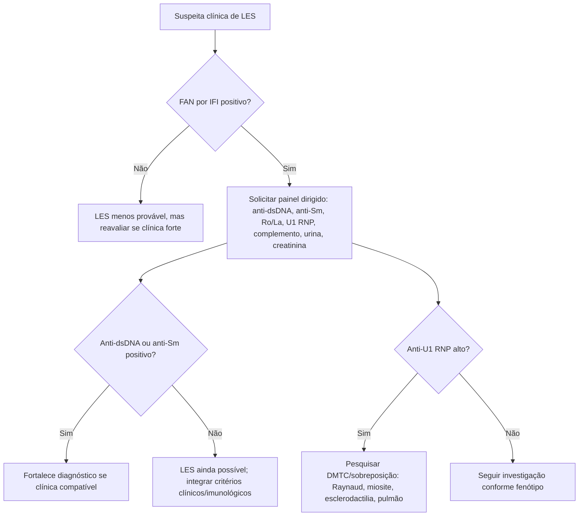
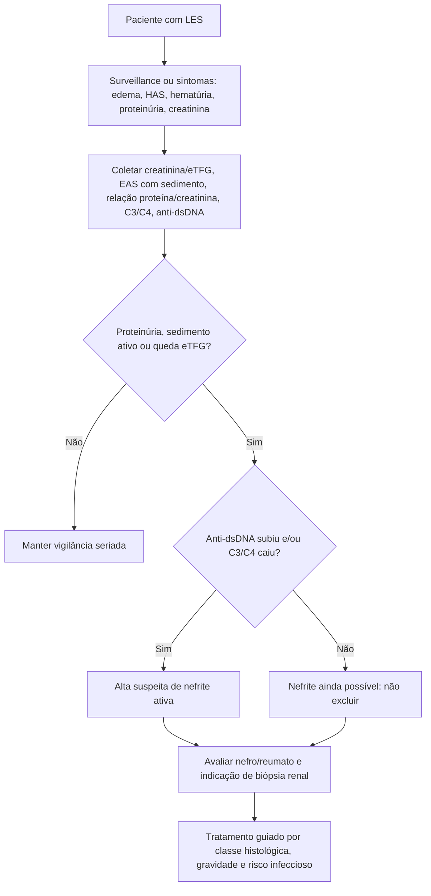

# 🧬 UPDOWN — Autoanticorpos no LES: anti-dsDNA, anti-Sm e anti-U1 RNP

> **Ideia central:** no lúpus, autoanticorpo não é “enfeite de laboratório”: alguns ajudam a **confirmar diagnóstico**, outros ajudam a **monitorar atividade**, e alguns apontam para **fenótipos clínicos específicos**. O segredo é interpretar **o anticorpo + o método do teste + o contexto clínico**.

---

## 1. 🎯 Objetivos de aprendizagem

Ao final, você deve conseguir:

1. Diferenciar **anti-ssDNA**, **anti-dsDNA**, **anti-Sm** e **anti-U1 RNP**.
2. Saber quando um anticorpo é mais útil para **diagnóstico** e quando é útil para **seguimento**.
3. Interpretar o impacto do **método laboratorial** no resultado do anti-dsDNA.
4. Reconhecer quando anti-dsDNA e complemento ajudam a suspeitar de **nefrite lúpica ativa**.
5. Evitar armadilhas comuns: “anti-dsDNA positivo = sempre flare” e “anti-dsDNA negativo = exclui nefrite”.

---

## 2. 🧠 Mapa mental rápido

| Autoanticorpo | Melhor uso clínico | Força | Limitação principal | Frase de plantão |
|---|---|---|---|---|
| **Anti-ssDNA** | Pouco útil | Pode aparecer em vários contextos | Baixa especificidade e pouca correlação com atividade | “Não tome decisão grande por anti-ssDNA.” |
| **Anti-dsDNA** | Diagnóstico de LES + seguimento em alguns pacientes | Específico, associado a nefrite e atividade em subgrupos | Depende do método; pode dissociar do quadro clínico | “Bom marcador, péssimo piloto automático.” |
| **Anti-Sm** | Diagnóstico de LES | Alta especificidade; pode persistir na remissão | Baixa sensibilidade | “Selo forte de LES, mas muita gente com LES não tem.” |
| **Anti-U1 RNP** | DMTC e sobreposição | Alto título sugere doença mista do tecido conjuntivo | Não é específico para LES | “RNP alto: pense em sobreposição/DMTC.” |

---

## 3. 🧬 Anti-DNA: duas famílias diferentes

### 3.1 Anti-ssDNA — DNA de fita simples

O **anti-ssDNA** reconhece estruturas expostas quando o DNA está desnaturado. Como esses alvos não são exclusivos do LES, o exame tem baixa utilidade prática para confirmar lúpus ou para acompanhar atividade.

**Onde ele pode aparecer?**

- LES, mas sem bom desempenho para atividade.
- Artrite reumatoide e outras doenças autoimunes.
- Lúpus induzido por drogas.
- Familiares saudáveis de pacientes com LES.
- Algumas pessoas sem doença autoimune definida.

✅ **Mensagem prática:** anti-ssDNA isolado raramente resolve um caso. Use a clínica, FAN por IFI, ENA, anti-dsDNA, complemento, urina e função renal.

---

### 3.2 Anti-dsDNA — DNA de dupla fita

O **anti-dsDNA** reconhece DNA nativo de dupla hélice. É um dos anticorpos mais úteis no LES porque combina:

- **Boa especificidade diagnóstica**, especialmente quando detectado por métodos mais específicos.
- **Associação com atividade de doença** em muitos pacientes.
- **Associação forte com nefrite lúpica**, principalmente quando vem junto de queda de complemento, sedimento urinário ativo e proteinúria.

Mas existe uma regra de ouro:

> **O anti-dsDNA acompanha melhor alguns pacientes do que outros.**  
> Em alguns, sobe antes ou durante o flare; em outros, permanece alto mesmo com doença quieta; e uma minoria pode ter nefrite ativa sem elevação relevante.

---

## 4. 🔬 Anti-dsDNA: o método muda o significado

### Tabela de métodos

| Método | O que tende a detectar | Ponto forte | Ponto fraco | Melhor uso prático |
|---|---|---|---|---|
| **Farr** | Anticorpos de alta afinidade contra dsDNA | Boa correlação com atividade/nefrite em vários estudos | Usa radioatividade; pouco disponível | Seguimento/atividade quando disponível |
| **Crithidia luciliae** | Anti-dsDNA com alta especificidade | Muito específico para LES | Menos sensível; semiquantitativo | Confirmar diagnóstico quando positivo |
| **ELISA** | Anti-dsDNA, inclusive anticorpos de menor afinidade; depende do substrato | Mais sensível e quantitativo | Menos específico; risco de falso-positivo | Monitorar tendência, com cautela |
| **Microesferas fluorescentes** | Autoanticorpos em plataforma multiplex | Quantitativo e prático | Interpretação depende do painel e do laboratório | Seguimento e painéis automatizados |

### O detalhe nerd que muda conduta 🧪

Se o DNA usado no ensaio estiver parcialmente desnaturado, o teste pode captar anticorpos contra ssDNA junto com dsDNA. Resultado: **sobe a sensibilidade, cai a especificidade**.

✅ **Pergunta obrigatória ao receber um resultado estranho:**  
**“Qual método o laboratório usa para anti-dsDNA?”**

---

## 5. 🧭 Como interpretar anti-dsDNA no mundo real

### Cenário A — suspeita inicial de LES

**Anti-dsDNA positivo por método específico**, especialmente com FAN positivo e clínica compatível, fortalece o diagnóstico.

**Anti-dsDNA negativo** não exclui LES.

### Cenário B — paciente com LES conhecido e suspeita de flare

Procure o padrão:

- Anti-dsDNA subindo em relação ao basal do próprio paciente.
- C3/C4 caindo.
- Proteinúria nova ou piora.
- Hematúria glomerular/cilindros.
- Creatinina subindo.
- Atividade sistêmica compatível.

> **Tendência longitudinal vale mais que valor isolado.**

### Cenário C — suspeita de nefrite lúpica

Anti-dsDNA alto + complemento baixo é um sinal de alerta, mas a decisão deve ser ancorada em:

- Urina tipo I com sedimento.
- Relação proteína/creatinina urinária ou proteinúria de 24 h.
- Creatinina/eTFG.
- Pressão arterial, edema, albumina.
- Avaliação para biópsia renal quando indicada.

### Cenário D — manifestação neuropsiquiátrica

Anti-dsDNA não é um bom marcador isolado para atividade neuropsiquiátrica. Nessa situação, a investigação depende de fenótipo clínico, exclusão de infecção/metabólico/tóxico/trombótico e avaliação neurológica completa.

---

## 6. 🧩 Anti-Sm: o “selo específico” do LES

O **anti-Sm** reconhece proteínas do complexo Sm, parte das pequenas ribonucleoproteínas nucleares envolvidas no processamento de RNA.

### Características práticas

- **Baixa sensibilidade:** muitos pacientes com LES não têm anti-Sm.
- **Alta especificidade:** quando positivo no contexto certo, ajuda bastante no diagnóstico.
- **Persistência:** pode continuar positivo mesmo quando o lúpus está em remissão.
- **Não é marcador ideal de atividade:** diferente do anti-dsDNA, o anti-Sm geralmente não oscila de forma útil para guiar flare.

### Associações clínicas possíveis

Em coortes de LES, anti-Sm já foi associado a maior frequência de:

- Doença renal.
- Doença neuropsiquiátrica.
- Vasculite.
- Coexistência com anti-dsDNA.

💡 **Pérola:** em paciente com quadro compatível, anti-Sm positivo pode ajudar no diagnóstico mesmo quando a doença está pouco ativa e o anti-dsDNA não está elevado.

---

## 7. 🧬 Anti-U1 RNP: pense em sobreposição e DMTC

O **anti-U1 RNP** reconhece proteínas do complexo U1 snRNP, como 70 kDa, A e C.

### O que ele sugere?

- Pode estar presente no LES.
- Pode aparecer em artrite reumatoide, esclerose sistêmica, Sjögren e polimiosite.
- **Altos títulos são típicos da doença mista do tecido conjuntivo (DMTC).**

### Quando levantar antena para DMTC?

Pense em DMTC/sobreposição quando houver anti-U1 RNP alto e combinação de:

- Fenômeno de Raynaud.
- Mãos edemaciadas.
- Artrite/artralgia.
- Miosite.
- Esclerodactilia ou features de esclerose sistêmica.
- Hipertensão pulmonar ou doença pulmonar intersticial.

✅ **Mensagem prática:** anti-U1 RNP não “fecha LES”. Ele abre uma porta diagnóstica para **fenótipo de sobreposição**.

---

## 8. 🧪 FAN, padrões e imagens: como memorizar

Na imunofluorescência indireta em células HEp-2:

- **Anti-DNA** tende a gerar padrão nuclear homogêneo.
- **Anti-Sm / anti-U1 RNP** podem gerar padrão nuclear pontilhado grosseiro.

⚠️ Padrão de FAN ajuda, mas não substitui o painel específico de autoanticorpos nem a clínica.

---

## 9. 🧠 Algoritmo clínico — suspeita de LES no internista



---

## 10. 🧠 Algoritmo clínico — LES com suspeita de nefrite



---

## 11. ⚠️ Armadilhas de prova e de plantão

| Armadilha | Correção |
|---|---|
| “Anti-dsDNA positivo sempre indica doença ativa.” | Não. Alguns pacientes mantêm anti-dsDNA alto mesmo em remissão. |
| “Anti-dsDNA negativo exclui nefrite lúpica.” | Não. Uma minoria pode ter nefrite ativa sem elevação do anti-dsDNA. |
| “Anti-Sm serve para monitorar flare.” | Em geral, não. Ele é mais útil para diagnóstico. |
| “Anti-U1 RNP é específico de LES.” | Não. Alto título sugere DMTC/sobreposição. |
| “ELISA positivo equivale a Crithidia positivo.” | Não. ELISA costuma ser mais sensível e menos específico. |
| “FAN negativo + anti-dsDNA positivo é sempre LES.” | Cuidado: pode haver diferença de método, falso-positivo ou relevância incerta. |

---

## 12. 🧠 Mnemônicos úteis

### 1) **dsDNA = Duplo Sinal de Doença e Nefrite Ativa**
- **D**upla fita.
- **S**obe em alguns flares.
- **D**erruba complemento quando há atividade imunológica.
- **N**efrite é a associação clínica mais clássica.

### 2) **Sm = Selo Marcante, mas Sumido**
- **Selo**: alta especificidade.
- **Marcante**: reforça diagnóstico.
- **Sumido**: baixa sensibilidade; muitos LES não têm.

### 3) **RNP = Raynaud, pulmão e sobrePosição**
- Lembre de DMTC quando houver RNP alto + Raynaud/mãos edemaciadas/miosite/pulmão.

### 4) **Crithidia Confirma; ELISA Espia Evolução**
- Crithidia: bom para confirmar por alta especificidade.
- ELISA: útil para tendência, mas com mais falso-positivo.

### 5) **Nefrite: DNA + Complemento + Urina**
- Anti-dsDNA sozinho não basta.
- C3/C4 ajudam.
- Urina e proteinúria mandam no jogo.

---

## 13. 🏆 Questões estilo R3/TEMI

### Questão 1
Paciente com poliartrite, fotossensibilidade, úlceras orais e FAN positivo. Anti-Sm positivo, anti-dsDNA negativo, complemento normal. Qual interpretação é mais adequada?

A. Anti-Sm exclui LES se anti-dsDNA for negativo.  
B. Anti-Sm positivo reforça diagnóstico de LES, mesmo com anti-dsDNA negativo.  
C. Anti-Sm positivo é marcador de atividade renal.  
D. Anti-Sm é típico de lúpus induzido por drogas.  
E. Anti-Sm indica obrigatoriamente DMTC.

**Resposta:** B.  
**Comentário:** anti-Sm é pouco sensível, mas altamente específico. Anti-dsDNA negativo não exclui LES.

---

### Questão 2
Qual exame tende a ter maior especificidade para anti-dsDNA no diagnóstico inicial de LES?

A. Anti-ssDNA.  
B. ELISA para anti-dsDNA.  
C. Crithidia luciliae.  
D. VHS.  
E. Anti-U1 RNP.

**Resposta:** C.  
**Comentário:** Crithidia luciliae é menos sensível, porém muito específico quando positivo.

---

### Questão 3
Paciente com LES conhecido, anti-dsDNA historicamente acompanha surtos. Agora vem com proteinúria nova, hematúria glomerular, queda de C3/C4 e anti-dsDNA subindo. Conduta conceitual mais correta:

A. Considerar alta suspeita de nefrite lúpica ativa e avaliar nefrologia/reumatologia e biópsia conforme indicação.  
B. Ignorar anti-dsDNA, pois nunca correlaciona com atividade.  
C. Tratar como infecção urinária sem investigação renal.  
D. Excluir nefrite se creatinina ainda estiver normal.  
E. Diagnosticar DMTC.

**Resposta:** A.  
**Comentário:** a combinação tendência anti-dsDNA + hipocomplementemia + sedimento/proteinúria aumenta a probabilidade de nefrite ativa.

---

### Questão 4
Anti-U1 RNP em alto título sugere especialmente:

A. Dermatomiosite paraneoplásica isolada.  
B. Doença mista do tecido conjuntivo ou fenótipo de sobreposição.  
C. Lúpus induzido por hidralazina.  
D. Artrite séptica.  
E. Vasculite ANCA exclusivamente.

**Resposta:** B.  
**Comentário:** anti-U1 RNP pode ocorrer em LES, mas alto título é clássico de DMTC.

---

### Questão 5
Qual frase está correta?

A. Anti-ssDNA é excelente para atividade do LES.  
B. Anti-Sm geralmente desaparece na remissão.  
C. Anti-dsDNA deve sempre ser interpretado com método laboratorial e tendência clínica.  
D. Anti-U1 RNP é específico de LES.  
E. ELISA para anti-dsDNA não gera falso-positivo.

**Resposta:** C.  
**Comentário:** tendência, método e contexto são indispensáveis.

---

## 14. 🃏 Flashcards

| Frente | Verso |
|---|---|
| Qual anti-DNA é pouco útil no LES? | Anti-ssDNA. |
| Qual anticorpo é mais ligado a nefrite lúpica? | Anti-dsDNA, especialmente com complemento baixo e alterações urinárias. |
| Anti-Sm é mais útil para diagnóstico ou atividade? | Diagnóstico. |
| Anti-Sm tem alta ou baixa sensibilidade? | Baixa sensibilidade. |
| Anti-Sm tem alta ou baixa especificidade? | Alta especificidade. |
| Anti-U1 RNP alto lembra qual síndrome? | Doença mista do tecido conjuntivo/sobreposição. |
| Crithidia luciliae é mais útil por qual propriedade? | Alta especificidade. |
| ELISA anti-dsDNA costuma ser mais sensível ou específico? | Mais sensível, menos específico que Crithidia. |
| Anti-dsDNA negativo exclui LES? | Não. |
| Anti-dsDNA negativo exclui nefrite? | Não. |
| O que aumenta suspeita de flare renal no LES? | Anti-dsDNA subindo + C3/C4 caindo + proteinúria/sedimento ativo. |
| Qual padrão de FAN pode aparecer com anti-DNA? | Homogêneo nuclear. |
| Qual padrão pode aparecer com anti-Sm/U1 RNP? | Pontilhado nuclear grosseiro. |
| Anti-Sm costuma sumir quando o LES entra em remissão? | Não necessariamente; pode persistir. |
| Qual dado laboratorial deve acompanhar anti-dsDNA na suspeita renal? | Complemento, urina, proteinúria e função renal. |
| O que perguntar ao laboratório diante de resultado discrepante? | Qual método foi usado para anti-dsDNA. |
| Anti-U1 RNP é específico de LES? | Não. |
| Lúpus neuropsiquiátrico é bem acompanhado por anti-dsDNA? | Em geral, não como marcador isolado. |
| Alto anti-Sm + complemento baixo pode sugerir o quê? | Maior vigilância para possível nefrite, inclusive formas pouco sintomáticas. |
| Palavra-chave para anti-dsDNA no seguimento? | Tendência longitudinal. |

---

## 15. 📌 Resumo final completo — por conceitos importantes

### 15.1. 🧭 Conceito-mãe: autoanticorpo não é diagnóstico isolado
Os autoanticorpos **anti-dsDNA, anti-Sm e anti-U1 RNP** são marcadores de alto valor no raciocínio do lúpus, mas só fazem sentido quando combinados com **fenótipo clínico, FAN, complemento, urina, função renal, método laboratorial e evolução temporal**.

> **Frase para guardar:** no LES, anticorpo é uma peça do quebra-cabeça — não é o quebra-cabeça inteiro.

---

### 15.2. 🧬 Anti-ssDNA: o “anti-DNA fraco”
O **anti-ssDNA** reconhece DNA desnaturado/de fita simples. Ele tem **baixa especificidade** e pode aparecer em várias condições, inclusive fora do LES. Por isso, **não é bom marcador diagnóstico nem bom marcador de atividade**.

**Como lembrar:**  
**ssDNA = “sem segurança”** para grandes decisões clínicas.

---

### 15.3. 🧪 Anti-dsDNA: o anticorpo de atividade e rim
O **anti-dsDNA** é o anticorpo mais importante deste grupo para o seguimento do LES. Ele pode ajudar em dois eixos:

| Eixo | Utilidade prática |
|---|---|
| **Diagnóstico** | Reforça LES quando positivo em contexto clínico compatível. |
| **Atividade** | Pode subir em surtos, especialmente em pacientes nos quais historicamente acompanha atividade. |
| **Rim** | Tem associação clássica com nefrite lúpica, principalmente quando vem com C3/C4 baixos, proteinúria e sedimento urinário ativo. |

**Como lembrar:**  
**dsDNA = “dupla fita, duplo valor”: diagnóstico + atividade renal.**

---

### 15.4. 🫘 Nefrite lúpica: a tríade que acende alerta
Na suspeita de nefrite lúpica ativa, o anti-dsDNA isolado é menos importante do que o conjunto:

```text
anti-dsDNA subindo
        +
C3/C4 caindo
        +
proteinúria / hematúria glomerular / cilindros / piora renal
        =
ALERTA DE NEFRITE LÚPICA ATIVA
```

**Mensagem de plantão:** creatinina normal **não exclui** nefrite inicial. O sedimento urinário e a proteinúria podem gritar antes da creatinina.

---

### 15.5. 🔬 Método do anti-dsDNA muda a interpretação
Nem todo anti-dsDNA positivo tem o mesmo peso. O método usado pelo laboratório importa muito.

| Método | Melhor uso mental | Pegadinha |
|---|---|---|
| **Crithidia luciliae** | Confirmação diagnóstica pela alta especificidade | Pode ser menos sensível. |
| **ELISA** | Seguimento quantitativo e triagem mais sensível | Mais sujeito a falso-positivo/menor especificidade. |
| **Farr** | Alta afinidade e boa correlação histórica com atividade | Pouco usado por radioatividade/logística. |
| **Microesferas fluorescentes** | Painéis automatizados e quantificação | Depende do antígeno/plataforma. |

**Como lembrar:**  
**Crithidia confirma; ELISA acompanha; tendência decide.**

---

### 15.6. 📈 Tendência longitudinal vale mais que número solto
O anti-dsDNA é mais útil quando o paciente já mostrou um padrão individual: **sobe nos surtos e cai na melhora**. Em alguns pacientes, ele permanece alto mesmo com doença pouco ativa; em outros, pode haver nefrite mesmo sem grande elevação.

**Frase-chave:** não trate o número; trate o paciente, a tendência e o órgão-alvo.

---

### 15.7. 🔖 Anti-Sm: o “selo diagnóstico” do LES
O **anti-Sm** é **pouco sensível**, então muitos pacientes com LES não terão esse anticorpo. Porém, quando aparece em contexto compatível, ele é um forte reforço diagnóstico. Diferente do anti-dsDNA, ele pode continuar positivo mesmo em remissão, portanto é mais útil para **diagnóstico** do que para monitorar atividade.

**Como lembrar:**  
**Sm = “Selo marcado” de LES.**  
Se positivo, ajuda muito; se negativo, não exclui.

---

### 15.8. 🧩 Anti-U1 RNP: marcador de sobreposição
O **anti-U1 RNP** pode aparecer no LES, mas altos títulos devem fazer pensar em **doença mista do tecido conjuntivo (DMTC)** ou síndrome de sobreposição, especialmente quando há Raynaud, mãos edemaciadas, artrite, miosite, esclerodactilia ou fenômenos pulmonares.

**Como lembrar:**  
**RNP = “Raciocine Na Possibilidade” de sobreposição.**

---

### 15.9. ⚠️ Na UTI/enfermaria: cuidado com o falso “flare”
Paciente lúpico internado pode piorar por várias razões: atividade do LES, infecção, toxicidade medicamentosa, trombose/SAAF, injúria renal por droga, sepse ou descompensação de doença crônica. Anti-dsDNA subindo e complemento baixo ajudam, mas **não substituem investigação infecciosa, avaliação renal e leitura clínica completa**.

**Frase de segurança:** antes de aumentar imunossupressão, procure infecção e confirme órgão-alvo.

---

### 15.10. 🎯 Pegadinhas de prova R3/TEMI
| Pegadinha | Correção mental |
|---|---|
| Anti-dsDNA negativo exclui LES. | Falso. Não exclui. |
| Anti-Sm negativo exclui LES. | Falso. É pouco sensível. |
| Anti-Sm é marcador principal de atividade. | Falso. É mais diagnóstico. |
| Anti-U1 RNP é específico de LES. | Falso. Lembra DMTC/sobreposição. |
| Anti-ssDNA guia tratamento. | Falso. Pouco útil. |
| Anti-dsDNA isolado define nefrite. | Falso. Precisa de urina, complemento, função renal e contexto. |

---

### 15.11. 🧠 Mapa de memorização em uma tela
```text
ANTI-ssDNA  → pouco útil / baixa especificidade
ANTI-dsDNA  → LES + atividade + nefrite, mas depende do método e da tendência
ANTI-Sm     → alta especificidade / baixa sensibilidade / diagnóstico
ANTI-U1 RNP → DMTC e sobreposição, especialmente em alto título
COMPLEMENTO → cai em flare imunológico, sobretudo renal
URINA       → manda no rim: proteinúria e sedimento ativo são decisivos
```

---

### 15.12. 🏁 Fechamento prático
Para guardar de verdade: **anti-dsDNA é o marcador dinâmico**, **anti-Sm é o marcador de identidade do LES**, **anti-U1 RNP é o marcador de fronteira com sobreposição**, e **anti-ssDNA é o marcador que quase nunca deve conduzir decisão importante**. Na prática, a melhor interpretação nasce da integração entre **anticorpo + método + tendência + complemento + urina + órgão-alvo**.

---

## 16. 🧭 Sugestão de integração no hub Antigravity

- **Categoria:** UpDown → Reumatologia → Lúpus / Autoanticorpos.
- **Links internos recomendados:**
  - FAN e padrões de imunofluorescência.
  - Nefrite lúpica.
  - LES na UTI.
  - SAAF.
  - Doença mista do tecido conjuntivo.
- **Cards relacionados:** anti-dsDNA, anti-Sm, anti-U1 RNP, complemento, proteinúria.

---

## 17. 📚 Fontes de apoio para checagem médica

- Revisão médica fornecida pelo usuário sobre anticorpos anti-dsDNA, anti-Sm e anti-U1 RNP.
- KDIGO 2024 Clinical Practice Guideline for the Management of Lupus Nephritis.
- American College of Rheumatology Guideline Summary for Lupus Nephritis, 2024/2025.

