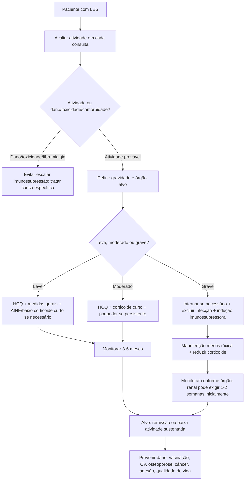

# UPDOWN #002 — Lúpus Eritematoso Sistêmico em Adultos
## Visão geral do manejo, monitoramento e prognóstico

> Versão autoral, didática e publicável em modo leitor. Conteúdo estruturado para estudo médico, prática clínica, enfermaria, ambulatório, UTI e preparação TEMI/R3.

---

# 1. Ideia central 🧠

O manejo do **lúpus eritematoso sistêmico (LES)** não é simplesmente “escolher um imunossupressor”. É um plano longitudinal de controle de uma doença multissistêmica que alterna períodos de baixa atividade, remissão incompleta, recaídas e dano acumulado.

A estratégia moderna pode ser resumida em quatro grandes objetivos:

1. **Alcançar remissão ou baixa atividade de doença**.
2. **Prevenir dano orgânico irreversível**.
3. **Reduzir toxicidade terapêutica**, principalmente exposição cumulativa a glicocorticoides.
4. **Melhorar qualidade de vida**, incluindo fadiga, dor, sono, saúde mental, fertilidade, vacinação, exercício e prevenção cardiovascular.

A visão prática é: **tratar a inflamação sem trocar atividade lúpica por dano medicamentoso**.

---

# 2. Atualizações práticas incorporadas nesta versão 🔄

## 2.1 Tratamento orientado por alvo
O cuidado atual enfatiza alvo terapêutico: **remissão clínica ou baixa atividade sustentada**, evitando surtos, dano acumulado e dependência crônica de corticoide.

## 2.2 Hidroxicloroquina como eixo basal
A hidroxicloroquina permanece como base para praticamente todos os pacientes com LES, salvo contraindicação. A dose prática de referência é **até 5 mg/kg/dia pelo peso real**, respeitando limite usual de 400 mg/dia e risco de toxicidade retiniana.

## 2.3 Corticoide como ponte, não como moradia
O glicocorticoide é útil para controle rápido, mas deve ser usado com estratégia de redução. Incapacidade de reduzir prednisona para doses baixas deve acionar raciocínio de agente poupador.

## 2.4 Biológicos e terapias-alvo ganharam espaço
- **Belimumabe**: opção poupadora de corticoide e útil em doença extrarrenal; também integra esquemas de nefrite lúpica em contextos específicos.
- **Anifrolumabe**: bloqueio da via do interferon tipo I; destaque em doença cutânea/articular moderada a grave sem nefrite ativa grave ou neuro-lúpus grave.
- **Obinutuzumabe**: anti-CD20 humanizado com papel emergente/atualizado especialmente na nefrite lúpica ativa em combinação com terapia padrão.
- **Rituximabe**: muito usado em cenários refratários, embora estudos randomizados clássicos tenham resultados inconsistentes.

## 2.5 Prevenção virou tratamento
Vacinação, fotoproteção, cessação tabágica, rastreio cardiovascular, osteoporose, câncer, vitamina D, exercício e adesão terapêutica são parte do tratamento, não “extras”.

---

# 3. Avaliação da atividade da doença 🔎

O LES exige reavaliação contínua porque uma alteração pode representar:

1. **Doença ativa**.
2. **Dano crônico já estabelecido**.
3. **Toxicidade medicamentosa**.
4. **Infecção**.
5. **Comorbidade não inflamatória**, como fibromialgia, distúrbio do sono ou depressão.

### Exemplo prático
Proteinúria e queda de TFG podem significar nefrite ativa, mas também podem refletir cicatriz glomerular crônica. No primeiro caso, pode ser necessário intensificar imunossupressão; no segundo, aumentar imunossupressão pode trazer dano sem benefício.

---

# 5. Definições úteis: surto, remissão e baixa atividade 🎯

## 5.1 Surto/exacerbação
Surto é aumento clinicamente significativo da atividade do LES, suficiente para justificar mudança terapêutica. Pode ser leve, moderado ou grave.

## 5.2 Remissão
Remissão completa sem terapia é incomum. Na prática, aceita-se remissão clínica com ausência de atividade mensurável, permitindo hidroxicloroquina, baixa dose de corticoide e/ou manutenção imunossupressora em algumas definições.

## 5.3 Baixa atividade da doença
O conceito de baixa atividade é muito útil porque é mais alcançável que remissão completa. Em geral, significa pouca atividade clínica, ausência de atividade em órgãos maiores, dose baixa de prednisona e tratamento de manutenção estável.

### Tradução clínica
Não é necessário “zerar todos os anticorpos” para tratar bem o paciente. O objetivo é evitar dano, surto e corticoide crônico alto, mantendo função orgânica e qualidade de vida.

---

# 6. Laboratório de monitoramento 🧪

## 6.1 Painel mínimo de seguimento

| Exame | Por que importa? |
|---|---|
| Hemograma com diferencial | leucopenia, linfopenia, anemia, trombocitopenia; atividade versus toxicidade |
| VHS e PCR | inflamação; PCR muito elevada deve lembrar infecção, embora não seja absoluta |
| Urina tipo 1 com sedimento | hematúria, cilindros, piúria, proteinúria |
| Relação proteína/creatinina urinária | quantifica proteinúria de forma prática |
| Creatinina e TFGe | monitora função renal |
| Anti-dsDNA | pode acompanhar atividade, especialmente renal |
| C3 e C4 | consumo sugere atividade, especialmente nefrite |
| Função hepática/metabólica conforme terapia | segurança medicamentosa |

## 6.2 O que não repetir sem necessidade
FAN e autoanticorpos como anti-Sm, Ro/SSA, La/SSB e RNP geralmente não precisam ser repetidos rotineiramente para monitorar atividade. Exceções incluem planejamento gestacional, gravidez ou mudança clínica específica.

## 6.3 Complemento e anti-dsDNA: úteis, mas não soberanos
A combinação de **anti-dsDNA subindo + C3/C4 caindo** aumenta suspeita de atividade, sobretudo renal. Porém, alguns pacientes têm sorologia ativa sem doença clinicamente ativa. Portanto, laboratório sem clínica pode enganar.

---

# 7. Frequência de acompanhamento 🗓️

A frequência deve ser individualizada.

| Cenário | Frequência prática |
|---|---|
| LES estável/inativo | geralmente a cada 3–6 meses |
| LES leve com ajustes terapêuticos | a cada 1–3 meses até estabilizar |
| Nefrite ativa ou órgão ameaçado | pode exigir avaliação semanal/quinzenal inicialmente |
| Pós-alta de surto grave | reavaliação precoce, com plano laboratorial claro |
| Gestação ou planejamento gestacional | seguimento conjunto e mais frequente |

### Ponto de segurança
Mesmo paciente “bem” pode desenvolver alteração laboratorial silenciosa, especialmente urinária. Por isso, urina e função renal são quase sempre obrigatórias no seguimento.

---

# 8. Medidas gerais para todos os pacientes ☀️🚭💉

## 8.1 Fotoproteção
A luz ultravioleta pode induzir ou agravar manifestações cutâneas e sistêmicas. Orientar:

- evitar sol direto e fontes intensas de UV;
- protetor amplo espectro UVA/UVB, alto FPS;
- roupas, chapéus, barreiras físicas;
- atenção a medicamentos fotossensibilizantes.

## 8.2 Tabagismo
Fumar está associado a maior atividade, maior risco cardiovascular e possível menor resposta a terapias como hidroxicloroquina e belimumabe. Cessar tabagismo é intervenção imunológica, cardiovascular e terapêutica.

## 8.3 Vacinação
Vacinas devem ser revisadas preferencialmente antes de imunossupressão. Em geral, vacinas inativadas/recombinantes são preferidas e seguras em doença estável. Vacinas vivas costumam ser contraindicadas sob imunossupressão moderada/grave.

### Vacinas frequentemente relevantes
- influenza anual;
- pneumocócica conforme esquema atualizado;
- hepatite B quando indicado;
- HPV em faixa etária/risco apropriado;
- COVID-19 conforme recomendações para imunocomprometidos;
- herpes-zóster recombinante;
- VSR em adultos imunocomprometidos ou com fatores de risco conforme idade/contexto.

## 8.4 Risco cardiovascular
LES acelera aterosclerose. Controlar agressivamente:

- pressão arterial;
- dislipidemia;
- diabetes;
- tabagismo;
- sedentarismo;
- obesidade;
- doença renal;
- exposição crônica a corticoide.

## 8.5 Osteoporose
Risco aumentado por inflamação, fotoproteção, deficiência de vitamina D, baixa atividade física e glicocorticoide. Avaliar:

- vitamina D;
- cálcio dietético;
- exercício com carga/isométrico;
- densitometria conforme risco;
- prevenção/tratamento de osteoporose induzida por glicocorticoide.

## 8.6 Câncer e rastreio
Pacientes com LES devem realizar rastreios por idade e risco. Atenção especial para:

- câncer cervical e HPV;
- linfoma, se linfonodomegalia persistente/sintomas B;
- câncer de pele em pacientes com imunossupressão;
- rastreios populacionais habituais.

## 8.7 Dieta, vitamina D e exercício
Não há uma “dieta do lúpus” comprovada para todos. Recomenda-se dieta equilibrada, controle de sal em hipertensão/nefrite e correção de deficiência de vitamina D. Exercício deve ser progressivo e adaptado à artrite, fadiga, osteopenia e condição cardiovascular.

---

# 9. Hidroxicloroquina: o tratamento de base 💊

## 9.1 Por que usar?
A hidroxicloroquina é associada a múltiplos benefícios:

- reduz surtos;
- ajuda em pele, articulações e sintomas constitucionais;
- pode reduzir dano acumulado;
- pode reduzir eventos trombóticos;
- pode melhorar sobrevida;
- ajuda como base poupadora de corticoide.

## 9.2 Dose prática
- Dose alvo: até **5 mg/kg/dia pelo peso real**.
- Limite usual: **400 mg/dia**.
- Pode ser dose única diária ou dividida se houver intolerância gastrointestinal.

## 9.3 Segurança
Monitorar:

- retina com oftalmologia;
- risco de QT em pacientes selecionados;
- interações com outros fármacos que prolongam QT;
- função renal/hepática conforme contexto;
- adesão, inclusive com nível sérico quando disponível.

### Pérola de prova
Suspender hidroxicloroquina sem motivo forte pode aumentar risco de surto.

---

# 10. Escalonamento por gravidade ⚖️

## 10.1 Doença leve
Exemplos:

- artralgia leve;
- rash discreto;
- fadiga sem órgão-alvo;
- leucopenia leve estável;
- sem nefrite, SNC, citopenia grave ou serosite importante.

Conduta típica:

- hidroxicloroquina;
- fotoproteção;
- AINE por curto período se seguro;
- baixa dose de prednisona por curto prazo se necessário;
- tratar dor não inflamatória, sono, humor e condicionamento.

## 10.2 Doença moderada
Exemplos:

- doença cutânea extensa;
- artrite persistente;
- citopenia não ameaçadora;
- sintomas constitucionais com impacto;
- serosite leve/moderada sem instabilidade.

Conduta típica:

- hidroxicloroquina;
- prednisona em dose baixa a moderada por curto prazo;
- introduzir poupador se persistente ou se dependente de corticoide.

Opções poupadoras conforme fenótipo:

- azatioprina;
- metotrexato;
- micofenolato;
- belimumabe;
- anifrolumabe.

## 10.3 Doença grave/ameaça a órgão
Exemplos:

- nefrite proliferativa;
- neuro-lúpus grave;
- hemorragia alveolar;
- miocardite;
- citopenias graves;
- vasculite visceral;
- microangiopatia/trombose grave.

Conduta típica:

- internação conforme gravidade;
- excluir infecção e mimetizadores;
- glicocorticoide sistêmico em dose alta/pulsoterapia em cenários selecionados;
- imunossupressor de indução: micofenolato, ciclofosfamida ou outros conforme órgão;
- terapia de manutenção menos tóxica;
- redução planejada do corticoide;
- equipe multidisciplinar.

---

# 11. Glicocorticoides: benefício rápido, dano cumulativo 🔥

Os glicocorticoides controlam inflamação rapidamente, mas aumentam risco de:

- infecção;
- diabetes/hiperglicemia;
- hipertensão;
- ganho de peso;
- osteoporose;
- osteonecrose;
- catarata/glaucoma;
- transtornos de humor/insônia;
- doença cardiovascular;
- miopatia;
- dano acumulado.

## Regra prática
Use a menor dose eficaz pelo menor tempo possível. Se o paciente não consegue reduzir para dose baixa, pense em atividade persistente, diagnóstico alternativo, dano crônico, adesão inadequada ou necessidade de poupador.

---

# 12. Biológicos e terapias-alvo 🧬

## 12.1 Belimumabe
Bloqueia BLyS/BAFF, reduzindo sobrevivência de células B autorreativas.

Uso prático:

- doença extrarrenal ativa apesar de terapia padrão;
- efeito poupador de corticoide;
- resposta não imediata: pode levar meses;
- pode integrar esquemas de nefrite lúpica em contextos específicos.

## 12.2 Anifrolumabe
Bloqueia receptor de interferon tipo I.

Uso prático:

- LES moderado a grave extrarrenal;
- destaque em pele e articulações;
- evitar extrapolar para nefrite ativa grave ou neuro-lúpus grave quando não há indicação/estudo robusto;
- atenção a infecções virais, especialmente herpes-zóster.

## 12.3 Rituximabe
Anti-CD20 depletor de células B.

Uso prático:

- frequentemente considerado em doença refratária;
- evidência randomizada clássica não foi claramente positiva;
- pode ser usado em contextos selecionados, especialmente quando outras opções falham ou em fenótipos específicos.

## 12.4 Obinutuzumabe
Anti-CD20 humanizado com depleção B potente.

Uso prático:

- papel mais forte em nefrite lúpica ativa em combinação com terapia padrão;
- pode representar uma das atualizações mais importantes no campo renal;
- exige atenção a infusão, infecções, HBV, imunoglobulinas e vacinação prévia quando possível.

## 12.5 Fronteira terapêutica
Áreas em investigação incluem CAR-T anti-CD19, inibidores de JAK, terapias anti-CD38, moduladores de células B/plasmócitos, anti-CD40, anti-BDCA2 e outras estratégias imunes.

---

# 13. Comorbidades e situações especiais 🧭

## 13.1 Gravidez e contracepção
Gravidez deve ser planejada idealmente após pelo menos seis meses de doença em remissão/baixa atividade, especialmente sem órgão maior ativo. Revisar medicações teratogênicas, anti-Ro/SSA, anti-La/SSB e anticorpos antifosfolipídios.

## 13.2 Síndrome antifosfolipídica
Trombose arterial/venosa ou morbidade obstétrica em LES exige avaliação de SAF. O manejo segue princípios da SAF, com anticoagulação conforme indicação.

## 13.3 Fenômeno de Raynaud
Tratamento inclui proteção contra frio, cessação tabágica, evitar vasoconstritores e considerar bloqueadores de canal de cálcio ou terapias avançadas se grave.

## 13.4 Sjögren associado
Pesquisar olho seco, boca seca, cáries, parotidomegalia e sintomas extraglandulares.

## 13.5 Fibromialgia
Pode coexistir em proporção relevante de pacientes. Dor difusa, fadiga, sono ruim e hipersensibilidade sem evidência inflamatória devem evitar escalada imunossupressora indevida.

## 13.6 Sulfonamidas
Alergia a antimicrobianos sulfonamídicos é mais comum no LES. TMP-SMX pode desencadear rash e, em alguns pacientes, exacerbação. Sulfonamidas não antimicrobianas têm menor risco de reação cruzada, mas devem ser analisadas caso a caso.

## 13.7 Resposta inadequada à prednisona
Se resposta clínica é inesperadamente pobre, considerar adesão, diagnóstico errado, infecção, dano crônico e, em situações específicas, conversão inadequada de prednisona para prednisolona ativa, especialmente em doença hepática. Alguns clínicos preferem metilprednisolona nesses cenários.

---

# 14. Fluxograma do manejo em Mermaid 🔁

---

# 15. Checklist prático de consulta 📝

## 15.1 Perguntas rápidas
- Teve febre, perda de peso, fadiga nova ou piora?
- Teve rash após sol, úlceras, alopecia?
- Dor ou inchaço articular com rigidez matinal?
- Dispneia, dor pleurítica, dor torácica?
- Edema, urina espumosa, alteração de pressão?
- Sintomas neurológicos ou psiquiátricos novos?
- Trombose, abortos, cefaleia incomum?
- Está tomando hidroxicloroquina e demais medicações corretamente?
- Teve infecção recente ou vacina recente?
- Algum efeito colateral do corticoide/imunossupressor?

## 15.2 Exame físico mínimo
- PA, peso, edema;
- pele e couro cabeludo;
- mucosas;
- articulações;
- ausculta cardíaca e pulmonar;
- linfonodos;
- exame neurológico se sintomas.

## 15.3 Exames mínimos frequentes
- hemograma;
- creatinina/TFGe;
- urina tipo 1;
- relação proteína/creatinina;
- C3/C4;
- anti-dsDNA;
- VHS/PCR conforme contexto;
- exames de segurança da medicação em uso.

---

# 16. Erros comuns que custam caro ⚠️

1. **Tratar FAN, não o paciente.**  
2. **Atribuir toda fadiga a LES ativo.**  
3. **Aumentar corticoide para dor de fibromialgia ou osteonecrose.**  
4. **Esquecer urina em paciente aparentemente estável.**  
5. **Ignorar vacinação antes de imunossupressão.**  
6. **Manter prednisona crônica sem plano de desmame.**  
7. **Não avaliar adesão antes de chamar de refratário.**  
8. **Atribuir febre ao LES sem excluir infecção.**  
9. **Não rastrear risco cardiovascular.**  
10. **Planejar gravidez durante atividade de doença.**

---

# 17. Prognóstico 📈

O prognóstico do LES melhorou muito nas últimas décadas, mas a doença ainda apresenta mortalidade superior à população geral.

## 17.1 Causas de morte por fase

| Fase | Principais ameaças |
|---|---|
| Primeiros anos | atividade grave: rim, SNC, pulmão, hematológico; infecções associadas à imunossupressão |
| Longo prazo | doença cardiovascular, doença renal crônica/terminal, complicações do tratamento, neoplasias, dano acumulado |

## 17.2 Fatores de pior prognóstico
- nefrite lúpica, especialmente proliferativa;
- hipertensão;
- alta atividade de doença;
- síndrome antifosfolipídica ou anticorpos antifosfolipídios;
- sexo masculino;
- extremos de idade no diagnóstico;
- baixo acesso a cuidado especializado;
- maior carga cumulativa de glicocorticoide;
- doença cardiovascular;
- infecções graves.

## 17.3 Remissão sustentada
Remissão prolongada é possível, mas não é a regra. Muitos pacientes atingem baixa atividade com tratamento, mas poucos permanecem anos em remissão completa sem medicação.

### Mensagem-chave
O objetivo realista e de alto valor é manter o paciente com **baixa atividade sustentada, sem surtos graves, com função orgânica preservada e mínima exposição a corticoide**.

---

# 18. Resumo final objetivo 🧠📌

| Nº | Tópico-chave | Essência prática |
|---|---|---|
| 1 | Objetivo central | Alcançar remissão ou baixa atividade, evitando surtos, dano orgânico e toxicidade terapêutica. |
| 2 | Manejo individualizado | A terapia depende de órgão acometido, gravidade, comorbidades, preferências e planejamento gestacional. |
| 3 | Avaliação contínua | Em toda consulta, diferenciar atividade lúpica de dano crônico, infecção, toxicidade, fibromialgia e comorbidades. |
| 4 | Alvo realista | Remissão completa é incomum; baixa atividade sustentada é meta prática e clinicamente valiosa. |
| 5 | Monitoramento básico | Hemograma, urina/sedimento, proteinúria, creatinina/TFGe, C3/C4 e anti-dsDNA formam o núcleo do seguimento. |
| 6 | Rim silencioso | Mesmo paciente assintomático precisa rastreio renal periódico, pois nefrite pode surgir com pouca clínica. |
| 7 | Interpretação laboratorial | Anti-dsDNA alto e complemento baixo ajudam, mas nunca substituem contexto clínico e avaliação de órgão-alvo. |
| 8 | Hidroxicloroquina | Deve ser mantida para quase todos, salvo contraindicação; reduz surtos, dano e pode melhorar sobrevida. |
| 9 | Dose da hidroxicloroquina | Usar até 5 mg/kg/dia pelo peso real, geralmente máximo 400 mg/dia, com vigilância oftalmológica. |
| 10 | Corticoide | É ponte para controle rápido, não tratamento crônico ideal; reduzir exposição cumulativa é prioridade. |
| 11 | Doença leve | Geralmente: hidroxicloroquina, fotoproteção, medidas gerais e sintomáticos curtos se necessário. |
| 12 | Doença moderada | Pode exigir corticoide curto e poupadores como azatioprina, metotrexato, micofenolato, belimumabe ou anifrolumabe. |
| 13 | Doença grave | Ameaça renal, SNC, pulmonar, cardíaca ou hematológica exige indução imunossupressora e equipe multidisciplinar. |
| 14 | Biológicos | Belimumabe, anifrolumabe, rituximabe e obinutuzumabe têm papéis distintos conforme fenótipo e refratariedade. |
| 15 | Prevenção | Fotoproteção, cessação tabágica, vacinação, exercício e rastreios são parte do tratamento, não acessórios. |
| 16 | Infecção | Febre em paciente imunossuprimido exige excluir infecção antes de atribuir a atividade lúpica. |
| 17 | Comorbidades | Rastrear risco cardiovascular, osteoporose, câncer, vitamina D, SAF, Sjögren, fibromialgia e saúde mental. |
| 18 | Gravidez | Idealmente planejar após pelo menos 6 meses de doença controlada e revisar drogas/autoanticorpos relevantes. |
| 19 | Prognóstico precoce | Nos primeiros anos, mortes se relacionam mais a doença ativa grave e infecção. |
| 20 | Prognóstico tardio | No longo prazo, predominam doença cardiovascular, DRC/DRT, toxicidade terapêutica, neoplasias e dano acumulado. |

---

# 19. Mnemônicos úteis 🧩

| Mnemônico | Como memorizar | Aplicação prática |
|---|---|---|
| **ALVO** | **A**liviar sintomas; **L**imitar dano; **V**igiar toxicidade/adesão; **O**timizar qualidade de vida | Lembra os objetivos globais do tratamento do LES. |
| **FAROL** | **F**lares; **A**desão; **R**im; **O**rgãos; **L**aboratório | Checklist mental para cada consulta de seguimento. |
| **HIDROX** | **H**CQ para quase todos; **I**mpacta surtos/sobrevida; **D**ose por peso; **R**etina; **O**bservar QT; **X**erife da adesão | Evita esquecer dose, benefício e segurança da hidroxicloroquina. |
| **PONTE, não CASA** | Corticoide é **P**otente, **O**rganiza resgate, mas **N**ão deve cronificar; exige **T**aper e **E**stratégia poupadora | Ajuda a evitar dependência crônica de prednisona. |
| **RINS-CeP** | **R**enal; **I**nfiltrado/hemorragia alveolar; **N**euro; **S**angue; **Ce**ração/coração-serosas; **P**rotrombose/SAF | Lembra ameaças graves/UTI no LES. |

---

# 20. Flashcards 🧠✨

## Card 1
**Pergunta:** Qual é o alvo moderno do tratamento do LES?  
**Resposta:** Remissão ou baixa atividade sustentada, com prevenção de dano e mínima toxicidade medicamentosa.

## Card 2
**Pergunta:** Qual medicação deve ser considerada para quase todos os pacientes com LES?  
**Resposta:** Hidroxicloroquina, salvo contraindicação.

## Card 3
**Pergunta:** Qual dose de referência da hidroxicloroquina reduz risco de toxicidade retiniana?  
**Resposta:** Até 5 mg/kg/dia pelo peso real, respeitando limite usual de 400 mg/dia.

## Card 4
**Pergunta:** Quais exames ajudam a monitorar atividade renal no LES?  
**Resposta:** Urina tipo 1, sedimento, relação proteína/creatinina, creatinina/TFGe, C3/C4 e anti-dsDNA.

## Card 5
**Pergunta:** Por que PCR muito elevada em LES febril preocupa?  
**Resposta:** Deve levantar suspeita de infecção, embora não seja critério absoluto.

## Card 6
**Pergunta:** O que significa não conseguir reduzir prednisona para dose baixa?  
**Resposta:** Reavaliar atividade, adesão, dano, diagnóstico diferencial e necessidade de agente poupador.

## Card 7
**Pergunta:** Qual biológico bloqueia a via do interferon tipo I?  
**Resposta:** Anifrolumabe.

## Card 8
**Pergunta:** Qual biológico bloqueia BLyS/BAFF?  
**Resposta:** Belimumabe.

## Card 9
**Pergunta:** Qual anti-CD20 humanizado ganhou destaque em nefrite lúpica ativa?  
**Resposta:** Obinutuzumabe.

## Card 10
**Pergunta:** Quais são causas tardias importantes de morte no LES?  
**Resposta:** Doença cardiovascular, doença renal crônica/terminal, complicações terapêuticas, neoplasias e dano acumulado.

---

# 21. Questões estilo TEMI/R3 🏆

## Questão 1
Paciente com LES estável pergunta se pode suspender hidroxicloroquina porque está assintomática. Qual orientação é mais adequada?

A. Suspender sempre após seis meses sem sintomas  
B. Manter, salvo contraindicação, pois reduz surtos e dano  
C. Trocar automaticamente por ciclofosfamida  
D. Usar apenas se houver nefrite classe IV  
E. Suspender se FAN negativar

**Resposta:** B.  
**Comentário:** Hidroxicloroquina é base terapêutica no LES e não deve ser suspensa apenas por estabilidade clínica.

---

## Questão 2
Qual painel é mais adequado para monitorar atividade de LES em seguimento ambulatorial?

A. FAN mensal, anti-Sm mensal e radiografia de tórax mensal  
B. Hemograma, urina/sedimento, proteinúria, creatinina/TFGe, C3/C4, anti-dsDNA e marcadores inflamatórios conforme contexto  
C. Apenas VHS  
D. Apenas PCR  
E. Anti-CCP e fator reumatoide seriados

**Resposta:** B.  
**Comentário:** Atividade do LES exige combinação clínica e laboratorial, com atenção especial ao rim.

---

## Questão 3
Em paciente com LES e dor difusa, sono ruim, fadiga e exames sem evidência de atividade, qual erro deve ser evitado?

A. Considerar fibromialgia associada  
B. Avaliar depressão e sono  
C. Aumentar imunossupressão automaticamente  
D. Revisar adesão e medicações  
E. Estimular recondicionamento progressivo

**Resposta:** C.  
**Comentário:** Dor/fadiga tipo 2 ou fibromialgia não devem levar automaticamente à escalada imunossupressora.

---

## Questão 4
Qual conduta é mais alinhada ao conceito “corticoide é ponte, não casa”?

A. Manter prednisona alta indefinidamente se houver melhora  
B. Usar corticoide para controle rápido e planejar desmame com poupador quando necessário  
C. Nunca usar corticoide em LES grave  
D. Usar apenas AINE em nefrite proliferativa  
E. Suspender abruptamente após pulsoterapia

**Resposta:** B.  
**Comentário:** Corticoide é útil, mas a exposição cumulativa aumenta dano. O desmame deve ser parte do plano.

---

## Questão 5
Mulher com LES, nefrite ativa e hipertensão. Qual medida não farmacológica é especialmente relevante?

A. Aumentar sal para compensar proteinúria  
B. Restrição de sal e controle pressórico rigoroso  
C. Evitar qualquer exercício para sempre  
D. Suspender fotoproteção  
E. Não vacinar por ter LES

**Resposta:** B.  
**Comentário:** Hipertensão e nefrite pioram prognóstico; dieta com controle de sal e controle pressórico são essenciais.

---

## Questão 6
Qual afirmação sobre vacinação em LES é mais correta?

A. Todas as vacinas são contraindicadas  
B. Vacinas vivas são sempre preferidas durante imunossupressão intensa  
C. Revisar vacinação antes de imunossupressão é parte do cuidado preventivo  
D. Influenza anual é contraindicada em LES estável  
E. Rituximabe melhora resposta humoral vacinal

**Resposta:** C.  
**Comentário:** Vacinas devem ser planejadas antes da imunossupressão quando possível; anti-CD20 reduz resposta humoral.

---

## Questão 7
Qual biológico tem mecanismo relacionado ao bloqueio de BLyS/BAFF?

A. Anifrolumabe  
B. Belimumabe  
C. Tocilizumabe  
D. Secuquinumabe  
E. Adalimumabe

**Resposta:** B.  
**Comentário:** Belimumabe bloqueia BLyS/BAFF, interferindo na sobrevivência de células B.

---

## Questão 8
Qual biológico bloqueia receptor de interferon tipo I e tem destaque em doença cutânea/articular moderada a grave?

A. Anifrolumabe  
B. Obinutuzumabe  
C. Infliximabe  
D. Abatacepte  
E. Ustequinumabe

**Resposta:** A.  
**Comentário:** Anifrolumabe bloqueia o receptor de IFN tipo I e é opção em LES moderado a grave extrarrenal.

---

## Questão 9
No prognóstico do LES, qual combinação é particularmente preocupante?

A. Fotossensibilidade isolada e FAN baixo  
B. Nefrite, hipertensão, alta atividade e anticorpos antifosfolipídios  
C. Alopecia isolada sem exames alterados  
D. Artralgia sem sinovite e exames normais  
E. Rash leve responsivo a fotoproteção

**Resposta:** B.  
**Comentário:** Nefrite, hipertensão, alta atividade e SAF/aPL estão entre fatores de pior prognóstico.

---

## Questão 10
Paciente com LES em prednisona crônica evolui com dor intensa no quadril, sem sinovite periférica importante. Qual diagnóstico deve ser lembrado antes de aumentar corticoide?

A. Osteonecrose/necrose avascular  
B. Urticária colinérgica  
C. Síndrome nefrótica pura  
D. Febre maculosa obrigatória  
E. Hipervitaminose C

**Resposta:** A.  
**Comentário:** Osteonecrose é complicação relevante em LES e glicocorticoide; aumentar corticoide pode piorar dano.

---

## Fim do UPDOWN #002
