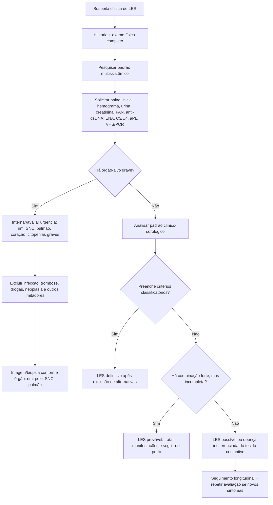

# UPDOWN #001 — Lúpus Eritematoso Sistêmico em Adultos
## Manifestações clínicas e diagnóstico — versão didática, autoral e publicável em Markdown

> **Objetivo do UpDown:** transformar material médico de referência em um conteúdo **original**, didático, memorizável e pronto para estudo/HTML público, sem reprodução literal do texto-fonte.

> **Aviso educacional:** material para estudo médico e apoio à organização do raciocínio. Não substitui julgamento clínico, protocolos institucionais, avaliação especializada ou discussão multiprofissional.

---

# 1. Ideia central 🧠

O **lúpus eritematoso sistêmico (LES)** é uma doença autoimune sistêmica, crônica, heterogênea e potencialmente multiorgânica. Ele pode se apresentar como algo aparentemente benigno — fadiga, artralgia, rash — ou como doença ameaçadora à vida — nefrite proliferativa, hemorragia alveolar, neuropsiquiátrico grave, citopenias graves, miocardite ou trombose associada a anticorpos antifosfolipídios.

A grande dificuldade diagnóstica é que **não existe um achado único patognomônico**. O diagnóstico nasce da combinação de:

1. **Fenótipo clínico compatível**
2. **Autoimunidade documentada**
3. **Evidência de envolvimento orgânico** quando presente
4. **Exclusão inteligente dos imitadores**
5. **Acompanhamento longitudinal**, pois o LES pode “aparecer em capítulos”

---

# 2. Frase-memória 🧩

## “LES é uma doença de padrão, não de peça única.”

Um FAN positivo isolado não fecha LES.  
Uma artralgia isolada não fecha LES.  
Uma citopenia isolada não fecha LES.  
Mas **rash fotossensível + artrite inflamatória + leucopenia + proteinúria + anti-dsDNA + C3/C4 baixos** muda completamente o jogo.

---

# 3. Quando suspeitar de LES? 🔎

Suspeite quando houver uma combinação de manifestações em **pele, articulações, sangue, rim, serosas, sistema nervoso, pulmão ou vasos**, especialmente em mulher jovem ou paciente de grupo epidemiológico de maior risco.

## Sinais que devem acender a luz amarela

| Domínio | Achados sugestivos |
|---|---|
| Constitucional | fadiga intensa, febre sem foco, perda ponderal |
| Pele/mucosa | rash malar, fotossensibilidade, lesões discoides, alopecia não cicatricial, úlceras orais/nasais indolores |
| Articular | artralgia/artrite simétrica, migratória, geralmente não erosiva |
| Renal | proteinúria, hematúria glomerular, cilindros, queda de TFG, hipertensão nova |
| Hematológico | leucopenia/linfopenia, trombocitopenia, anemia hemolítica autoimune |
| Serosas | pleurite, derrame pleural, pericardite, derrame pericárdico |
| Neurológico | convulsão, psicose, delirium, AVC, neuropatias, mielite |
| Vascular | Raynaud, vasculite cutânea, trombose venosa/arterial, livedo |
| Pulmonar | pleurite, pneumonite, doença intersticial, hipertensão pulmonar, hemorragia alveolar |
| Cardíaco | pericardite, miocardite, doença valvar tipo Libman-Sacks, DAC precoce |

---

# 4. LES tipo “inflamatório” versus LES tipo “sintomático” 🧬

Uma forma útil de pensar o LES é separar dois grandes grupos de manifestações:

## LES tipo 1 — inflamação/autoimunidade/dano orgânico

Mais relacionado à atividade imunológica objetiva.

Exemplos:
- nefrite lúpica;
- artrite inflamatória;
- rash cutâneo ativo;
- serosite;
- citopenias autoimunes;
- complemento baixo e anti-dsDNA alto em contexto compatível.

## LES tipo 2 — sintomas de alta carga, nem sempre inflamatórios

Nem sempre acompanha marcador sorológico de atividade e pode responder menos à imunossupressão.

Exemplos:
- fadiga crônica;
- dor difusa;
- distúrbio do sono;
- humor deprimido/ansiedade;
- fibromialgia associada;
- queixas cognitivas não inflamatórias.

### Pegadinha clínica ⚠️

Aumentar corticoide para toda fadiga em LES pode ser erro. Antes, pense em: sono, depressão, fibromialgia, anemia, hipotireoidismo, infecção, efeito medicamentoso, sedentarismo, atividade renal/hematológica oculta.

---

# 5. Manifestações clínicas por sistema 🫀🫁🧠🧫

## 5.1 Sintomas constitucionais

### Fadiga

É uma das queixas mais comuns e pode ser incapacitante. Porém, nem sempre traduz atividade inflamatória. Avaliar:

- anemia;
- doença renal;
- hipotireoidismo;
- depressão;
- distúrbio do sono;
- fibromialgia;
- medicações;
- infecção subaguda;
- atividade lúpica sistêmica.

### Febre

No LES, febre pode ser doença ativa, mas **infecção deve ser excluída com rigor**, especialmente em paciente usando corticoide, imunossupressor, biológico, ou com nefrite.

#### Dica prática

- Febre + leucopenia + C3/C4 baixos + anti-dsDNA em ascensão + sem foco infeccioso → favorece atividade lúpica.
- Febre + corticoide moderado/alto + prostração + PCR muito elevada + foco clínico/radiológico → trate como infecção até prova em contrário.

---

## 5.2 Articulações e músculos

Artralgia e artrite são muito frequentes e podem ser manifestações iniciais.

### Padrão clássico da artrite lúpica

- poliarticular;
- simétrica;
- migratória;
- mãos, punhos e joelhos são comuns;
- geralmente não erosiva;
- deformidades, quando presentes, costumam ser redutíveis.

## LES versus artrite reumatoide

| Característica | LES | Artrite reumatoide |
|---|---|---|
| Erosão radiográfica | rara | comum |
| Deformidade | pode ocorrer, geralmente redutível | geralmente fixa se avançada |
| Rigidez matinal | pode ocorrer | frequentemente mais prolongada |
| Anti-CCP | geralmente negativo, mas pode ocorrer em minoria | muito sugestivo quando positivo em contexto compatível |
| FR | pode positivar | comum |
| Nódulos | incomuns | mais típicos em doença soropositiva |

### Rhupus

Termo usado quando há sobreposição LES + artrite reumatoide, especialmente quando existe artrite erosiva com autoanticorpos compatíveis com AR.

---

## 5.3 Pele e mucosas

A pele frequentemente dá pistas muito valiosas.

### Lesões importantes

| Lesão | Como pensar |
|---|---|
| Rash malar | eritema em região malar, tende a poupar sulco nasolabial, frequentemente fotossensível |
| Lúpus cutâneo agudo | rash malar ou erupção maculopapular difusa relacionada à atividade sistêmica |
| Lúpus cutâneo subagudo | lesões anulares ou psoriasiformes, fotodistribuídas |
| Lúpus discoide | placas bem delimitadas, descamativas, podem cicatrizar e causar alteração pigmentar |
| Úlceras orais/nasais | frequentemente indolores |
| Alopecia não cicatricial | queda difusa ou fragilidade capilar; pode acompanhar atividade |

### Pegadinha dermatológica

Dermatomiosite pode simular rash fotossensível. Procure pápulas de Gottron, heliotropo, fraqueza proximal objetiva e enzimas musculares elevadas.

---

## 5.4 Rim — o órgão que muda prognóstico

A **nefrite lúpica** pode ser silenciosa no início. Por isso, todo paciente com LES ou suspeita forte precisa de rastreio renal periódico.

### Avaliação renal mínima

- creatinina e estimativa de TFG;
- urina tipo 1 com sedimento;
- relação proteína/creatinina urinária;
- pressão arterial;
- albumina sérica se proteinúria relevante;
- complemento C3/C4;
- anti-dsDNA;
- considerar biópsia renal se critérios clínicos/laboratoriais sugerirem nefrite significativa.

### Sinais de alerta renal 🚨

- proteinúria persistente;
- hematúria glomerular;
- cilindros hemáticos/celulares;
- queda de TFG;
- hipertensão nova;
- síndrome nefrótica;
- glomerulonefrite rapidamente progressiva.

---

## 5.5 Pulmão

Manifestações pulmonares podem ser inflamatórias, trombóticas, infecciosas ou medicamentosas.

### Principais apresentações

- pleurite;
- derrame pleural;
- pneumonite lúpica;
- doença pulmonar intersticial;
- hipertensão pulmonar;
- síndrome do pulmão encolhido;
- hemorragia alveolar difusa;
- tromboembolismo pulmonar, especialmente com anticorpos antifosfolipídios.

### UTI pearl 🫁

LES + queda de Hb + infiltrado pulmonar difuso + hipoxemia → pense em **hemorragia alveolar difusa**, mas investigue agressivamente infecção e edema pulmonar.

---

## 5.6 Coração e vasos

### Coração

- pericardite é a manifestação cardíaca mais comum;
- miocardite é menos comum, mas potencialmente grave;
- endocardite de Libman-Sacks pode gerar embolização e disfunção valvar;
- LES aumenta risco cardiovascular precoce.

### Vasos

- Raynaud é comum;
- vasculite cutânea pode aparecer como púrpura palpável, petéquias, livedo, úlceras ou lesões nodulares;
- trombose venosa ou arterial deve levantar suspeita de síndrome antifosfolipídica associada.

---

## 5.7 Neuropsiquiátrico

O LES neuropsiquiátrico é um dos campos mais difíceis porque há muitos imitadores.

### Possíveis manifestações

- convulsões;
- psicose;
- delirium;
- disfunção cognitiva;
- AVC;
- neuropatia periférica;
- neuropatias cranianas;
- mielite;
- meningite asséptica;
- distúrbios do movimento.

### Regra de ouro 🧠

Antes de chamar de neuro-lúpus, excluir:

- infecção do SNC;
- distúrbio metabólico;
- efeito de corticoide/medicações;
- trombose/SAF;
- hipertensão grave/PRES;
- uremia;
- sepse;
- doença psiquiátrica primária.

---

## 5.8 Hematológico

### Achados comuns

- anemia da inflamação;
- leucopenia, especialmente linfopenia;
- trombocitopenia leve;
- anemia hemolítica autoimune;
- linfadenopatia e esplenomegalia em atividade.

### Situações de gravidade

- plaquetopenia grave com sangramento;
- anemia hemolítica autoimune importante;
- pancitopenia;
- suspeita de síndrome hemofagocítica;
- microangiopatia trombótica, especialmente se houver anemia hemolítica microangiopática, plaquetopenia, lesão renal e sintomas neurológicos.

---

## 5.9 Gastrointestinal

Muitos sintomas gastrointestinais em pacientes com LES vêm de medicações ou infecções. Porém, o LES também pode causar:

- esofagite;
- pseudo-obstrução intestinal;
- enteropatia perdedora de proteínas;
- hepatite associada ao LES;
- pancreatite;
- peritonite;
- vasculite/isquemia mesentérica.

### Red flag abdominal 🚨

Dor abdominal intensa em LES ativo, especialmente com lactato, peritonismo, sangramento ou instabilidade → pensar em vasculite/isquemia mesentérica e não banalizar como “gastrite do corticoide”.

---

## 5.10 Olhos

Pode haver:

- ceratoconjuntivite seca por Sjögren secundário;
- vasculopatia retiniana;
- neuropatia óptica;
- esclerite/episclerite;
- uveíte;
- toxicidade ocular por antimaláricos;
- glaucoma/catarata relacionados a corticoide.

---

# 6. Exames laboratoriais iniciais 🧪

## Painel inicial sugerido na suspeita de LES

| Grupo | Exames |
|---|---|
| Hematológico | hemograma completo com diferencial, reticulócitos se anemia |
| Renal | creatinina, ureia, eletrólitos, urina tipo 1, sedimento, relação proteína/creatinina |
| Hepático/metabólico | TGO/TGP, FA, GGT, bilirrubinas, albumina |
| Inflamação | VHS, PCR |
| Músculo | CK se mialgia importante ou fraqueza objetiva |
| Autoimunidade básica | FAN por imunofluorescência indireta em HEp-2 quando possível |
| Autoanticorpos específicos | anti-dsDNA, anti-Sm, anti-Ro/SSA, anti-La/SSB, anti-U1-RNP |
| Complemento | C3, C4, CH50 se disponível |
| Antifosfolipídios | anticoagulante lúpico, anticardiolipina IgG/IgM, anti-beta2GPI IgG/IgM |
| Diferenciais | TSH, anti-TPO/antitireoglobulina, sorologias conforme contexto |

---

# 7. Como interpretar o FAN? 🧫

## FAN positivo não é diagnóstico de LES

FAN pode aparecer em pessoas saudáveis, idosos, infecções, outras doenças autoimunes e até em alguns contextos medicamentosos.

## FAN negativo reduz muito a probabilidade, mas não zera

LES com FAN negativo é raro, mas pode ocorrer por:

- método menos sensível;
- ensaio de fase sólida com painel limitado;
- anti-Ro/SSA isolado;
- doença antiga ou já tratada;
- limitações técnicas do substrato usado no teste.

### Conduta prática

- Suspeita baixa + FAN negativo por bom método → LES improvável.
- Suspeita alta + FAN negativo em ensaio de fase sólida → repetir por imunofluorescência indireta HEp-2.
- Suspeita alta + FAN negativo mesmo por IFI → pedir ENA, anti-dsDNA, complemento e investigar órgão-alvo.

---

# 8. Autoanticorpos — como usar sem se perder 🧭

| Autoanticorpo | Utilidade prática |
|---|---|
| FAN | muito sensível, pouco específico |
| anti-dsDNA | mais específico; pode acompanhar atividade, especialmente renal |
| anti-Sm | muito específico, pouco sensível |
| anti-Ro/SSA | LES, Sjögren, lúpus cutâneo subagudo, lúpus neonatal; pode aparecer em FAN negativo |
| anti-La/SSB | mais associado a Sjögren, pode coexistir no LES |
| anti-U1-RNP | pensar em sobreposição/DMTC se título alto e fenótipo compatível |
| antifosfolipídios | risco trombótico/obstétrico; avaliar SAF |

---

# 9. Critérios EULAR/ACR 2019 — forma prática 🧮

## Etapa 1 — critério de entrada

Para classificação EULAR/ACR 2019, é necessário FAN positivo em título compatível ou teste equivalente em algum momento.

## Etapa 2 — pontuar domínios

Somam-se critérios clínicos e imunológicos. Dentro de um mesmo domínio, conta-se apenas o item de maior peso.

## Etapa 3 — ponto de corte

Pontuação total **≥10** + pelo menos um critério clínico classifica LES.

### Pontuações de alto impacto

- nefrite classe III/IV em biópsia: peso muito alto;
- anti-dsDNA ou anti-Sm: peso relevante;
- lúpus cutâneo agudo, artrite, pericardite, convulsão e serosite pesam bastante;
- complemento baixo e antifosfolipídios ajudam na composição do quadro.

### Cuidado

Critérios de classificação ajudam, mas não substituem raciocínio clínico. Foram feitos para pesquisa e padronização, não para funcionar como “botão diagnóstico automático”.

---

# 10. Diagnóstico: definitivo, provável, possível 🧠

## LES definitivo

Após excluir explicações alternativas, considerar LES definitivo quando o paciente preenche critérios classificatórios robustos, como:

- ACR histórico;
- SLICC;
- EULAR/ACR 2019.

## LES provável

Paciente ainda não fecha critérios, mas tem combinação forte, por exemplo:

- 2–3 critérios clássicos;
- mais uma manifestação compatível não específica, como Raynaud, pneumonite, miocardite, hematúria glomerular, meningite asséptica, vasculite abdominal ou marcadores inflamatórios elevados.

## LES possível

Poucos elementos, mas existe sinalização autoimune. Exige seguimento, repetição dirigida de exames e vigilância para evolução.

## Doença indiferenciada do tecido conjuntivo

Usar quando há sintomas e autoimunidade sugerindo doença sistêmica, mas sem critérios suficientes para LES ou outra conectivopatia definida.

---

# 11. Diagnóstico diferencial — os grandes imitadores 🕵️

| Imitador | Pistas contra LES / a favor do imitador |
|---|---|
| Artrite reumatoide | anti-CCP alto, erosões, rigidez prolongada, artrite persistente típica |
| DMTC | anti-U1-RNP alto, Raynaud intenso, mãos edemaciadas, sobreposição com esclerose/miosite |
| Esclerose sistêmica | esclerodactilia, telangiectasias, calcinose, crise renal esclerodérmica, anti-Scl70/centrômero |
| Sjögren | xerostomia/xeroftalmia objetivas, biópsia salivar típica, anti-Ro/La predominante |
| Vasculites ANCA | acometimento renal/pulmonar, neuropatia, ANCA positivo, FAN geralmente ausente ou não dominante |
| Behçet | aftas dolorosas recorrentes, úlcera genital, uveíte, trombose/vasculite de padrão próprio |
| Dermatomiosite/polimiosite | fraqueza proximal objetiva, CK alta, Gottron/heliotropo, anticorpos de miosite |
| Still adulto | febre quotidiana, rash evanescente, ferritina muito alta, leucocitose, FAN negativo |
| Infecções virais | EBV, CMV, parvovírus B19, HIV, hepatites podem simular LES |
| Neoplasias hematológicas | citopenias, linfonodos, LDH, esplenomegalia, sintomas B, alterações clonais |
| PTT/microangiopatia | esquizócitos, plaquetopenia, lesão renal, neuro flutuante, ADAMTS13 baixo em PTT imune |
| Fibromialgia | dor difusa/fadiga sem inflamação objetiva, sem órgão-alvo, exames sem padrão lúpico |

---

# 12. Fluxograma diagnóstico em Markdown/Mermaid 🔁



---

# 13. Checklist de consulta inicial 📝

## História dirigida

- Febre? Perda de peso? Fadiga incapacitante?
- Rash após sol? Lesão malar? Lesões discoides?
- Úlceras orais/nasais indolores?
- Queda de cabelo?
- Dor/inchaço articular? Rigidez matinal?
- Dor torácica pleurítica? Dispneia?
- Sintomas neurológicos: convulsão, psicose, confusão, déficit focal?
- Edema, urina espumosa, hipertensão?
- Trombose prévia? Abortos recorrentes?
- Raynaud?
- Uso de drogas associadas a lúpus induzido?
- História familiar de autoimunidade?

## Exame físico dirigido

- pele fotoexposta;
- couro cabeludo;
- mucosa oral/nasal;
- articulações periféricas;
- ausculta cardíaca/pulmonar;
- edema/PA;
- linfonodos/baço;
- exame neurológico se sintomas.

---

# 14. Checklist de UTI/enfermaria — LES grave 🚨

## Perguntas que mudam conduta nas primeiras horas

1. É LES ativo, infecção, trombose ou tudo junto?
2. Há nefrite rapidamente progressiva?
3. Há hemorragia alveolar?
4. Há neuro-lúpus ou evento trombótico/SAF?
5. Há citopenia imune grave ou microangiopatia?
6. O paciente está em uso de corticoide/imunossupressor?
7. Precisa de biópsia renal/pele ou imagem urgente?
8. Precisa de pulsoterapia, plasmaférese, ciclofosfamida, rituximabe ou anticoagulação?
9. Há contraindicação infecciosa para intensificar imunossupressão?
10. Reumatologia/Nefrologia/Hematologia/UTI já foram acionadas?

---

# 15. “LES ativo ou infecção?” — abordagem rápida 🦠🔥

| Elemento | Favorece LES ativo | Favorece infecção |
|---|---|---|
| Leucócitos | leucopenia/linfopenia | leucocitose pode ocorrer, mas imunossuprimido pode não elevar |
| Complemento | C3/C4 baixos | pode estar normal ou alterado por outras razões |
| anti-dsDNA | elevação pode sugerir atividade | não explica infecção isoladamente |
| PCR | pode subir pouco/moderado | elevação importante sugere infecção, mas não é absoluto |
| Foco | serosite/rash/nefrite/citopenia | foco respiratório, urinário, pele, cateter, abdominal |
| Resposta | pode melhorar com anti-inflamatório/corticoide | febre persistente apesar de corticoide é preocupante |
| Risco | atividade lúpica conhecida | corticoide alto, imunossupressor, nefrite, internação |

### Regra de segurança

No paciente imunossuprimido febril, **não atribuir febre ao LES antes de procurar infecção de forma ativa**.

---

# 16. Memory Cards 🧠✨

## Card 1
**Pergunta:** FAN positivo fecha LES?  
**Resposta:** Não. FAN é sensível, mas pouco específico. Deve ser interpretado no contexto clínico.

## Card 2
**Pergunta:** Quais anticorpos são mais específicos para LES?  
**Resposta:** Anti-Sm e anti-dsDNA, especialmente em títulos/moderados altos e contexto compatível.

## Card 3
**Pergunta:** Artrite lúpica costuma ser erosiva?  
**Resposta:** Não. Em geral é não erosiva; erosão sugere AR, rhupus ou outro diagnóstico.

## Card 4
**Pergunta:** Qual órgão exige rastreio periódico mesmo sem sintomas?  
**Resposta:** Rim. Nefrite lúpica pode ser silenciosa.

## Card 5
**Pergunta:** LES com febre em uso de corticoide alto: qual prioridade?  
**Resposta:** Excluir infecção de forma agressiva.

## Card 6
**Pergunta:** Critério de entrada do EULAR/ACR 2019?  
**Resposta:** FAN positivo em título compatível ou teste equivalente em algum momento.

## Card 7
**Pergunta:** Pontuação mínima EULAR/ACR 2019 para classificar LES?  
**Resposta:** ≥10 pontos, com pelo menos um critério clínico.

## Card 8
**Pergunta:** Anti-Ro/SSA isolado pode aparecer em que situação peculiar?  
**Resposta:** LES com FAN negativo por limitações metodológicas; também Sjögren e lúpus cutâneo subagudo.

## Card 9
**Pergunta:** Dor difusa e fadiga em LES sempre indicam atividade inflamatória?  
**Resposta:** Não. Considerar fibromialgia, sono, humor, anemia, tireoide e outros fatores.

## Card 10
**Pergunta:** Trombose em paciente com LES deve lembrar o quê?  
**Resposta:** Síndrome antifosfolipídica associada.

---

# 17. Questões estilo prova/TEMI/R3 🏆

## Questão 1

Mulher de 28 anos com artrite de mãos, rash malar fotossensível, leucopenia, proteinúria de 1,2 g/dia, C3/C4 baixos e anti-dsDNA positivo. Qual é o próximo ponto crítico da avaliação?

A. Diagnosticar fibromialgia e evitar investigação renal  
B. Solicitar apenas fator reumatoide  
C. Avaliar nefrite lúpica e considerar biópsia renal conforme contexto  
D. Descartar LES porque artrite lúpica não acomete mãos  
E. Iniciar antibiótico empírico obrigatório sem investigação adicional

**Resposta:** C.  
**Comentário:** Proteinúria significativa em contexto lúpico exige avaliação renal estruturada e, frequentemente, biópsia para definir classe, atividade, cronicidade e tratamento.

---

## Questão 2

Paciente com LES em prednisona alta apresenta febre persistente. Qual é a postura mais segura?

A. Considerar febre lúpica automaticamente  
B. Excluir infecção de forma ativa antes de atribuir à atividade do LES  
C. Suspender toda investigação porque PCR não ajuda  
D. Diagnosticar Still adulto imediatamente  
E. Aumentar imunossupressão sem culturas ou imagem

**Resposta:** B.  
**Comentário:** Imunossupressão aumenta risco de infecção grave. Febre em LES não deve ser atribuída à atividade sem investigação adequada.

---

## Questão 3

Qual achado favorece artrite reumatoide em vez de artrite lúpica clássica?

A. Artralgia  
B. Simetria  
C. Rigidez matinal  
D. Erosões radiográficas e anti-CCP positivo  
E. FAN positivo

**Resposta:** D.  
**Comentário:** LES pode ter artrite simétrica e FAN positivo. Erosões e anti-CCP alto apontam mais para AR ou sobreposição tipo rhupus.

---

## Questão 4

No EULAR/ACR 2019, qual é o papel do FAN?

A. Critério dispensável  
B. Critério de entrada para classificação  
C. Critério que sozinho fecha LES  
D. Critério exclusivo de atividade renal  
E. Exame sem utilidade clínica

**Resposta:** B.  
**Comentário:** Para classificação EULAR/ACR, FAN positivo em algum momento é porta de entrada, mas não basta isoladamente.

---

## Questão 5

Paciente com LES apresenta dispneia aguda, hipoxemia, infiltrado alveolar bilateral e queda abrupta de hemoglobina. Qual complicação deve entrar imediatamente no diagnóstico diferencial?

A. Síndrome do pulmão encolhido apenas  
B. Hemorragia alveolar difusa  
C. Fibromialgia pulmonar  
D. Artrite lúpica torácica  
E. Rash malar pulmonar

**Resposta:** B.  
**Comentário:** LES + hipoxemia + infiltrado difuso + queda de Hb é combinação clássica de alerta para hemorragia alveolar difusa. Infecção, edema pulmonar e TEP também precisam ser avaliados.

---

## Questão 6

Qual combinação sorológica é mais sugestiva de LES ativo com possível envolvimento renal?

A. Anti-CCP alto isolado e C3/C4 normais  
B. FAN negativo em todos os métodos e complemento normal  
C. Anti-dsDNA elevado associado a C3/C4 baixos em paciente com proteinúria  
D. FR baixo isolado sem sintomas  
E. Anti-Scl70 positivo isolado com esclerodactilia

**Resposta:** C.  
**Comentário:** Anti-dsDNA elevado, consumo de complemento e proteinúria formam um padrão altamente sugestivo de atividade lúpica renal.

---

## Questão 7

Homem de 35 anos com aftas orais dolorosas recorrentes, úlceras genitais, uveíte e FAN negativo. Qual diagnóstico diferencial deve ser lembrado antes de rotular como LES?

A. Síndrome de Behçet  
B. Síndrome nefrótica pura  
C. Osteoartrite  
D. Febre familiar do Mediterrâneo obrigatória  
E. Doença de Alzheimer precoce

**Resposta:** A.  
**Comentário:** Behçet cursa com aftas geralmente dolorosas, úlceras genitais, doença ocular inflamatória e vasculite/trombose, podendo simular LES em alguns aspectos.

---

## Questão 8

Em paciente com suspeita de LES e FAN negativo por ensaio de fase sólida, mas alta suspeita clínica, qual é uma próxima etapa razoável?

A. Encerrar investigação definitivamente  
B. Repetir FAN por imunofluorescência indireta em HEp-2 e ampliar autoanticorpos conforme contexto  
C. Diagnosticar artrite reumatoide automaticamente  
D. Solicitar apenas ácido úrico  
E. Usar anti-CCP como critério de entrada para LES

**Resposta:** B.  
**Comentário:** Ensaios de fase sólida podem ser menos sensíveis para alguns perfis. Em alta suspeita, repetir por IFI HEp-2 e avaliar ENA/anti-dsDNA pode ser necessário.

---

## Questão 9

Paciente com LES refere fadiga intensa, dor difusa, sono não reparador, humor deprimido, exames sem evidência de atividade orgânica e complemento estável. Qual interpretação é mais adequada?

A. Sempre é nefrite oculta grave  
B. Sempre indica necessidade de pulsoterapia  
C. Pode representar manifestação tipo 2/fibromialgia associada, exigindo abordagem não apenas imunossupressora  
D. Exclui definitivamente LES  
E. Indica anticoagulação plena

**Resposta:** C.  
**Comentário:** Fadiga e dor difusa podem não refletir inflamação ativa. Sono, humor, fibromialgia, anemia, tireoide e medicamentos devem ser avaliados.

---

## Questão 10

Paciente com LES apresenta trombose venosa profunda não provocada e história de perda gestacional recorrente. Qual investigação é essencial?

A. Apenas FAN seriado mensal  
B. Anticorpos antifosfolipídios: anticoagulante lúpico, anticardiolipina e anti-beta2 glicoproteína I  
C. Anti-Jo1 como exame principal  
D. Teste ergométrico como primeira linha  
E. Dosagem isolada de ferritina

**Resposta:** B.  
**Comentário:** Trombose e morbidade obstétrica em LES exigem investigação de síndrome antifosfolipídica associada.

---

# 18. Resumo de bolso 📌

## LES em 10 linhas

1. LES é uma doença autoimune sistêmica e heterogênea.
2. O diagnóstico é clínico-laboratorial e exige exclusão de imitadores.
3. FAN é sensível, mas não específico.
4. Anti-dsDNA e anti-Sm fortalecem muito a hipótese.
5. C3/C4 baixos ajudam a reconhecer atividade, especialmente renal.
6. Artrite e pele são apresentações comuns.
7. Rim deve ser rastreado mesmo sem sintomas.
8. Febre em LES imunossuprimido é infecção até prova em contrário.
9. Trombose sugere avaliar anticorpos antifosfolipídios/SAF.
10. Critérios classificatórios ajudam, mas não substituem julgamento clínico.

---

# 19. Sugestões de imagens para gerar no projeto 🎨

## Pacote visual recomendado para o UPDOWN #001

| Nº | Imagem | Formato | Objetivo didático | Prompt-base resumido |
|---|---|---|---|---|
| 1 | LES em 10 sinais de alerta | 1080×1920 | Card de triagem rápida para plantão/ambulatório | “Infográfico vertical médico, lúpus sistêmico, 10 sinais de alerta, ícones de pele, rim, articulação, sangue, pulmão, SNC, vasos, estilo limpo, português” |
| 2 | Suspeita de LES: da clínica ao diagnóstico | 16:9 | Fluxograma para aula e Enciclomedia | “Fluxograma horizontal: suspeita clínica → exames → excluir diferenciais → critérios → LES definitivo/provável/possível” |
| 3 | FAN positivo não é diagnóstico | 1080×1080 | Evitar erro comum em prova e prática | “Card quadrado: FAN positivo ≠ LES; interpretar com clínica, autoanticorpos e órgão-alvo” |
| 4 | LES ativo versus infecção | 1080×1920 | Checklist de segurança na UTI | “Tabela visual comparando LES ativo e infecção: leucócitos, PCR, complemento, anti-dsDNA, foco, imunossupressão” |
| 5 | Mapa sistêmico do LES | 16:9 | Visão panorâmica por órgãos | “Mapa mental do LES por sistemas: pele, articulação, rim, sangue, serosas, pulmão, coração, SNC, vasos” |
| 6 | Autoanticorpos no LES | 1080×1920 | Memorização laboratorial | “Infográfico vertical: FAN, anti-dsDNA, anti-Sm, anti-Ro, anti-La, anti-RNP, antifosfolipídios; significado clínico” |
| 7 | Nefrite lúpica: rastreio silencioso | 1080×1920 | Card de ambulatório/enfermaria | “Card médico: proteinúria, hematúria, cilindros, creatinina, PA, C3/C4, anti-dsDNA, indicação de biópsia” |
| 8 | Hemorragia alveolar no LES | 1080×1920 | Alerta UTI | “Card de emergência: LES + hipoxemia + infiltrado bilateral + queda de Hb = pensar em hemorragia alveolar” |
| 9 | LES versus AR versus DMTC | 16:9 | Diagnóstico diferencial de prova | “Tabela comparativa visual: LES, artrite reumatoide, doença mista do tecido conjuntivo; anti-CCP, erosões, anti-RNP, Raynaud, rim” |
| 10 | Critérios EULAR/ACR 2019 simplificados | 1080×1920 | Revisão de classificação | “Infográfico vertical: FAN como entrada, domínios clínicos e imunológicos, ≥10 pontos, pelo menos 1 critério clínico” |
| 11 | Febre no LES imunossuprimido | 1080×1920 | Segurança clínica | “Algoritmo visual: febre em LES usando corticoide → procurar infecção → culturas/imagem → avaliar atividade lúpica” |
| 12 | LES grave na UTI — 5 ameaças | 16:9 | Aula/plantão | “Infográfico: nefrite rapidamente progressiva, hemorragia alveolar, neuro-lúpus, citopenia grave, SAF/trombose” |

---

# 20. Bloco Antigravity — instruções para exportação do módulo 🧰

## Estrutura de pasta recomendada

```text
UPDOWN_001_LES_Manifestacoes_Diagnostico/
├── README.md
├── index.md
├── updown_001_les_manifestacoes_diagnostico.md
├── questoes_temi_r3_les.md
├── flashcards_les.md
├── sugestoes_imagens_les.md
├── fluxograma_mermaid_les.md
├── antigravity_instructions.md
└── metadata.json
```

## Como adicionar ao projeto Enciclomedia/Antigravity

1. Copie a pasta **UPDOWN_001_LES_Manifestacoes_Diagnostico** para o diretório de conteúdo médico do projeto.
2. Use o arquivo **index.md** como página inicial do módulo.
3. Use **metadata.json** para indexação, busca, tags e relação automática com temas correlatos.
4. Use **questoes_temi_r3_les.md** no banco de questões.
5. Use **flashcards_les.md** no sistema de revisão espaçada.
6. Use **sugestoes_imagens_les.md** como fila de geração de imagens.
7. Use **fluxograma_mermaid_les.md** para renderizar o algoritmo diagnóstico.

## Tags recomendadas

```yaml
tags:
  - updown
  - lupus
  - les
  - reumatologia
  - clinica-medica
  - medicina-intensiva
  - temi
  - r3
  - diagnostico
  - autoimunidade
  - nefrologia
  - uti
```

## Temas correlatos para linkagem automática

- Nefrite lúpica
- Síndrome antifosfolipídica
- Hemorragia alveolar difusa
- Neuro-lúpus
- Febre no imunossuprimido
- Artrite reumatoide
- Doença mista do tecido conjuntivo
- Vasculites ANCA
- Síndrome de Sjögren
- Lúpus induzido por drogas

---

# 21. Próximos UpDowns sugeridos 🔬

1. **Nefrite lúpica: diagnóstico, biópsia e classificação**
2. **LES na UTI: manifestações ameaçadoras à vida**
3. **Síndrome antifosfolipídica no LES**
4. **Hemorragia alveolar difusa no LES**
5. **Neuro-lúpus: abordagem prática**
6. **Tratamento geral do LES: hidroxicloroquina, corticoide e imunossupressores**
7. **LES e infecção: como diferenciar e manejar**
8. **Critérios EULAR/ACR 2019 em calculadora didática**

---

# 22. Prompt-padrão do projeto UpDown 🧰

```text
Transforme o material fornecido em um “UPDOWN”: uma versão autoral em Markdown, sem copiar trechos literais longos, com linguagem didática, conversacional, organizada para estudo médico e publicação em HTML. Estruture em: ideia central, quando suspeitar, fisiopatologia prática, manifestações clínicas, exames, diagnóstico, diferenciais, fluxogramas Mermaid, resumo de bolso, flashcards, questões comentadas, checklist de plantão, sugestões de imagens e próximos temas. Preserve a precisão científica, mas reescreva de forma original e memorizável.
```

---

## Fim do UPDOWN #001
