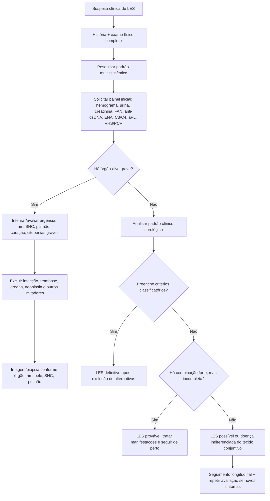

# 12. Fluxograma diagnóstico em Markdown/Mermaid 🔁

```mermaid
flowchart TD
A[Suspeita clínica de LES] --> B[História + exame físico completo]
B --> C[Pesquisar padrão multissistêmico]
C --> D[Solicitar painel inicial: hemograma, urina, creatinina, FAN, anti-dsDNA, ENA, C3/C4, aPL, VHS/PCR]
D --> E{Há órgão-alvo grave?}
E -- Sim --> F[Internar/avaliar urgência: rim, SNC, pulmão, coração, citopenias graves]
F --> G[Excluir infecção, trombose, drogas, neoplasia e outros imitadores]
G --> H[Imagem/biópsia conforme órgão: rim, pele, SNC, pulmão]
E -- Não --> I[Analisar padrão clínico-sorológico]
I --> J{Preenche critérios classificatórios?}
J -- Sim --> K[LES definitivo após exclusão de alternativas]
J -- Não --> L{Há combinação forte, mas incompleta?}
L -- Sim --> M[LES provável: tratar manifestações e seguir de perto]
L -- Não --> N[LES possível ou doença indiferenciada do tecido conjuntivo]
N --> O[Seguimento longitudinal + repetir avaliação se novos sintomas]
```
