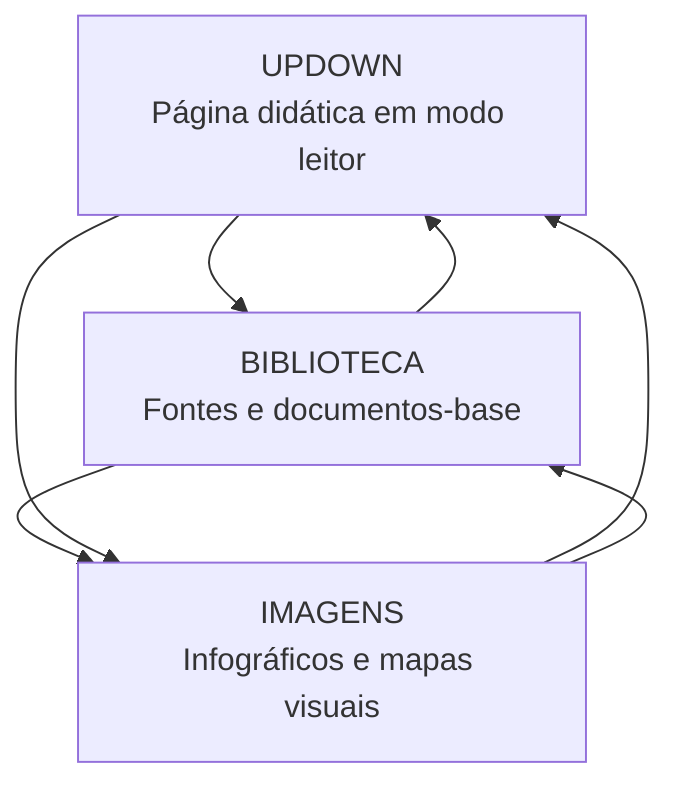

# Triângulo de conexão — UPDOWN ↔ Biblioteca ↔ Imagens

## Conceito

Cada conteúdo do projeto deve funcionar como um nó dentro de um triângulo:



---

# 1. UPDOWN

Página final para leitura pública.

## Deve conter

- introdução didática;
- tópicos clínicos;
- tabelas;
- fluxograma;
- resumo final objetivo;
- mnemônicos;
- flashcards;
- questões.

## Não deve conter

- prompts internos;
- instruções para IA;
- sugestões de imagem;
- notas privadas;
- bastidores de produção.

---

# 2. Biblioteca

Página que armazena ou lista materiais-base.

## Pode conter

- PDFs enviados;
- diretrizes;
- artigos;
- guidelines;
- links oficiais;
- notas de leitura;
- metadados;
- versão/data do material.

## Card sugerido

```markdown
### Biblioteca — LES manejo e prognóstico

- Fonte-base: UpToDate, revisão até abril/2026.
- Tema: manejo geral, monitoramento e prognóstico.
- Relacionados: nefrite lúpica, SAF, hidroxicloroquina, biológicos.
```

---

# 3. Imagens

Página visual derivada do UpDown.

## Pode conter

- wallpapers 1080×1920;
- fluxogramas 16:9;
- cards quadrados;
- mapas mentais;
- algoritmos de conduta;
- ilustrações anatômicas/didáticas.

---

# 4. Linkagem automática por metadados

```yaml
id: updown-002-les-manejo
titulo: LES em adultos — manejo e prognóstico
area:
  - reumatologia
  - clinica-medica
  - uti
tags:
  - les
  - lupus
  - hidroxicloroquina
  - corticoide
  - biologicos
biblioteca_id: biblioteca-les-manejo
imagens_id: imagens-les-manejo
apps_relacionados:
  - calculadora-drogas-vasoativas
  - mapa-fan
  - sepse-sofa-qsofa
```

---

# 5. Implementação visual sugerida

Na página de cada UpDown, inserir após o cabeçalho:

```markdown
[📚 Biblioteca do tema] [🖼️ Imagens relacionadas] [🧮 Aplicações extras]
```

Na biblioteca, inserir:

```markdown
[📖 Ler UpDown] [🖼️ Ver imagens]
```

Na galeria de imagens, inserir:

```markdown
[📖 Ler explicação] [📚 Ver fontes]
```
