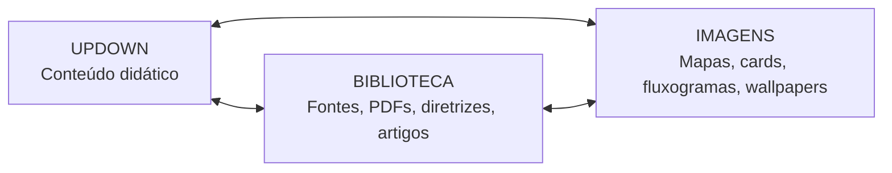

# Página principal UPDOWN — versão reorganizada

> Hub público para conteúdos médicos transformados em linguagem didática, original, rastreável e pronta para estudo.

---

# 1. Propósito do UpDown

O **UpDown** transforma materiais médicos extensos em páginas didáticas, autorais e organizadas para leitura rápida, revisão clínica e estudo longitudinal.

Cada módulo deve entregar:

- conteúdo em **modo leitor**;
- resumo objetivo;
- fluxograma;
- flashcards;
- questões;
- mnemônicos úteis;
- conexão com biblioteca;
- conexão com imagens/infográficos;
- relação com aplicações extras quando houver.

---

# 2. Triângulo de navegação



## Como o triângulo funciona

| Ponto | Função | Exemplo |
|---|---|---|
| **UPDOWN** | Página pública de leitura | LES — manejo e prognóstico |
| **BIBLIOTECA** | Materiais-base e fontes | PDF original, diretrizes, artigos, guidelines |
| **IMAGENS** | Material visual derivado | Fluxograma, mapa mental, card de bolso, wallpaper |

---

# 3. Estrutura visual sugerida da página

## Bloco 1 — Cabeçalho

```text
UPDOWN
Medicina Interna • UTI • Prova TEMI • Revisão rápida • Enciclomedia
```

Botões principais:

- **Abrir Biblioteca**
- **Abrir Galeria de Imagens**
- **Ver Aplicações Extras**
- **Banco de Questões**

## Bloco 2 — Navegação triangular

Cards lado a lado:

```text
[ UPDOWNS ]  [ BIBLIOTECA ]  [ IMAGENS ]
```

Cada card deve mostrar:

- descrição em 1 linha;
- botão de acesso;
- número de itens cadastrados;
- últimos adicionados.

## Bloco 3 — Módulos UpDown publicados

Cada módulo deve aparecer como card:

```markdown
## UPDOWN #002 — LES: manejo e prognóstico

**Área:** Reumatologia • Clínica Médica • UTI  
**Status:** publicado  
**Tempo de leitura:** 20–30 min  
**Tags:** LES, autoimunidade, hidroxicloroquina, corticoide, prognóstico

[Abrir modo leitor] [Biblioteca] [Imagens] [Questões]
```

## Bloco 4 — Aplicações extras

Manter as aplicações extras, mas com nomes claros e função prática.

| Aplicação | Função | Status |
|---|---|---|
| Calculadora de drogas vasoativas | mL/h, dose, concentração e prescrição padronizada | em revisão contínua |
| Mapa de FAN | interpretação de padrões e anticorpos | planejado |
| Delirium/CAM-ICU | rastreio estruturado de delirium na UTI | planejado |
| Sepse + SOFA/qSOFA | triagem, gravidade e bundle | planejado |
| Wells | probabilidade pré-teste para TEP/TVP | planejado |
| Glasgow | escala neurológica | planejado |
| SAPS 3 | gravidade e prognóstico UTI | planejado |
| Adrogué-Madias | previsão de variação do sódio | planejado |
| NaCl em mEq/mL | preparo de soluções salinas e cálculo de mEq | planejado |

---

# 4. O que deve sair da página pública

Remover da página principal:

- bloco genérico de templates;
- bloco de conexão com VM;
- links experimentais sem descrição clínica clara;
- prompts internos;
- instruções de produção;
- rascunhos ou notas para Antigravity.

Se necessário, mover para:

```text
/admin/lab-tecnico.html
```

---

# 5. Rotas sugeridas

```text
/updown/index.html
/biblioteca/index.html
/imagens/index.html
/apps/index.html
/apps/vasoativas/index.html
/apps/fan/index.html
/apps/sepse/index.html
/apps/delirium/index.html
```

---

# 6. Padrão de publicação por UpDown

```text
/updown/NNN-tema/index.html
/updown/NNN-tema/metadata.json
/updown/NNN-tema/flashcards.json
/updown/NNN-tema/questions.json
/imagens/NNN-tema/
/biblioteca/NNN-tema/
```

---

# 7. Regra de resumo dos UpDowns

- máximo de **20 tópicos**;
- máximo de **2 linhas por tópico**;
- mnemônicos após o resumo, em tabela;
- sem sugestões internas no documento público.

---

# 8. Texto curto para a página

> O UpDown transforma conhecimento médico complexo em páginas didáticas, originais e interconectadas com biblioteca, imagens e ferramentas úteis para plantão, UTI e preparação para provas.
