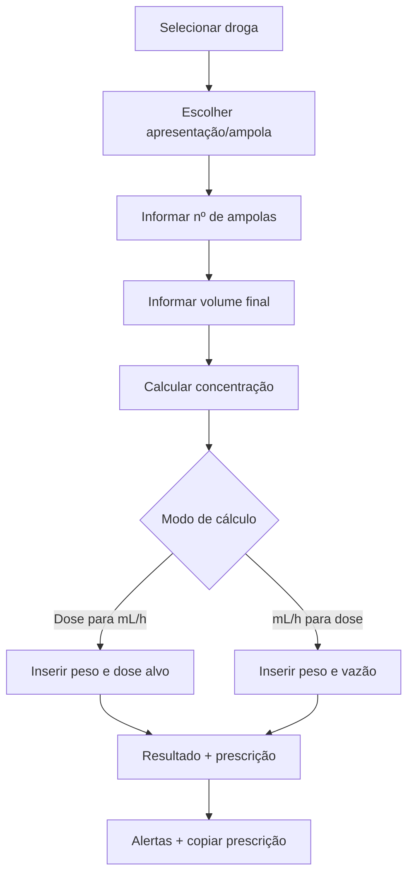

# Calculadora de drogas vasoativas v2 — especificação prática Brasil

> Documento para orientar a refatoração da calculadora no Antigravity.  
> Finalidade: deixar a ferramenta mais intuitiva, segura, prática e alinhada à realidade hospitalar brasileira.

---

# 1. Objetivo

A calculadora deve permitir:

1. selecionar a droga;
2. escolher apresentação comum no Brasil;
3. escolher número de ampolas;
4. definir volume final da solução;
5. calcular concentração final;
6. converter dose em mL/h;
7. converter mL/h em dose;
8. gerar prescrição formatada;
9. mostrar alertas de segurança.

---

# 2. Fluxo de uso ideal



---

# 3. Drogas prioritárias

| Droga | Unidade usual | Precisa de peso? | Observação |
|---|---:|---:|---|
| Noradrenalina/norepinefrina | mcg/kg/min | sim | cuidado com base versus sal |
| Adrenalina/epinefrina | mcg/kg/min | sim | modo contínuo; bolus de PCR/anafilaxia deve ser área separada |
| Dobutamina | mcg/kg/min | sim | inotrópico, concentração em mcg/mL |
| Dopamina | mcg/kg/min | sim | menos preferida em choque séptico moderno, mas ainda presente |
| Vasopressina | UI/min | não | dose fixa, sem peso |
| Nitroglicerina | mcg/min | não | vasodilatador, atenção a PVC |
| Nitroprussiato | mcg/kg/min | sim | proteger da luz, risco cianeto/tiocianato |
| Milrinona | mcg/kg/min | sim | cautela/ajuste em disfunção renal |

---

# 4. Apresentações comuns no Brasil

> Conferir sempre o estoque local, bula e padronização da instituição.

| Droga | Apresentação comum | Unidade para cálculo sugerida |
|---|---|---|
| Noradrenalina | hemitartarato 8 mg/4 mL, equivalente a norepinefrina base 4 mg/4 mL em muitas apresentações | usar base 4 mg/ampola como padrão seguro |
| Adrenalina | 1 mg/mL, ampola 1 mL | 1 mg/ampola |
| Dobutamina | 250 mg/20 mL | 250 mg/ampola |
| Dopamina | 50 mg/10 mL | 50 mg/ampola |
| Vasopressina | 20 UI/mL, ampola 1 mL | 20 UI/ampola |
| Nitroglicerina | 50 mg/10 mL, 5 mg/mL | 50 mg/ampola |
| Nitroprussiato | 50 mg frasco-ampola | 50 mg/frasco |
| Milrinona | 10 mg/10 mL, 1 mg/mL | 10 mg/ampola |

---

# 5. Presets de diluição

## 5.1 Noradrenalina — norepinefrina base

| Preset | Preparo | Concentração |
|---|---|---:|
| Diluída | 4 mg base em 250 mL | 16 mcg/mL |
| Intermediária | 8 mg base em 100 mL | 80 mcg/mL |
| Concentrada UTI | 16 mg base em 100 mL | 160 mcg/mL |
| Muito concentrada | 32 mg base em 100 mL | 320 mcg/mL |

### Prescrição modelo

```text
NORADRENALINA (norepinefrina base) __ mg em SG 5% ou SF 0,9% q.s.p. __ mL.
Concentração final: __ mcg/mL.
Iniciar a __ mcg/kg/min = __ mL/h em BIC.
Titular conforme PAM alvo e protocolo institucional.
Preferir CVC; se periférico, usar veia calibrosa, monitorar extravasamento e trocar para CVC o quanto antes.
```

### Alerta obrigatório

```text
Atenção: confirmar se a ampola do serviço expressa hemitartarato ou norepinefrina base. Muitas ampolas 8 mg/4 mL de hemitartarato equivalem a 4 mg/4 mL de norepinefrina base.
```

## 5.2 Adrenalina

| Preset | Preparo | Concentração |
|---|---|---:|
| Diluída | 4 mg em 100 mL | 40 mcg/mL |
| Intermediária | 10 mg em 100 mL | 100 mcg/mL |
| Concentrada | 20 mg em 100 mL | 200 mcg/mL |

## 5.3 Dobutamina

| Preset | Preparo | Concentração |
|---|---|---:|
| Usual | 250 mg em 250 mL | 1000 mcg/mL |
| Restrição hídrica | 250 mg em 100 mL | 2500 mcg/mL |
| Concentrada | 500 mg em 250 mL | 2000 mcg/mL |
| Seringa/BIC | 250 mg em 50 mL | 5000 mcg/mL |

## 5.4 Dopamina

| Preset | Preparo | Concentração |
|---|---|---:|
| Bula clássica | 50 mg em 250 mL | 200 mcg/mL |
| Usual UTI | 200 mg em 250 mL | 800 mcg/mL |
| Concentrada | 400 mg em 250 mL | 1600 mcg/mL |

## 5.5 Vasopressina

| Preset | Preparo | Concentração |
|---|---|---:|
| Diluída | 20 UI em 250 mL | 0,08 UI/mL |
| Usual | 20 UI em 100 mL | 0,2 UI/mL |
| Concentrada | 20 UI em 50 mL | 0,4 UI/mL |

## 5.6 Nitroglicerina

| Preset | Preparo | Concentração |
|---|---|---:|
| Usual | 50 mg em 250 mL | 200 mcg/mL |
| Máxima prática comum | 50 mg em 125 mL | 400 mcg/mL |
| Restrição hídrica — conferir protocolo | 50 mg em 100 mL | 500 mcg/mL |

## 5.7 Nitroprussiato de sódio

| Preset | Preparo | Concentração |
|---|---|---:|
| Usual | 50 mg em 250 mL SG 5% | 200 mcg/mL |
| Diluída | 50 mg em 500 mL SG 5% | 100 mcg/mL |
| Restrição hídrica | 50 mg em 125 mL SG 5% | 400 mcg/mL |

## 5.8 Milrinona

| Preset | Preparo | Concentração |
|---|---|---:|
| Usual | 10 mg em 100 mL | 100 mcg/mL |
| Concentrada | 20 mg em 100 mL | 200 mcg/mL |
| Seringa/BIC | 10 mg em 50 mL | 200 mcg/mL |

---

# 6. Interface ideal

## Campo 1 — Peso

```text
Peso: ____ kg
```

Mostrar alerta se peso vazio em droga dependente de peso.

## Campo 2 — Droga

Dropdown:

```text
Noradrenalina
Adrenalina
Dobutamina
Dopamina
Vasopressina
Nitroglicerina
Nitroprussiato
Milrinona
```

## Campo 3 — Apresentação

Deve atualizar automaticamente conforme droga.

Exemplo para noradrenalina:

```text
Hemitartarato 8 mg/4 mL = base 4 mg/4 mL
Outro valor manual
```

## Campo 4 — Preparo

```text
Nº de ampolas: __
Volume final: __ mL
```

## Campo 5 — Modo

```text
[ Dose → mL/h ]
[ mL/h → Dose ]
```

## Campo 6 — Prescrição

Botão:

```text
Copiar prescrição formatada
```

---

# 7. Validações

- impedir divisão por zero;
- exigir peso quando unidade for mcg/kg/min;
- exigir concentração calculada;
- alertar se mL/h > 100;
- alertar se mL/h < 0,1;
- alertar se dose fora da faixa usual;
- alertar em concentrações muito altas;
- na noradrenalina, confirmar base versus sal.

---

# 8. Saída compacta

```text
Droga: Noradrenalina
Preparo: 16 mg base em 100 mL
Concentração: 160 mcg/mL
Peso: 70 kg
Dose: 0,10 mcg/kg/min
Vazão: 2,6 mL/h
```

---

# 9. Saída em prescrição

```text
NORADRENALINA (norepinefrina base) 16 mg + SG 5% q.s.p. 100 mL.
Concentração: 160 mcg/mL.
Administrar em BIC a 2,6 mL/h, equivalente a 0,10 mcg/kg/min para 70 kg.
Titular conforme PAM alvo/protocolo institucional. Preferir CVC.
```

---

# 10. Aviso fixo

```text
Conferir apresentação da ampola, padronização institucional, compatibilidade, estabilidade, via, bomba de infusão e metas clínicas antes de prescrever. Ferramenta de apoio; não substitui julgamento clínico.
```
