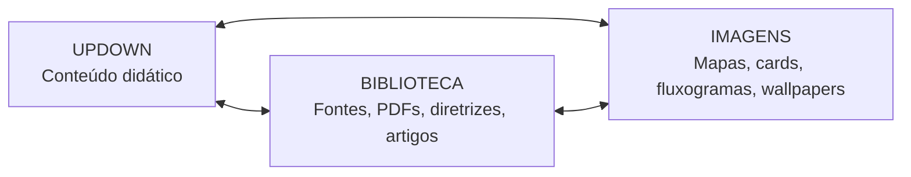
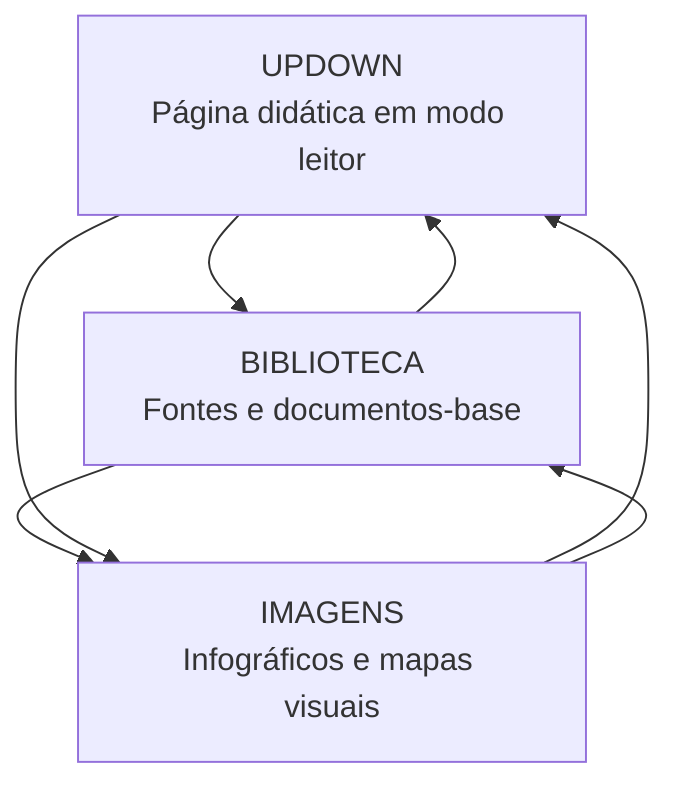
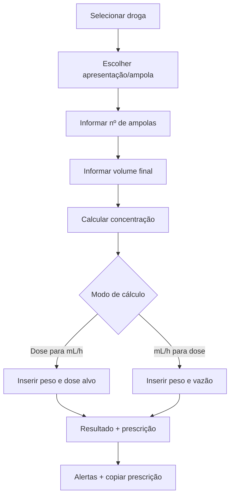

# UPDOWN HUB REDESIGN — pacote completo


---

# Arquivo: `README.md`

# UPDOWN HUB — Reorganização da página principal + aplicações extras

Este pacote foi preparado para ser inserido no repositório do projeto **Enciclomedia / UpDown**.

## Objetivo

Reorganizar a página de UpDown como um **hub médico em modo leitor**, com conexão direta entre:

```text
UPDOWN  ↔  BIBLIOTECA  ↔  IMAGENS
```

Cada artigo transformado em UpDown passa a ter três portas: **ler conteúdo didático**, **consultar biblioteca/fonte** e **ver ou gerar imagens relacionadas**.

## O que remover da página atual

Remover ou ocultar da página pública os blocos que não estão bem caracterizados:

- tópico genérico de **templates**;
- tópico de **conexão com VM**;
- qualquer bloco técnico solto sem relação clara com UpDown, Biblioteca, Imagens ou Aplicações Extras.

Esses itens podem ficar em área administrativa/privada, mas não devem competir com a navegação central.

## Estrutura do pacote

```text
01_pagina_updown/
├── updown_home_reorganizada.md
├── triangulo_updown_biblioteca_imagens.md
└── cards_modulos_updown.md

02_aplicacoes_extras/
├── hub_aplicacoes_extras.md
└── roadmap_calculadoras_uti.md

03_calculadoras/
├── calculadora_drogas_vasoativas_v2.md
├── especificacao_formula_mlh_dose.md
└── prescricoes_comuns_brasil_vasoativas.md

04_antigravity/
├── instrucoes_antigravity.md
├── checklist_implementacao.md
└── prompt_universal_refatoracao_updown.md

05_data/
└── vasoactive_drugs_brasil_presets.json
```

## Regra de ouro

A página pública deve ser limpa, prática e intuitiva. Bastidores, prompts, notas internas e sugestões de produção ficam em arquivos privados ou no chat.


---

# Arquivo: `01_pagina_updown/updown_home_reorganizada.md`

# Página principal UPDOWN — versão reorganizada

> Hub público para conteúdos médicos transformados em linguagem didática, original, rastreável e pronta para estudo.

---

# 1. Propósito do UpDown

O **UpDown** transforma materiais médicos extensos em páginas didáticas, autorais e organizadas para leitura rápida, revisão clínica e estudo longitudinal.

Cada módulo deve entregar:

- conteúdo em **modo leitor**;
- resumo objetivo;
- fluxograma;
- flashcards;
- questões;
- mnemônicos úteis;
- conexão com biblioteca;
- conexão com imagens/infográficos;
- relação com aplicações extras quando houver.

---

# 2. Triângulo de navegação



## Como o triângulo funciona

| Ponto | Função | Exemplo |
|---|---|---|
| **UPDOWN** | Página pública de leitura | LES — manejo e prognóstico |
| **BIBLIOTECA** | Materiais-base e fontes | PDF original, diretrizes, artigos, guidelines |
| **IMAGENS** | Material visual derivado | Fluxograma, mapa mental, card de bolso, wallpaper |

---

# 3. Estrutura visual sugerida da página

## Bloco 1 — Cabeçalho

```text
UPDOWN
Medicina Interna • UTI • Prova TEMI • Revisão rápida • Enciclomedia
```

Botões principais:

- **Abrir Biblioteca**
- **Abrir Galeria de Imagens**
- **Ver Aplicações Extras**
- **Banco de Questões**

## Bloco 2 — Navegação triangular

Cards lado a lado:

```text
[ UPDOWNS ]  [ BIBLIOTECA ]  [ IMAGENS ]
```

Cada card deve mostrar:

- descrição em 1 linha;
- botão de acesso;
- número de itens cadastrados;
- últimos adicionados.

## Bloco 3 — Módulos UpDown publicados

Cada módulo deve aparecer como card:

```markdown
## UPDOWN #002 — LES: manejo e prognóstico

**Área:** Reumatologia • Clínica Médica • UTI  
**Status:** publicado  
**Tempo de leitura:** 20–30 min  
**Tags:** LES, autoimunidade, hidroxicloroquina, corticoide, prognóstico

[Abrir modo leitor] [Biblioteca] [Imagens] [Questões]
```

## Bloco 4 — Aplicações extras

Manter as aplicações extras, mas com nomes claros e função prática.

| Aplicação | Função | Status |
|---|---|---|
| Calculadora de drogas vasoativas | mL/h, dose, concentração e prescrição padronizada | em revisão contínua |
| Mapa de FAN | interpretação de padrões e anticorpos | planejado |
| Delirium/CAM-ICU | rastreio estruturado de delirium na UTI | planejado |
| Sepse + SOFA/qSOFA | triagem, gravidade e bundle | planejado |
| Wells | probabilidade pré-teste para TEP/TVP | planejado |
| Glasgow | escala neurológica | planejado |
| SAPS 3 | gravidade e prognóstico UTI | planejado |
| Adrogué-Madias | previsão de variação do sódio | planejado |
| NaCl em mEq/mL | preparo de soluções salinas e cálculo de mEq | planejado |

---

# 4. O que deve sair da página pública

Remover da página principal:

- bloco genérico de templates;
- bloco de conexão com VM;
- links experimentais sem descrição clínica clara;
- prompts internos;
- instruções de produção;
- rascunhos ou notas para Antigravity.

Se necessário, mover para:

```text
/admin/lab-tecnico.html
```

---

# 5. Rotas sugeridas

```text
/updown/index.html
/biblioteca/index.html
/imagens/index.html
/apps/index.html
/apps/vasoativas/index.html
/apps/fan/index.html
/apps/sepse/index.html
/apps/delirium/index.html
```

---

# 6. Padrão de publicação por UpDown

```text
/updown/NNN-tema/index.html
/updown/NNN-tema/metadata.json
/updown/NNN-tema/flashcards.json
/updown/NNN-tema/questions.json
/imagens/NNN-tema/
/biblioteca/NNN-tema/
```

---

# 7. Regra de resumo dos UpDowns

- máximo de **20 tópicos**;
- máximo de **2 linhas por tópico**;
- mnemônicos após o resumo, em tabela;
- sem sugestões internas no documento público.

---

# 8. Texto curto para a página

> O UpDown transforma conhecimento médico complexo em páginas didáticas, originais e interconectadas com biblioteca, imagens e ferramentas úteis para plantão, UTI e preparação para provas.


---

# Arquivo: `01_pagina_updown/triangulo_updown_biblioteca_imagens.md`

# Triângulo de conexão — UPDOWN ↔ Biblioteca ↔ Imagens

## Conceito

Cada conteúdo do projeto deve funcionar como um nó dentro de um triângulo:



---

# 1. UPDOWN

Página final para leitura pública.

## Deve conter

- introdução didática;
- tópicos clínicos;
- tabelas;
- fluxograma;
- resumo final objetivo;
- mnemônicos;
- flashcards;
- questões.

## Não deve conter

- prompts internos;
- instruções para IA;
- sugestões de imagem;
- notas privadas;
- bastidores de produção.

---

# 2. Biblioteca

Página que armazena ou lista materiais-base.

## Pode conter

- PDFs enviados;
- diretrizes;
- artigos;
- guidelines;
- links oficiais;
- notas de leitura;
- metadados;
- versão/data do material.

## Card sugerido

```markdown
### Biblioteca — LES manejo e prognóstico

- Fonte-base: UpToDate, revisão até abril/2026.
- Tema: manejo geral, monitoramento e prognóstico.
- Relacionados: nefrite lúpica, SAF, hidroxicloroquina, biológicos.
```

---

# 3. Imagens

Página visual derivada do UpDown.

## Pode conter

- wallpapers 1080×1920;
- fluxogramas 16:9;
- cards quadrados;
- mapas mentais;
- algoritmos de conduta;
- ilustrações anatômicas/didáticas.

---

# 4. Linkagem automática por metadados

```yaml
id: updown-002-les-manejo
titulo: LES em adultos — manejo e prognóstico
area:
  - reumatologia
  - clinica-medica
  - uti
tags:
  - les
  - lupus
  - hidroxicloroquina
  - corticoide
  - biologicos
biblioteca_id: biblioteca-les-manejo
imagens_id: imagens-les-manejo
apps_relacionados:
  - calculadora-drogas-vasoativas
  - mapa-fan
  - sepse-sofa-qsofa
```

---

# 5. Implementação visual sugerida

Na página de cada UpDown, inserir após o cabeçalho:

```markdown
[📚 Biblioteca do tema] [🖼️ Imagens relacionadas] [🧮 Aplicações extras]
```

Na biblioteca, inserir:

```markdown
[📖 Ler UpDown] [🖼️ Ver imagens]
```

Na galeria de imagens, inserir:

```markdown
[📖 Ler explicação] [📚 Ver fontes]
```


---

# Arquivo: `01_pagina_updown/cards_modulos_updown.md`

# Cards de módulos UpDown — modelo padronizado

Use este modelo para listar os módulos já publicados e os próximos.

---

# 1. Card público de módulo

```markdown
## UPDOWN #002 — LES: manejo, monitoramento e prognóstico

**Área:** Reumatologia • Clínica Médica • UTI  
**Nível:** R3/TEMI  
**Status:** publicado  
**Leitura:** 20–30 min  
**Atualização:** 2026

**Resumo:** Manejo longitudinal do LES, metas terapêuticas, hidroxicloroquina, corticoide, biológicos, prevenção e prognóstico.

[Abrir modo leitor](/updown/002-les-manejo/index.html)  
[Ver biblioteca](/biblioteca/002-les-manejo/index.html)  
[Ver imagens](/imagens/002-les-manejo/index.html)  
[Questões](/questoes/002-les-manejo/index.html)
```

---

# 2. Card de módulo futuro

```markdown
## UPDOWN #003 — Nefrite lúpica

**Área:** Nefrologia • Reumatologia • UTI  
**Status:** planejado  
**Prioridade:** alta

**Aplicações relacionadas:** proteinúria, sedimento urinário, creatinina/TFGe, imunossupressão.

[Reservar módulo] [Adicionar fonte] [Criar imagens]
```

---

# 3. Layout de grade

```text
Desktop: 3 cards por linha
Tablet: 2 cards por linha
Mobile: 1 card por linha
```

Campos por card:

```json
{
  "id": "updown-002-les-manejo",
  "numero": 2,
  "titulo": "LES: manejo, monitoramento e prognóstico",
  "area": ["Reumatologia", "Clínica Médica", "UTI"],
  "status": "publicado",
  "leitura": "20–30 min",
  "links": {
    "reader": "/updown/002-les-manejo/index.html",
    "biblioteca": "/biblioteca/002-les-manejo/index.html",
    "imagens": "/imagens/002-les-manejo/index.html",
    "questoes": "/questoes/002-les-manejo/index.html"
  }
}
```


---

# Arquivo: `02_aplicacoes_extras/hub_aplicacoes_extras.md`

# Hub de Aplicações Extras — Plantão, UTI e estudo

> Área modular para ferramentas práticas que serão adicionadas e melhoradas continuamente.

---

# 1. Princípio

As aplicações extras não devem parecer links soltos. Cada uma precisa ter:

- nome claro;
- finalidade clínica;
- entrada de dados;
- saída esperada;
- avisos de segurança;
- link para UpDowns relacionados;
- status de desenvolvimento.

---

# 2. Aplicações prioritárias

| Aplicação | Uso no plantão/UTI | Status inicial |
|---|---|---|
| Calculadora de drogas vasoativas | Converter dose ↔ mL/h e gerar prescrição padronizada | revisar e publicar v2 |
| Mapa de FAN | Interpretar FAN, ENA e autoanticorpos | abrir estrutura |
| Delirium/CAM-ICU | Rastrear delirium na UTI | abrir estrutura |
| Sepse + SOFA/qSOFA | Triagem, gravidade, bundle e reavaliação | abrir estrutura |
| Wells TEP/TVP | Probabilidade pré-teste | abrir estrutura |
| Glasgow | Avaliação neurológica | abrir estrutura |
| SAPS 3 | Prognóstico e gravidade UTI | abrir estrutura |
| Adrogué-Madias | Prever variação do sódio sérico | abrir estrutura |
| NaCl mEq/mL | Preparar soluções de NaCl e calcular mEq | abrir estrutura |

---

# 3. Card padrão de aplicação

```markdown
## Calculadora de drogas vasoativas

**Finalidade:** converter dose prescrita em mL/h e gerar prescrição padronizada com concentração e ampolas.  
**Público:** médicos, UTI, emergência, enfermaria monitorizada.  
**Status:** v2 em revisão contínua.  
**Segurança:** exige conferência com protocolo institucional e farmácia.

[Abrir calculadora] [Ver instruções] [Reportar erro] [Ver fontes]
```

---

# 4. Categorias

## Hemodinâmica

- drogas vasoativas;
- choque séptico;
- choque cardiogênico;
- nitroprussiato/nitroglicerina;
- Wells TEP/TVP.

## Neurologia/UTI

- Glasgow;
- CAM-ICU;
- delirium;
- sedação;
- RASS futuro.

## Sepse e gravidade

- qSOFA;
- SOFA;
- SAPS 3;
- bundle sepse.

## Distúrbios hidroeletrolíticos

- Adrogué-Madias;
- NaCl 3%;
- NaCl 20%;
- cálculo de mEq;
- velocidade de correção do sódio.

## Imunologia/Reumatologia

- mapa de FAN;
- ENA;
- antifosfolipídios;
- atividade de LES.

---

# 5. Rotas sugeridas

```text
/apps/index.html
/apps/vasoativas/index.html
/apps/fan/index.html
/apps/delirium/index.html
/apps/sepse/index.html
/apps/wells/index.html
/apps/glasgow/index.html
/apps/saps3/index.html
/apps/adroguemadias/index.html
/apps/nacl/index.html
```

---

# 6. Aviso padrão

> Ferramenta educacional e de apoio. Conferir apresentação disponível, diluição institucional, bomba de infusão, via de administração, compatibilidade, função renal/hepática, peso utilizado e metas clínicas antes de prescrever.


---

# Arquivo: `02_aplicacoes_extras/roadmap_calculadoras_uti.md`

# Roadmap de calculadoras padronizadas — UTI e plantão

Este documento prepara a abertura dos próximos tópicos extras.

---

# 1. Vasoativas v2

## Campos

- peso;
- droga;
- apresentação;
- número de ampolas;
- volume final;
- concentração calculada;
- dose alvo;
- unidade de dose;
- resultado em mL/h;
- texto de prescrição.

## Saídas

- concentração final;
- dose ↔ mL/h;
- prescrição pronta;
- alertas de segurança.

---

# 2. Mapa de FAN

## Campos

- padrão FAN;
- título;
- autoanticorpos associados;
- manifestações clínicas;
- suspeita principal.

## Saídas

- interpretação provável;
- diagnósticos associados;
- próximos exames sugeridos;
- alertas de falso positivo.

---

# 3. Delirium / CAM-ICU

## Campos

- alteração aguda/flutuante;
- inatenção;
- nível de consciência;
- pensamento desorganizado;
- RASS.

## Saídas

- CAM-ICU positivo/negativo;
- conduta inicial;
- fatores precipitantes;
- bundle não farmacológico.

---

# 4. Sepse / SOFA / qSOFA

## Campos

- PA/PAM;
- FR;
- Glasgow;
- PaO2/FiO2 ou SatO2;
- plaquetas;
- bilirrubina;
- creatinina/diurese;
- vasopressor;
- lactato.

## Saídas

- qSOFA;
- SOFA estimado;
- suspeita de disfunção orgânica;
- bundle inicial;
- necessidade de UTI.

---

# 5. Wells TEP/TVP

## Campos

- sinais de TVP;
- TEP mais provável;
- frequência cardíaca;
- imobilização/cirurgia;
- TVP/TEP prévio;
- hemoptise;
- câncer ativo.

## Saídas

- pontuação;
- probabilidade;
- próximo passo diagnóstico conforme risco.

---

# 6. Glasgow

## Campos

- abertura ocular;
- resposta verbal;
- resposta motora;
- intubação/sedação;
- pupilas futuro.

## Saídas

- ECG total;
- classificação;
- alerta para via aérea/neuroimagem.

---

# 7. SAPS 3

## Campos

- idade;
- comorbidades;
- procedência;
- motivo de admissão;
- variáveis fisiológicas;
- suporte recebido.

## Saídas

- SAPS 3 estimado;
- mortalidade estimada;
- aviso de uso institucional/epidemiológico.

---

# 8. Adrogué-Madias

## Campos

- sódio atual;
- potássio da solução;
- sódio da solução;
- água corporal total estimada;
- volume infundido.

## Saídas

- variação prevista do sódio;
- alerta de correção rápida;
- comparação entre soluções.

---

# 9. Soluções de NaCl em mEq e mL

## Campos

- concentração disponível: NaCl 0,9%, 3%, 10%, 20%;
- volume desejado;
- mEq desejados;
- volume da ampola;
- concentração em mEq/mL.

## Saídas

- mEq totais;
- mL necessários;
- sugestão de preparo;
- alerta de osmolaridade e via de administração.

---

# 10. Evolução contínua

```text
v1: cálculo básico
v2: prescrição formatada
v3: alertas de segurança
v4: integração com biblioteca e UpDowns
v5: versão mobile otimizada
```


---

# Arquivo: `03_calculadoras/especificacao_formula_mlh_dose.md`

# Especificação técnica — fórmula dose ↔ mL/h

Este documento define a lógica básica para calculadoras de infusão contínua.

---

# 1. Fórmula para drogas em mcg/kg/min

```text
mL/h = (dose_mcg_kg_min × peso_kg × 60) / concentração_mcg_mL
```

## Inverso

```text
dose_mcg_kg_min = (mL_h × concentração_mcg_mL) / (peso_kg × 60)
```

---

# 2. Fórmula para drogas em mcg/min

```text
mL/h = (dose_mcg_min × 60) / concentração_mcg_mL
```

## Inverso

```text
dose_mcg_min = (mL_h × concentração_mcg_mL) / 60
```

---

# 3. Fórmula para vasopressina em UI/min

```text
mL/h = (dose_UI_min × 60) / concentração_UI_mL
```

## Inverso

```text
dose_UI_min = (mL_h × concentração_UI_mL) / 60
```

---

# 4. Cálculo de concentração

## mg em mL

```text
concentração_mcg_mL = (mg_totais × 1000) / volume_final_mL
```

## UI em mL

```text
concentração_UI_mL = UI_totais / volume_final_mL
```

---

# 5. Regra crítica para norepinefrina/noradrenalina

No Brasil, muitas ampolas exibem:

```text
Hemitartarato de norepinefrina 8 mg/4 mL
```

Mas isso frequentemente equivale a:

```text
Norepinefrina base 4 mg/4 mL = 1 mg/mL
```

A calculadora deve permitir escolher:

- calcular por **norepinefrina base**;
- calcular pelo **rótulo/sal**;
- exibir alerta de conferência institucional.

## Texto do alerta

> Atenção: confirme se o serviço prescreve noradrenalina como norepinefrina base ou hemitartarato. Muitas apresentações 8 mg/4 mL correspondem a 4 mg/4 mL de norepinefrina base.


---

# Arquivo: `03_calculadoras/calculadora_drogas_vasoativas_v2.md`

# Calculadora de drogas vasoativas v2 — especificação prática Brasil

> Documento para orientar a refatoração da calculadora no Antigravity.  
> Finalidade: deixar a ferramenta mais intuitiva, segura, prática e alinhada à realidade hospitalar brasileira.

---

# 1. Objetivo

A calculadora deve permitir:

1. selecionar a droga;
2. escolher apresentação comum no Brasil;
3. escolher número de ampolas;
4. definir volume final da solução;
5. calcular concentração final;
6. converter dose em mL/h;
7. converter mL/h em dose;
8. gerar prescrição formatada;
9. mostrar alertas de segurança.

---

# 2. Fluxo de uso ideal



---

# 3. Drogas prioritárias

| Droga | Unidade usual | Precisa de peso? | Observação |
|---|---:|---:|---|
| Noradrenalina/norepinefrina | mcg/kg/min | sim | cuidado com base versus sal |
| Adrenalina/epinefrina | mcg/kg/min | sim | modo contínuo; bolus de PCR/anafilaxia deve ser área separada |
| Dobutamina | mcg/kg/min | sim | inotrópico, concentração em mcg/mL |
| Dopamina | mcg/kg/min | sim | menos preferida em choque séptico moderno, mas ainda presente |
| Vasopressina | UI/min | não | dose fixa, sem peso |
| Nitroglicerina | mcg/min | não | vasodilatador, atenção a PVC |
| Nitroprussiato | mcg/kg/min | sim | proteger da luz, risco cianeto/tiocianato |
| Milrinona | mcg/kg/min | sim | cautela/ajuste em disfunção renal |

---

# 4. Apresentações comuns no Brasil

> Conferir sempre o estoque local, bula e padronização da instituição.

| Droga | Apresentação comum | Unidade para cálculo sugerida |
|---|---|---|
| Noradrenalina | hemitartarato 8 mg/4 mL, equivalente a norepinefrina base 4 mg/4 mL em muitas apresentações | usar base 4 mg/ampola como padrão seguro |
| Adrenalina | 1 mg/mL, ampola 1 mL | 1 mg/ampola |
| Dobutamina | 250 mg/20 mL | 250 mg/ampola |
| Dopamina | 50 mg/10 mL | 50 mg/ampola |
| Vasopressina | 20 UI/mL, ampola 1 mL | 20 UI/ampola |
| Nitroglicerina | 50 mg/10 mL, 5 mg/mL | 50 mg/ampola |
| Nitroprussiato | 50 mg frasco-ampola | 50 mg/frasco |
| Milrinona | 10 mg/10 mL, 1 mg/mL | 10 mg/ampola |

---

# 5. Presets de diluição

## 5.1 Noradrenalina — norepinefrina base

| Preset | Preparo | Concentração |
|---|---|---:|
| Diluída | 4 mg base em 250 mL | 16 mcg/mL |
| Intermediária | 8 mg base em 100 mL | 80 mcg/mL |
| Concentrada UTI | 16 mg base em 100 mL | 160 mcg/mL |
| Muito concentrada | 32 mg base em 100 mL | 320 mcg/mL |

### Prescrição modelo

```text
NORADRENALINA (norepinefrina base) __ mg em SG 5% ou SF 0,9% q.s.p. __ mL.
Concentração final: __ mcg/mL.
Iniciar a __ mcg/kg/min = __ mL/h em BIC.
Titular conforme PAM alvo e protocolo institucional.
Preferir CVC; se periférico, usar veia calibrosa, monitorar extravasamento e trocar para CVC o quanto antes.
```

### Alerta obrigatório

```text
Atenção: confirmar se a ampola do serviço expressa hemitartarato ou norepinefrina base. Muitas ampolas 8 mg/4 mL de hemitartarato equivalem a 4 mg/4 mL de norepinefrina base.
```

## 5.2 Adrenalina

| Preset | Preparo | Concentração |
|---|---|---:|
| Diluída | 4 mg em 100 mL | 40 mcg/mL |
| Intermediária | 10 mg em 100 mL | 100 mcg/mL |
| Concentrada | 20 mg em 100 mL | 200 mcg/mL |

## 5.3 Dobutamina

| Preset | Preparo | Concentração |
|---|---|---:|
| Usual | 250 mg em 250 mL | 1000 mcg/mL |
| Restrição hídrica | 250 mg em 100 mL | 2500 mcg/mL |
| Concentrada | 500 mg em 250 mL | 2000 mcg/mL |
| Seringa/BIC | 250 mg em 50 mL | 5000 mcg/mL |

## 5.4 Dopamina

| Preset | Preparo | Concentração |
|---|---|---:|
| Bula clássica | 50 mg em 250 mL | 200 mcg/mL |
| Usual UTI | 200 mg em 250 mL | 800 mcg/mL |
| Concentrada | 400 mg em 250 mL | 1600 mcg/mL |

## 5.5 Vasopressina

| Preset | Preparo | Concentração |
|---|---|---:|
| Diluída | 20 UI em 250 mL | 0,08 UI/mL |
| Usual | 20 UI em 100 mL | 0,2 UI/mL |
| Concentrada | 20 UI em 50 mL | 0,4 UI/mL |

## 5.6 Nitroglicerina

| Preset | Preparo | Concentração |
|---|---|---:|
| Usual | 50 mg em 250 mL | 200 mcg/mL |
| Máxima prática comum | 50 mg em 125 mL | 400 mcg/mL |
| Restrição hídrica — conferir protocolo | 50 mg em 100 mL | 500 mcg/mL |

## 5.7 Nitroprussiato de sódio

| Preset | Preparo | Concentração |
|---|---|---:|
| Usual | 50 mg em 250 mL SG 5% | 200 mcg/mL |
| Diluída | 50 mg em 500 mL SG 5% | 100 mcg/mL |
| Restrição hídrica | 50 mg em 125 mL SG 5% | 400 mcg/mL |

## 5.8 Milrinona

| Preset | Preparo | Concentração |
|---|---|---:|
| Usual | 10 mg em 100 mL | 100 mcg/mL |
| Concentrada | 20 mg em 100 mL | 200 mcg/mL |
| Seringa/BIC | 10 mg em 50 mL | 200 mcg/mL |

---

# 6. Interface ideal

## Campo 1 — Peso

```text
Peso: ____ kg
```

Mostrar alerta se peso vazio em droga dependente de peso.

## Campo 2 — Droga

Dropdown:

```text
Noradrenalina
Adrenalina
Dobutamina
Dopamina
Vasopressina
Nitroglicerina
Nitroprussiato
Milrinona
```

## Campo 3 — Apresentação

Deve atualizar automaticamente conforme droga.

Exemplo para noradrenalina:

```text
Hemitartarato 8 mg/4 mL = base 4 mg/4 mL
Outro valor manual
```

## Campo 4 — Preparo

```text
Nº de ampolas: __
Volume final: __ mL
```

## Campo 5 — Modo

```text
[ Dose → mL/h ]
[ mL/h → Dose ]
```

## Campo 6 — Prescrição

Botão:

```text
Copiar prescrição formatada
```

---

# 7. Validações

- impedir divisão por zero;
- exigir peso quando unidade for mcg/kg/min;
- exigir concentração calculada;
- alertar se mL/h > 100;
- alertar se mL/h < 0,1;
- alertar se dose fora da faixa usual;
- alertar em concentrações muito altas;
- na noradrenalina, confirmar base versus sal.

---

# 8. Saída compacta

```text
Droga: Noradrenalina
Preparo: 16 mg base em 100 mL
Concentração: 160 mcg/mL
Peso: 70 kg
Dose: 0,10 mcg/kg/min
Vazão: 2,6 mL/h
```

---

# 9. Saída em prescrição

```text
NORADRENALINA (norepinefrina base) 16 mg + SG 5% q.s.p. 100 mL.
Concentração: 160 mcg/mL.
Administrar em BIC a 2,6 mL/h, equivalente a 0,10 mcg/kg/min para 70 kg.
Titular conforme PAM alvo/protocolo institucional. Preferir CVC.
```

---

# 10. Aviso fixo

```text
Conferir apresentação da ampola, padronização institucional, compatibilidade, estabilidade, via, bomba de infusão e metas clínicas antes de prescrever. Ferramenta de apoio; não substitui julgamento clínico.
```


---

# Arquivo: `03_calculadoras/prescricoes_comuns_brasil_vasoativas.md`

# Prescrições comuns — drogas vasoativas no Brasil

> Modelos para alimentar a calculadora. Devem ser ajustados ao protocolo institucional.

---

# 1. Noradrenalina

## Prescrição concentrada comum

```text
NORADRENALINA (norepinefrina base) 16 mg em SG 5% q.s.p. 100 mL.
Concentração final: 160 mcg/mL.
Iniciar em BIC conforme dose calculada em mcg/kg/min.
Titular para PAM alvo conforme protocolo.
Preferir CVC. Monitorar extravasamento, perfusão periférica e lactato.
```

## Prescrição intermediária

```text
NORADRENALINA (norepinefrina base) 8 mg em SG 5% q.s.p. 100 mL.
Concentração final: 80 mcg/mL.
Administrar em BIC conforme cálculo.
```

---

# 2. Adrenalina

```text
ADRENALINA 10 mg em SG 5% ou SF 0,9% q.s.p. 100 mL.
Concentração final: 100 mcg/mL.
Administrar em BIC conforme dose calculada em mcg/kg/min.
Monitorização contínua de ECG e pressão arterial.
```

---

# 3. Dobutamina

```text
DOBUTAMINA 250 mg em SG 5% ou SF 0,9% q.s.p. 250 mL.
Concentração final: 1000 mcg/mL.
Administrar em BIC conforme dose calculada em mcg/kg/min.
Monitorar frequência cardíaca, arritmias, isquemia, diurese e lactato.
```

---

# 4. Dopamina

```text
DOPAMINA 200 mg em SG 5% ou SF 0,9% q.s.p. 250 mL.
Concentração final: 800 mcg/mL.
Administrar em BIC conforme dose calculada em mcg/kg/min.
Monitorar taquiarritmias, isquemia, PA e perfusão periférica.
```

---

# 5. Vasopressina

```text
VASOPRESSINA 20 UI em SF 0,9% ou SG 5% q.s.p. 100 mL.
Concentração final: 0,2 UI/mL.
Administrar em BIC a dose fixa conforme protocolo, frequentemente 0,03 UI/min no choque séptico/vasoplégico.
Não titular livremente sem protocolo. Monitorar isquemia periférica/esplâncnica.
```

---

# 6. Nitroglicerina

```text
NITROGLICERINA 50 mg em SG 5% ou SF 0,9% q.s.p. 250 mL.
Concentração final: 200 mcg/mL.
Administrar em BIC conforme dose em mcg/min.
Titular conforme PA, dor/isquemia, congestão e protocolo.
Atenção a hipotensão, cefaleia, tolerância e compatibilidade com PVC.
```

---

# 7. Nitroprussiato de sódio

```text
NITROPRUSSIATO DE SÓDIO 50 mg em SG 5% q.s.p. 250 mL.
Concentração final: 200 mcg/mL.
Administrar em BIC conforme dose calculada em mcg/kg/min.
Proteger da luz. Monitorização contínua de PA.
Atenção a toxicidade por cianeto/tiocianato, especialmente em uso prolongado ou disfunção renal/hepática.
```

---

# 8. Milrinona

```text
MILRINONA 10 mg em SG 5% ou SF 0,9% q.s.p. 100 mL.
Concentração final: 100 mcg/mL.
Administrar em BIC conforme dose calculada em mcg/kg/min.
Avaliar função renal, hipotensão e arritmias.
```

---

# 9. Campos variáveis para prescrição automática

```text
{{droga}}
{{dose_total}}
{{unidade_total}}
{{diluente}}
{{volume_final}}
{{concentracao}}
{{unidade_concentracao}}
{{peso}}
{{dose_alvo}}
{{unidade_dose}}
{{ml_h}}
{{meta_clinica}}
```

---

# 10. Exemplo de saída completa

```text
NORADRENALINA (norepinefrina base) 16 mg em SG 5% q.s.p. 100 mL.
Concentração final: 160 mcg/mL.
Paciente: 70 kg.
Administrar em BIC a 2,6 mL/h, equivalente a 0,10 mcg/kg/min.
Titular conforme PAM alvo ≥65 mmHg ou meta individual.
Preferir CVC; monitorar extravasamento e perfusão periférica.
```


---

# Arquivo: `04_antigravity/instrucoes_antigravity.md`

# Instruções prontas para Antigravity — refatoração da página UpDown

## Objetivo

Refatorar a página principal do projeto UpDown para ficar mais clara, navegável e conectada com Biblioteca, Imagens e Aplicações Extras.

---

# 1. Tarefas principais

## 1.1 Remover blocos ruins

Remover da página pública:

- bloco de templates genéricos;
- bloco de conexão com VM;
- qualquer item sem descrição clínica clara.

Não apagar definitivamente se houver risco de perda; mover para área privada ou comentar no código.

---

## 1.2 Criar triângulo de navegação

Adicionar seção visual:

```text
UPDOWN ↔ BIBLIOTECA ↔ IMAGENS
```

Cada card deve ter:

- título;
- descrição curta;
- botão principal;
- contador;
- últimos adicionados.

---

## 1.3 Melhorar aplicações extras

Criar seção:

```text
Aplicações extras para plantão e UTI
```

Cards iniciais:

- Calculadora de drogas vasoativas;
- Mapa de FAN;
- Delirium/CAM-ICU;
- Sepse + SOFA/qSOFA;
- Wells;
- Glasgow;
- SAPS 3;
- Adrogué-Madias;
- NaCl mEq/mL.

---

## 1.4 Atualizar calculadora de drogas vasoativas

Usar os documentos:

```text
03_calculadoras/calculadora_drogas_vasoativas_v2.md
03_calculadoras/especificacao_formula_mlh_dose.md
03_calculadoras/prescricoes_comuns_brasil_vasoativas.md
05_data/vasoactive_drugs_brasil_presets.json
```

Implementar:

- seleção da droga;
- apresentação da ampola;
- número de ampolas;
- volume final;
- concentração automática;
- cálculo dose → mL/h;
- cálculo mL/h → dose;
- prescrição formatada;
- alertas de segurança.

---

# 2. Rotas sugeridas

Criar ou ajustar:

```text
/updown/index.html
/biblioteca/index.html
/imagens/index.html
/apps/index.html
/apps/vasoativas/index.html
```

Preparar placeholders:

```text
/apps/fan/index.html
/apps/delirium/index.html
/apps/sepse/index.html
/apps/wells/index.html
/apps/glasgow/index.html
/apps/saps3/index.html
/apps/adroguemadias/index.html
/apps/nacl/index.html
```

---

# 3. Prompt operacional para Antigravity

```text
Refatore a página principal do projeto UpDown usando os arquivos Markdown deste pacote como especificação. Remova os blocos pouco claros de templates e conexão com VM da página pública. Crie uma navegação central em triângulo entre UpDown, Biblioteca e Imagens. Mantenha uma seção de Aplicações Extras para ferramentas de plantão/UTI. Melhore a calculadora de drogas vasoativas usando presets brasileiros, cálculo dose↔mL/h, concentração por ampola/volume final e prescrição formatada. Prepare placeholders para Mapa de FAN, Delirium/CAM-ICU, Sepse/SOFA/qSOFA, Wells, Glasgow, SAPS3, Adrogué-Madias e NaCl mEq/mL. A página deve ser intuitiva, responsiva e em modo leitor. Não exibir prompts internos nem notas privadas ao público.
```

---

# 4. Critérios de aceitação

A implementação estará boa quando:

- a página UpDown abrir sem Markdown bruto;
- houver cards claros para UpDown, Biblioteca e Imagens;
- aplicações extras estiverem agrupadas e compreensíveis;
- a calculadora de vasoativas aceitar apresentações comuns;
- prescrição formatada puder ser copiada;
- houver alertas de segurança;
- placeholders dos próximos apps estiverem visíveis mas marcados como “em breve”;
- não houver bastidores ou prompts no site público.


---

# Arquivo: `04_antigravity/checklist_implementacao.md`

# Checklist de implementação — UpDown Hub

## Página principal

- [ ] Remover bloco “templates”.
- [ ] Remover bloco “conexão com VM”.
- [ ] Criar cabeçalho UpDown.
- [ ] Criar cards: UpDown, Biblioteca, Imagens.
- [ ] Criar seção de módulos publicados.
- [ ] Criar seção aplicações extras.
- [ ] Criar rodapé com aviso educacional.

## Biblioteca

- [ ] Criar rota `/biblioteca/index.html`.
- [ ] Card por tema.
- [ ] Linkar para UpDown correspondente.
- [ ] Linkar para imagens correspondentes.

## Imagens

- [ ] Criar rota `/imagens/index.html`.
- [ ] Galeria por tema.
- [ ] Linkar para UpDown correspondente.
- [ ] Linkar para biblioteca correspondente.

## Aplicações extras

- [ ] Criar `/apps/index.html`.
- [ ] Criar `/apps/vasoativas/index.html`.
- [ ] Criar placeholders para apps futuros.

## Calculadora de vasoativas

- [ ] Seleção de droga.
- [ ] Seleção de apresentação.
- [ ] Número de ampolas.
- [ ] Volume final.
- [ ] Concentração automática.
- [ ] Dose → mL/h.
- [ ] mL/h → dose.
- [ ] Prescrição formatada.
- [ ] Botão copiar.
- [ ] Alertas.
- [ ] Noradrenalina com base versus sal.

## Segurança

- [ ] Exibir alerta de conferência institucional.
- [ ] Validar campos vazios.
- [ ] Validar peso.
- [ ] Validar dose fora de faixa usual.
- [ ] Evitar resultado sem unidade.
- [ ] Exibir concentração final em destaque.


---

# Arquivo: `04_antigravity/prompt_universal_refatoracao_updown.md`

# Prompt universal — organizar página UpDown no Antigravity

```text
Você está trabalhando no projeto Enciclomedia/UpDown. Reorganize a página principal do UpDown como um hub médico em modo leitor. Remova da página pública blocos pouco claros como templates genéricos e conexão com VM. Crie uma navegação triangular entre UPDOWN, BIBLIOTECA e IMAGENS, com cards claros e links bidirecionais. Mantenha uma seção de Aplicações Extras para ferramentas clínicas de plantão/UTI. Atualize a calculadora de drogas vasoativas para aceitar apresentações comuns no Brasil, número de ampolas, volume final, concentração, cálculo dose↔mL/h e prescrição formatada. Prepare placeholders para Mapa de FAN, CAM-ICU/delirium, sepse/SOFA/qSOFA, Wells, Glasgow, SAPS3, Adrogué-Madias e NaCl mEq/mL. Não exiba prompts internos, bastidores ou notas privadas no site público. Priorize interface intuitiva, responsiva, segura e fácil de expandir.
```


---

# Arquivo: `05_data/vasoactive_drugs_brasil_presets.json`

```json
{
  "version": "vasoativas-v2-brasil",
  "warning": "Conferir apresentação real disponível, protocolo institucional, diluente, estabilidade, compatibilidade e metas clínicas antes de prescrever.",
  "formula_mcg_kg_min_to_mlh": "mL/h = dose_mcg_kg_min * peso_kg * 60 / concentracao_mcg_mL",
  "formula_mcg_min_to_mlh": "mL/h = dose_mcg_min * 60 / concentracao_mcg_mL",
  "formula_ui_min_to_mlh": "mL/h = dose_ui_min * 60 / concentracao_ui_mL",
  "drugs": [
    {
      "id": "noradrenalina",
      "name": "Noradrenalina / norepinefrina",
      "unit": "mcg/kg/min",
      "requires_weight": true,
      "critical_note": "Muitas ampolas 8 mg/4 mL de hemitartarato equivalem a 4 mg/4 mL de norepinefrina base. Confirmar convenção do serviço.",
      "common_ampoules": [
        {
          "label": "Hemitartarato 8 mg/4 mL = base 4 mg/4 mL",
          "mg_for_calc_base": 4,
          "volume_ml": 4
        }
      ],
      "presets": [
        {
          "label": "4 mg base em 250 mL",
          "mg_total": 4,
          "final_volume_ml": 250,
          "concentration_mcg_ml": 16
        },
        {
          "label": "8 mg base em 100 mL",
          "mg_total": 8,
          "final_volume_ml": 100,
          "concentration_mcg_ml": 80
        },
        {
          "label": "16 mg base em 100 mL",
          "mg_total": 16,
          "final_volume_ml": 100,
          "concentration_mcg_ml": 160
        },
        {
          "label": "32 mg base em 100 mL",
          "mg_total": 32,
          "final_volume_ml": 100,
          "concentration_mcg_ml": 320
        }
      ]
    },
    {
      "id": "adrenalina",
      "name": "Adrenalina / epinefrina",
      "unit": "mcg/kg/min",
      "requires_weight": true,
      "common_ampoules": [
        {
          "label": "1 mg/mL ampola 1 mL",
          "mg_for_calc": 1,
          "volume_ml": 1
        }
      ],
      "presets": [
        {
          "label": "4 mg em 100 mL",
          "mg_total": 4,
          "final_volume_ml": 100,
          "concentration_mcg_ml": 40
        },
        {
          "label": "10 mg em 100 mL",
          "mg_total": 10,
          "final_volume_ml": 100,
          "concentration_mcg_ml": 100
        },
        {
          "label": "20 mg em 100 mL",
          "mg_total": 20,
          "final_volume_ml": 100,
          "concentration_mcg_ml": 200
        }
      ]
    },
    {
      "id": "dobutamina",
      "name": "Dobutamina",
      "unit": "mcg/kg/min",
      "requires_weight": true,
      "common_ampoules": [
        {
          "label": "250 mg/20 mL",
          "mg_for_calc": 250,
          "volume_ml": 20
        }
      ],
      "presets": [
        {
          "label": "250 mg em 250 mL",
          "mg_total": 250,
          "final_volume_ml": 250,
          "concentration_mcg_ml": 1000
        },
        {
          "label": "250 mg em 100 mL",
          "mg_total": 250,
          "final_volume_ml": 100,
          "concentration_mcg_ml": 2500
        },
        {
          "label": "500 mg em 250 mL",
          "mg_total": 500,
          "final_volume_ml": 250,
          "concentration_mcg_ml": 2000
        },
        {
          "label": "250 mg em 50 mL",
          "mg_total": 250,
          "final_volume_ml": 50,
          "concentration_mcg_ml": 5000
        }
      ]
    },
    {
      "id": "dopamina",
      "name": "Dopamina",
      "unit": "mcg/kg/min",
      "requires_weight": true,
      "common_ampoules": [
        {
          "label": "50 mg/10 mL",
          "mg_for_calc": 50,
          "volume_ml": 10
        }
      ],
      "presets": [
        {
          "label": "50 mg em 250 mL",
          "mg_total": 50,
          "final_volume_ml": 250,
          "concentration_mcg_ml": 200
        },
        {
          "label": "200 mg em 250 mL",
          "mg_total": 200,
          "final_volume_ml": 250,
          "concentration_mcg_ml": 800
        },
        {
          "label": "400 mg em 250 mL",
          "mg_total": 400,
          "final_volume_ml": 250,
          "concentration_mcg_ml": 1600
        }
      ]
    },
    {
      "id": "vasopressina",
      "name": "Vasopressina",
      "unit": "UI/min",
      "requires_weight": false,
      "common_ampoules": [
        {
          "label": "20 UI/mL ampola 1 mL",
          "ui_for_calc": 20,
          "volume_ml": 1
        }
      ],
      "presets": [
        {
          "label": "20 UI em 250 mL",
          "ui_total": 20,
          "final_volume_ml": 250,
          "concentration_ui_ml": 0.08
        },
        {
          "label": "20 UI em 100 mL",
          "ui_total": 20,
          "final_volume_ml": 100,
          "concentration_ui_ml": 0.2
        },
        {
          "label": "20 UI em 50 mL",
          "ui_total": 20,
          "final_volume_ml": 50,
          "concentration_ui_ml": 0.4
        }
      ]
    },
    {
      "id": "nitroglicerina",
      "name": "Nitroglicerina",
      "unit": "mcg/min",
      "requires_weight": false,
      "common_ampoules": [
        {
          "label": "50 mg/10 mL = 5 mg/mL",
          "mg_for_calc": 50,
          "volume_ml": 10
        }
      ],
      "presets": [
        {
          "label": "50 mg em 250 mL",
          "mg_total": 50,
          "final_volume_ml": 250,
          "concentration_mcg_ml": 200
        },
        {
          "label": "50 mg em 125 mL",
          "mg_total": 50,
          "final_volume_ml": 125,
          "concentration_mcg_ml": 400
        },
        {
          "label": "50 mg em 100 mL",
          "mg_total": 50,
          "final_volume_ml": 100,
          "concentration_mcg_ml": 500
        }
      ]
    },
    {
      "id": "nitroprussiato",
      "name": "Nitroprussiato de sódio",
      "unit": "mcg/kg/min",
      "requires_weight": true,
      "common_ampoules": [
        {
          "label": "50 mg frasco-ampola",
          "mg_for_calc": 50,
          "volume_ml": null
        }
      ],
      "presets": [
        {
          "label": "50 mg em 500 mL SG5%",
          "mg_total": 50,
          "final_volume_ml": 500,
          "concentration_mcg_ml": 100
        },
        {
          "label": "50 mg em 250 mL SG5%",
          "mg_total": 50,
          "final_volume_ml": 250,
          "concentration_mcg_ml": 200
        },
        {
          "label": "50 mg em 125 mL SG5%",
          "mg_total": 50,
          "final_volume_ml": 125,
          "concentration_mcg_ml": 400
        }
      ]
    },
    {
      "id": "milrinona",
      "name": "Milrinona",
      "unit": "mcg/kg/min",
      "requires_weight": true,
      "common_ampoules": [
        {
          "label": "10 mg/10 mL = 1 mg/mL",
          "mg_for_calc": 10,
          "volume_ml": 10
        }
      ],
      "presets": [
        {
          "label": "10 mg em 100 mL",
          "mg_total": 10,
          "final_volume_ml": 100,
          "concentration_mcg_ml": 100
        },
        {
          "label": "20 mg em 100 mL",
          "mg_total": 20,
          "final_volume_ml": 100,
          "concentration_mcg_ml": 200
        },
        {
          "label": "10 mg em 50 mL",
          "mg_total": 10,
          "final_volume_ml": 50,
          "concentration_mcg_ml": 200
        }
      ]
    }
  ]
}
```
