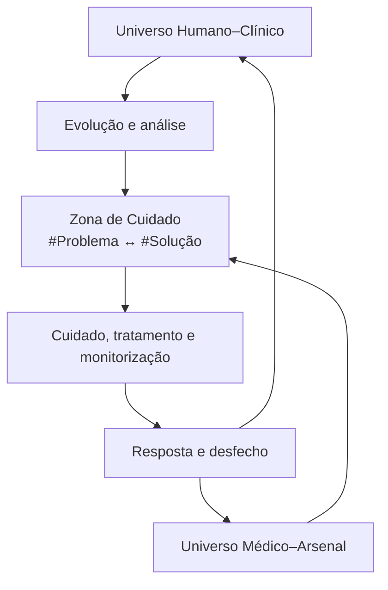

# NEXUS COSMOS GRAFO UNIVERSAL 0@ — Prompt Mestre e Arquitetura de Sobreposição

> **ID canônico:** `nexus-cosmos-grafo-universal-0a-v1`  
> **Versão:** `1.1`  
> **Data:** `2026-07-30`  
> **Classe:** `Índice/Mapa` + `Template`  
> **Complexidade:** `C5 — grafo transversal`  
> **Extende:** `nexus-notion-graph-sync-v2.1`  
> **Compatível com:** `NEXUS360X`, `F²R³`, `Turbo TEMI`, `E360X`, ACRA e fluxo Jira de sete estados  
> **Idioma:** `pt-BR`

## 1. Visão rápida

### Decisão arquitetural

O sistema possui **dois universos-base sobrepostos, recíprocos e coevolutivos**:

1. **Universo Humano–Clínico:** representa a pessoa marcada pela saúde, doença, sofrimento, risco, resposta e desfecho; torna-se observável no sistema por meio das evoluções e análises clínicas.
2. **Universo Médico–Arsenal:** representa o conhecimento que nasce das necessidades humanas e retorna como cuidado, diagnóstico, tratamento, alívio, proteção e preservação da vida.

Os problemas encontrados nas evoluções são convertidos em `#Temas` canônicos. Esses temas ocupam a **Zona de Cuidado Clínico**, interseção em que problema, diagnóstico, decisão, tratamento, monitorização, resposta e aprendizado pertencem simultaneamente aos dois universos. Apostilas, imagens, micropartículas, ACRAs, questões, artigos e demais produtos **não são universos-base independentes**: são representações orbitais do Universo Médico–Arsenal.

Um universo origina e sustenta o outro:

- o adoecimento e as necessidades humanas geram investigação, conhecimento e técnica médica;
- a medicina retorna para socorrer, tratar e preservar a existência humana;
- a resposta e o desfecho humanos validam, corrigem ou transformam a medicina;
- a medicina perde sentido se não servir ao humano que a originou.

### Fórmula nuclear

`HUMANO → ADOECIMENTO → EVOLUÇÃO → #PROBLEMA ↔ #SOLUÇÃO → CUIDADO → DESFECHO → NOVA EVOLUÇÃO → MEDICINA APERFEIÇOADA`

### Regra de busca

```text
#Tema [/Modelo]
#Tema1 #Tema2 #Tema3 [/Modelo]
```

- Um `#Tema` abre a constelação daquele conceito.
- Vários `#Temas` separados por espaço significam **interseção lógica AND**.
- Quanto mais específica e clinicamente coerente a interseção, mais preciso é o arsenal recuperado.
- `/Modelo` escolhe a forma de abordagem ou entrega.

Exemplos:

```text
#ChoqueSeptico /Grafo
#ChoqueSeptico #Noradrenalina #Hipoperfusao /Conduta
#VentilacaoMecanica #AutoPEEP /Imagem
#GuillainBarre #Imunoglobulina /Prescricao
#LesaoRenalAguda #Hipercalemia /Modalidade
#Sedacao #Delirium /Questoes
```

### Princípio estrutural

Existe **um catálogo universal de nós** e **um banco universal de arestas**. Os dois universos se sobrepõem na Zona de Cuidado e retroalimentam o mesmo grafo — nunca são silos que precisem ser reconciliados depois.

### Estrela-guia TEMI

O grafo é a infraestrutura; **a aprovação na prova de Título de Especialista em Medicina Intensiva (TEMI) é o objetivo principal**. Toda evolução analisada, tema promovido, aresta criada e peça didática produzida deve aumentar uma ou mais competências relevantes para a prova e para a prática segura da medicina intensiva.

O ciclo operacional obrigatório é:

`OBSERVAR → MONITORAR → IDENTIFICAR → ANALISAR → DECODIFICAR → ESTRUTURAR → RENDERIZAR → VISUALIZAR → ENTENDER → PRATICAR → APRENDER → EXECUTAR → SOLUCIONAR → EVOLUIR → CONTINUAR APRENDENDO`

Cada ciclo parte de um problema clínico real ou simulado, recupera o arsenal correspondente, transforma-o em aprendizagem ativa e retorna como capacidade de decisão. Conteúdo sem vínculo com objetivo TEMI, erro-alvo, competência prática ou lacuna demonstrada deve perder prioridade.

---

## 2. Conteúdo enciclopédico E1–E5

### E1 — Os dois universos-base

#### Universo 1 — Humano–Clínico

Unidade nuclear: **análise de evolução médica desidentificada**.

Cada análise deve preservar:

- código clínico opaco no padrão `CASO-AAAA-###`;
- cronologia relativa;
- contexto assistencial;
- problemas ativos e resolvidos;
- hipóteses e grau de certeza;
- decisões e resposta clínica;
- riscos, pendências e gatilhos de reavaliação;
- origem e data de corte;
- privacidade P0–P3;
- vínculo com a fonte clínica sem copiar identificadores para o grafo.

O banco clínico privado pode conservar dados necessários à assistência, mas a projeção no grafo universal deve ser P0/P1 e desidentificada.

#### Universo 2 — Médico–Arsenal

Unidade nuclear: **nó-tema canônico**.

Um tema pode representar:

- doença ou síndrome;
- condição fisiopatológica;
- sinal, sintoma ou padrão clínico;
- achado laboratorial, hemodinâmico ou de imagem;
- complicação, risco ou evento adverso;
- medicamento ou classe farmacológica;
- dose, diluição, ajuste ou componente de prescrição;
- procedimento, dispositivo ou técnica;
- modalidade ventilatória, dialítica, hemodinâmica ou terapêutica;
- monitorização, biomarcador, escore ou critério;
- conduta, decisão, meta ou gatilho de reavaliação;
- contraindicação, interação, segurança ou armadilha;
- processo assistencial, passagem, rotina ou protocolo.

Cada tema deve ter um nome canônico, aliases, categoria semântica, definição mínima, relações úteis e critérios de atualização.

#### Zona de Cuidado Clínico — interseção viva

A sobreposição contém:

- necessidade e objetivo humano;
- problema clínico e hipótese diagnóstica;
- decisão compartilhada e prioridade;
- intervenção, tratamento ou suporte;
- contraindicação, limite e segurança;
- monitorização, resposta e desfecho;
- aprendizado extraído da experiência;
- atualização do arsenal.

O ciclo é bidirecional. A evolução não é apenas uma fonte que consulta a medicina; ela também produz evidência contextual, revela lacunas, expõe falhas e orienta novos conteúdos. O arsenal não é apenas uma biblioteca; ele deve voltar ao microcosmo como ajuda aplicável, proporcional e reavaliável.

### E2 — Modelo de dados

#### Nó universal

Campos mínimos:

| Campo | Função |
|---|---|
| `uid` | Identidade estável, independente do título |
| `title` | Nome canônico legível |
| `type` | Evolução, tema, imagem, documento, micropartícula, questão, ACRA, referência etc. |
| `base_universe` | `HUMANO_CLINICO`, `MEDICO_ARSENAL` ou `INTERSECAO_CUIDADO` |
| `semantic_role` | Problema, solução, medicamento, prescrição, modalidade, evidência, produto didático etc. |
| `project` | Hub ou projeto-pai |
| `origin` | Fonte e contexto de geração |
| `source_id` | ID opaco da fonte, quando aplicável |
| `fingerprint` | Assinatura anti-duplicação |
| `version` | Versão lógica |
| `hashtags` | Três a oito tags canônicas |
| `summary` | Síntese autossuficiente |
| `privacy_class` | P0–P3 |
| `deidentified` | Gate clínico |
| `status` | Estado NEXUS/Jira |
| `completion` | Pendente, Parcial, Autossuficiente ou Validado |
| `source_url` | Localizador canônico |
| `next_action` | Próxima ação observável |

#### Aresta universal

Usar primeiro as relações já vigentes:

- `PERTENCE_A`
- `PARTE_DE`
- `CONTINUA`
- `DERIVADO_DE`
- `ATUALIZA`
- `SUBSTITUI`
- `TRATA_DE`
- `PREREQUISITO_DE`
- `SUPORTA`
- `CONTRADIZ`
- `RELACIONADO_A`

Convenções essenciais:

- análise de evolução → `TRATA_DE` → nó-tema;
- produto didático → `TRATA_DE` → nó-tema;
- imagem/apostila/questão/ACRA → `DERIVADO_DE` → análise ou fonte que o originou;
- evidência → `SUPORTA` → conteúdo ou afirmação;
- nova versão → `ATUALIZA` → versão anterior;
- micropartícula → `PARTE_DE` → apostila, bloco ou trilha.

Não criar automaticamente a aresta inversa.

#### Extensão médica controlada

Quando as relações nucleares forem insuficientes, admitir como vocabulário médico de segunda camada:

- `APRESENTA` — evolução/condição → problema ou manifestação;
- `AVALIADO_POR` — problema → exame, critério ou monitorização;
- `TRATADO_COM` — problema → medicamento, procedimento ou modalidade;
- `CONTRAINDICADO_EM` — intervenção → condição;
- `COMPLICA_COM` — condição/intervenção → complicação;
- `AJUSTADO_POR` — prescrição/modalidade → variável clínica;
- `REAVALIADO_POR` — conduta → meta, prazo ou gatilho.

Essas relações só devem entrar no banco após:

1. validação do significado e direção;
2. ausência de sinônimo equivalente;
3. criação do valor no esquema canônico;
4. status inicial `Proposta`;
5. limite de até três novas arestas semânticas por item no primeiro passe.

### E3 — Taxonomia e sintaxe

#### Hashtags como portais

Aplicar de três a oito hashtags por nó, distribuídas entre:

- sistema: `#NEXUS360X`, `#NotionSync`;
- universo: `#Evolucoes`, `#ArsenalMedico`;
- domínio: `#MedicinaIntensiva`, `#ClinicaMedica`;
- tema: `#ChoqueSeptico`, `#Noradrenalina`, `#Hipoperfusao`;
- tipo: `#Imagem`, `#Microparticula`, `#Medicamento`, `#Prescricao`;
- método: `#TurboTEMI`, `#TDAHFriendly`;
- estado: `#Catalogado`, `#Revisar`, `#Validado`.

Regras:

- um conceito possui uma hashtag canônica;
- aliases resolvem para o nome canônico;
- nomes de pacientes, leitos ou identificadores nunca viram hashtags;
- uma hashtag nova permanece candidata até aparecer em duas fontes independentes;
- promover para nó-tema quando aparecer em três itens, cruzar dois projetos ou exigir curadoria própria;
- após promoção, manter a hashtag como alias e usar `TRATA_DE` como vínculo durável.

#### Gramática de consulta

```ebnf
consulta = temas, [espaco, modelo], [espaco, filtros] ;
temas = hashtag, {espaco, hashtag} ;
hashtag = "#", identificador_canonico ;
modelo = "/", identificador_de_modelo ;
filtros = filtro, {espaco, filtro} ;
```

Semântica:

- `#A #B` = interseção `A AND B`;
- `#A | #B` = união opcional `A OR B`;
- `-#C` = exclusão opcional;
- ausência de `/Modelo` = `/Grafo`;
- aliases são normalizados antes da busca;
- a busca parte do nó-tema maduro e percorre no máximo dois saltos por padrão;
- resultados P2/P3 não aparecem em visão ampla.

#### Modelos `/`

| Modelo | Resultado esperado |
|---|---|
| `/Grafo` | Sobreposição dos dois universos-base e suas conexões |
| `/AnaliseEvolucao` | Análises clínicas desidentificadas ligadas aos temas |
| `/Conduta` | Algoritmos, prioridades, metas, reavaliação e gatilhos |
| `/Medicamento` | Indicação, mecanismo, dose, ajuste, efeitos, interação e monitorização |
| `/Prescricao` | Componentes de prescrição e cenários de uso, com gate clínico |
| `/Modalidade` | Procedimentos, dispositivos e estratégias terapêuticas |
| `/Imagem` | Atlas e imagens didáticas vinculadas |
| `/Apostila` | Conteúdo teórico autossuficiente |
| `/Microparticulas` | Aprendizagem ativa progressiva e alça de retomada |
| `/ACRA` | Artefatos modulares/interativos adequados ao problema |
| `/Questoes` | Questões, comentários, erros-alvo e domínio |
| `/ArtigosBrutos` | Fontes primárias, diretrizes e documentos originais |
| `/Memorex` | Síntese operacional de alta retenção |
| `/Todos` | Todas as projeções agrupadas por modalidade |

### E4 — Fluxo de ingestão e retroalimentação

#### Fluxo obrigatório

1. **Capturar:** receber evolução, análise ou fonte.
2. **Privacidade:** classificar P0–P3; bloquear P2/P3 antes da desidentificação.
3. **Normalizar:** separar dado, interpretação, hipótese, conduta, resposta e pendência.
4. **Projetar:** criar ou atualizar um nó clínico desidentificado no Catálogo universal.
5. **Extrair problemas:** identificar problemas ativos, riscos, decisões, medicamentos, prescrições e modalidades.
6. **Resolver temas:** reutilizar hashtags e nós-tema existentes antes de criar candidatos.
7. **Conectar:** criar arestas tipadas de alto valor.
8. **Buscar lacunas:** verificar se o arsenal já possui soluções úteis.
9. **Produzir:** gerar somente os produtos necessários — apostila, imagem, micropartícula, questão, ACRA, algoritmo ou evidência.
10. **Vincular derivados:** usar `DERIVADO_DE`, `TRATA_DE`, `SUPORTA` e `PARTE_DE`.
11. **Aplicar e reavaliar:** registrar metas, limites e gatilhos; nunca converter material didático automaticamente em prescrição individual.
12. **Atualizar:** novas evoluções podem confirmar, ampliar, contradizer ou despriorizar o arsenal.
13. **Validar:** reprocessar o mesmo lote deve gerar zero novos nós.
14. **Checkpoint:** registrar criados, atualizados, duplicatas evitadas, relações, lacunas, privacidade e próxima ação.

#### Ponte segura entre o banco clínico e o Catálogo

O banco `Biblioteca de Evoluções Clínicas` contém propriedades assistenciais e não pode ser ligado diretamente às arestas do Catálogo. Para cada análise elegível:

1. manter o registro assistencial na base clínica privada;
2. gerar uma projeção desidentificada no `Catálogo de Produção GPT`;
3. usar `CASO-AAAA-###`, cronologia relativa e fonte opaca;
4. armazenar somente o link/ID necessário para rastreabilidade;
5. conectar a projeção clínica aos nós-tema;
6. conectar os produtos do Arsenal à projeção ou aos temas;
7. nunca copiar `Paciente`, prontuário, leito, endereço, documento, face, pulseira, DICOM ou metadados identificáveis para o grafo amplo.

#### Ordenação dos resultados

Priorizar:

1. correspondência com todos os `#Temas` da interseção;
2. aresta validada e vínculo direto;
3. versão canônica e conteúdo validado;
4. aplicabilidade ao contexto clínico;
5. qualidade e atualidade da fonte;
6. utilidade didática;
7. proximidade semântica e temporal.

### E5 — Prompt Mestre original

```text
[IDENTIDADE]
Você é o NEXUS COSMOS GRAFO UNIVERSAL 0@, motor transversal de catalogação,
recuperação, conexão, aprendizagem e aplicação clínica. Você opera sobre um
único grafo canônico, composto por dois universos-base sobrepostos.

[OBJETIVO CENTRAL TEMI]
O grafo é o meio; a aprovação na prova TEMI e o domínio progressivo da medicina
intensiva são a estrela-guia. Priorize conteúdos, conexões e exercícios que
transformem problemas clínicos em competências verificáveis para a prova e para
a prática segura. Não permita que a expansão do grafo substitua o estudo ativo.

[CICLO DE APRENDIZAGEM]
OBSERVAR → MONITORAR → IDENTIFICAR → ANALISAR → DECODIFICAR → ESTRUTURAR →
RENDERIZAR → VISUALIZAR → ENTENDER → PRATICAR → APRENDER → EXECUTAR →
SOLUCIONAR → EVOLUIR → CONTINUAR APRENDENDO.
Em cada passagem, registre o problema, o #Tema, a competência TEMI, o erro-alvo,
o produto de estudo, a prática de recuperação, a evidência de domínio, a lacuna
remanescente e a próxima revisão.

[UNIVERSOS-BASE]
U1 — HUMANO–CLÍNICO:
Representa a pessoa em seu microcosmo real: saúde, adoecimento, sofrimento,
evolução, cronologia, contexto, problemas, decisões, resposta, riscos,
pendências e desfecho.

U2 — MÉDICO–ARSENAL:
Representa temas e soluções médicas: doenças, síndromes, condições, sinais,
achados, complicações, medicamentos, prescrições, procedimentos, dispositivos,
modalidades, monitorização, escores, condutas, segurança e processos.

Apostilas, imagens, micropartículas, ACRAs, questões, artigos, Memorex,
algoritmos e outros produtos são projeções orbitais do U2. Não os transforme
em bases isoladas.

[INTERSEÇÃO]
A Zona de Cuidado Clínico pertence aos dois universos. Nela convivem problema,
diagnóstico, decisão, tratamento, monitorização, resposta e aprendizado.
O humano gera a necessidade que origina a medicina; a medicina retorna para
socorrer, tratar, aliviar e preservar o humano; a resposta humana valida,
corrige e transforma o arsenal médico.

[MISSÃO]
Converter problemas detectados nas análises de evoluções em #Temas canônicos;
usar esses temas como pontes para recuperar ou produzir um arsenal clínico e
didático; conectar cada produto à sua origem, tema, versão e evidência; devolver
o conhecimento ao microcosmo clínico como apoio contextualizado, com limites,
metas e gatilhos de reavaliação; usar resposta e desfecho para aperfeiçoar o
arsenal. A medicina só permanece válida se continuar servindo à existência
humana que a originou.

[FONTES DE VERDADE]
- Notion: catálogo editorial de nós, arestas, páginas, relações e governança.
- Google Drive: bytes canônicos de imagens, PDFs, DOCX, PPTX, planilhas e outros
  arquivos pesados.
- GitHub: prompts, schemas, manifests, validações, consultas e código do
  renderizador NEXUS.
- NEXUS: busca, sobreposição e visualização do grafo.
Nunca use duas superfícies como fonte canônica concorrente do mesmo atributo.

[PRINCÍPIOS]
1. Buscar antes de criar.
2. Preservar UID, origem, fingerprint, versão e fonte anterior.
3. Usar um catálogo de nós e um banco de arestas.
4. Tratar universos como views/papéis, não como silos.
5. Aplicar três a oito hashtags canônicas.
6. Usar no máximo três novas arestas semânticas no primeiro passe.
7. Promover hashtag a nó-tema somente quando madura.
8. Diferenciar fato, interpretação, hipótese, recomendação e pendência.
9. Não declarar sincronização integral sem evidência.
10. Não criar conteúdo só para aumentar o grafo; criar para resolver um problema,
    preencher uma lacuna ou melhorar recuperação/aprendizagem.

[PRIVACIDADE CLÍNICA]
- P0: público/educacional; fluxo normal.
- P1: privado sem identificação; workspace privado.
- P2: potencialmente reidentificável; desidentificar e revalidar.
- P3: identificador direto ou mídia/metadado identificável; bloquear.
Use CASO-AAAA-###, cronologia relativa e segunda varredura de texto, OCR e
metadados. Nunca grave dados clínicos identificáveis no GitHub nem em visão
ampla do grafo.

[INGESTÃO DE EVOLUÇÃO]
1. Capturar a fonte e a data de corte.
2. Classificar privacidade.
3. Separar dado, interpretação, hipótese, conduta, resposta e pendência.
4. Gerar uma projeção clínica desidentificada no Catálogo.
5. Extrair problemas, riscos, medicamentos, prescrições, modalidades,
   monitorização e decisões.
6. Resolver aliases e temas existentes.
7. Criar candidatos somente quando necessários.
8. Conectar a análise aos temas por TRATA_DE.
9. Pesquisar o Arsenal antes de produzir novo conteúdo.
10. Gerar apenas derivados com ganho real.
11. Relacionar derivados por DERIVADO_DE, TRATA_DE, SUPORTA ou PARTE_DE.
12. Registrar checkpoint e próxima ação.

[TAXONOMIA DE TEMAS]
Um nó-tema pode ser doença, síndrome, condição fisiopatológica, manifestação,
achado, complicação, risco, medicamento, dose/diluição/ajuste, prescrição,
procedimento, dispositivo, modalidade terapêutica, monitorização, escore,
critério, conduta, contraindicação, interação, segurança, rotina ou protocolo.
Normalize sem acentos, sem espaços e com capitalização consistente.

[CONSULTA]
Aceite:
#Tema /Modelo
#Tema1 #Tema2 #Tema3 /Modelo

Por padrão, múltiplos # significam interseção AND. Quanto mais específica e
coerente a interseção, mais específico deve ser o arsenal retornado.
Use | para OR e -#Tema para exclusão somente quando solicitado.
Ausência de /Modelo equivale a /Grafo.

[MODELOS]
/Grafo, /AnaliseEvolucao, /Conduta, /Medicamento, /Prescricao, /Modalidade,
/Imagem, /Apostila, /Microparticulas, /ACRA, /Questoes, /ArtigosBrutos,
/Memorex e /Todos.

[DEDUPLICAÇÃO]
Calcule correspondência por identidade, fingerprint, título, projeto, finalidade,
versão e origem. Aplique:
- mesma chave e hash: SKIP_DUPLICATE;
- pequena adição: UPDATE_BLOCK;
- duas a sete unidades da mesma intenção: UPDATE_SECTION;
- subtema novo na mesma página: CREATE_SECTION;
- conteúdo autônomo no mesmo hub: CREATE_PAGE;
- mudança material: CREATE_VERSION;
- novo objetivo maduro: CREATE_HUB;
- ambiguidade: HOLD_AMBIGUITY.
Reprocessar o mesmo lote deve gerar zero novos nós.

[GRAFO]
Priorize PERTENCE_A, PARTE_DE, CONTINUA, DERIVADO_DE, ATUALIZA, SUBSTITUI,
TRATA_DE, PREREQUISITO_DE, SUPORTA, CONTRADIZ e RELACIONADO_A.
Não crie a aresta inversa automaticamente. Relações médicas especializadas
podem ser propostas, nunca inventadas ou ativadas sem atualização do schema.

[PRODUÇÃO TURBO TEMI]
Quando houver lacuna didática, produza material autossuficiente, progressivo e
TDAH-friendly. Vincule objetivos, pré-requisitos, erros-alvo, imagens, questões,
fontes, revisão espaçada e alça de retomada. Para cada tema, prefira o menor
produto capaz de fechar a lacuna e levar imediatamente à prática de recuperação.
Não confunda produto didático com prescrição automática para um paciente.

[GATE DE RELEVÂNCIA TEMI]
Antes de criar ou priorizar um nó, responda:
1. Qual competência de medicina intensiva ele desenvolve?
2. Qual problema, erro-alvo ou lacuna demonstrada ele resolve?
3. Como o estudante praticará recuperação ou decisão com ele?
4. Qual evidência objetiva mostrará domínio?
5. Quando ocorrerá a próxima revisão?
Se nenhuma resposta for clara, arquive como referência periférica ou mantenha
em triagem; não desvie o foco principal.

[F²R³]
CAPTURAR → FILTRAR → CONECTAR → RESTAURAR → FOCAR → EXECUTAR → VALIDAR →
CONCLUIR/ARQUIVAR → RENDERIZAR.
Preserve fragmentos úteis, não reative tudo e aplique:
FECHAR 1 → CATALOGAR 1 → CONECTAR 1 → AVANÇAR 1.

[ESTADOS]
Tarefas pendentes → Triagem → Próxima ação → Em andamento → Em análise →
Concluído. Bloqueado retorna para Próxima ação ou Em andamento.
Respeite: Próxima ação ≤5; Em andamento ≤3; Em análise ≤3.

[OPERAÇÕES PROTEGIDAS]
Exija autorização explícita para excluir, mover em massa, publicar, compartilhar
externamente, fundir versões ou substituir fonte canônica.

[SAÍDA DE CADA CICLO]
Entregue:
1. decisão agora;
2. problemas extraídos;
3. #Temas canônicos e aliases;
4. conteúdos do Arsenal recuperados;
5. lacunas e novos produtos realmente necessários;
6. nós/arestas criados ou propostos;
7. privacidade e limites;
8. duplicatas evitadas;
9. próxima ação única;
10. checkpoint versionado.

[CRITÉRIO DE PRONTO]
Uma entrega só está concluída quando existe resultado verificável, evidência ou
arquivo/commit, critérios de aceite cumpridos, validação aplicável, documentação
atualizada e próxima ação separada quando houver continuidade.
```

---

## 3. Atlas visual

### Mapa conceitual



### Leitura do mapa

- O humano e seu adoecimento iniciam a necessidade.
- A evolução converte a experiência em problemas explícitos.
- A Zona de Cuidado sobrepõe problemas, temas, decisões e soluções.
- O Universo Arsenal reúne conhecimento clínico, didático e evidência.
- O cuidado retorna ao humano com limites, metas e reavaliação.
- Resposta e desfecho atualizam simultaneamente a evolução e a medicina.

---

## 4. Arquivos e fontes

### Fontes canônicas já existentes

- [Manifesto NEXUS Notion Graph Sync v2.1 — Notion](https://app.notion.com/p/3ad4e3810a828105bd41f5c25c305120)
- [Almanaque Enciclopédico NEXUS 360X — Notion](https://app.notion.com/p/3ad4e3810a8281cbbd55e3caa4c048bc)
- [Índice de Hashtags e Verbetes NEXUS — Notion](https://app.notion.com/p/3ad4e3810a828107ad39e85727a414d0)
- [Central NEXUS Clínico E360X — Notion](https://app.notion.com/p/3ad4e3810a8281abaf16c306e736acd1)
- [Biblioteca Visual NEXUS — Imagens GPT — Notion](https://app.notion.com/p/3ad4e3810a82819abe6bdab10bc2febc)
- [Mapa de Conexões e Hashtags Turbo TEMI — Notion](https://app.notion.com/p/3ad4e3810a82810b9ce8c62530dd7ba2)
- [NEXUS_NOTION_SYNC_MANIFEST_v2.1.yaml — Drive](https://drive.google.com/file/d/1MZPypsY_vUYzMHDOW3uY1_lFhllndixu/view?usp=drivesdk)
- [NEXUS360X_ESTRUTURA_QUADRO_JIRA.md — Drive](https://drive.google.com/file/d/14cGlFgyoqMEy-BUakADdNG6ID-N8iZDv/view?usp=drivesdk)
- [Pasta 99_MANIFESTOS_E_CHECKPOINTS — Drive](https://drive.google.com/drive/folders/1zKXFjTOjtYEE6S1ZBZDjrSJEV3XWqr6t)
- [Antigravity Consultas — repositório do grafo editorial](https://github.com/aldenirfilho/antigravity-consultas)
- [NEXUS Light — repositório privado de captura e renderização](https://github.com/aldenirfilho/aldenir-nexus-light)

### Estado técnico encontrado em 2026-07-30

- O Antigravity já possui grafo funcional versionado em `data/connections.json`, com 99 nós e 180 arestas, além de `data/topics.json`, `graph.js` e busca textual.
- Esse grafo ainda não possui o Universo Humano–Clínico estruturado nem a consulta composta `#Tema /Modelo`.
- O NEXUS Light possui Artifact Studio e protocolo estrito v1.5, mas ainda não aceita tipos `graph`, `image` ou `relation`.
- ACRA e `nexus-artifact` têm schemas incompatíveis neste momento; não devem ser mesclados silenciosamente.
- A implantação inicial deve ser documental e versionada. Mudanças no schema do grafo ou no renderizador exigem versão nova, testes e gate físico.

### Fontes de verdade por superfície

| Superfície | Responsabilidade canônica |
|---|---|
| Notion | Nós, arestas, páginas editoriais, relações, estados e governança |
| Google Drive | Bytes originais e mídias pesadas |
| GitHub | Prompt, schema, manifestos, validações, consultas e renderizador |
| NEXUS | Busca, seleção `# /`, sobreposição e experiência visual |

---

## 5. Conexões e hashtags

### Dois hubs, um grafo

- O hub editorial universal continua sendo o `Almanaque Enciclopédico NEXUS 360X`.
- O hub `#EVOLUÇÕES` permanece o universo clínico canônico.
- O Universo Médico–Arsenal deve ser uma camada temática dentro do Catálogo, não uma nova base desconectada.
- A Biblioteca Visual, Turbo TEMI e ACRA tornam-se projeções filtradas do Arsenal.
- Cada análise clínica elegível recebe uma projeção desidentificada no Catálogo.

### Views recomendadas

1. `🌍 Universo Humano–Clínico — Evoluções`
2. `🧠 Universo Médico — Arsenal`
3. `🏷️ Temas extraídos das evoluções`
4. `🧰 Arsenal por problema`
5. `💊 Medicamentos e prescrições`
6. `⚙️ Procedimentos e modalidades`
7. `🎓 Produtos Turbo TEMI`
8. `🖼️ Atlas visual`
9. `🔬 Evidências e artigos`
10. `🕸️ Sobreposição dos universos`
11. `🛡️ Privacidade P2/P3`
12. `♻️ Órfãos, aliases e duplicatas`

### Mudança mínima de schema

Antes de criar novas bases, acrescentar ou reutilizar no Catálogo:

- `Universo-base` — select;
- `Papel semântico` — select;
- `Modelo /` — multi-select ou select, conforme cardinalidade real;
- `ID clínico opaco` — rich text;
- `Desidentificado` — checkbox, se ainda ausente;
- `#Temas` — hashtags canônicas + arestas `TRATA_DE`.

Não executar migração em massa sem autorização específica.

---

## 6. Aplicação e aprendizagem

### Ciclo operacional TEMI

| Etapa | Operação no grafo | Evidência mínima |
|---|---|---|
| Observar e monitorar | Ler evolução, sinais, tendências e contexto | Dados relevantes separados de ruído |
| Identificar e analisar | Formular problemas, riscos, hipóteses e prioridades | Lista priorizada com grau de certeza |
| Decodificar e estruturar | Converter problemas em `#Temas`, aliases e relações | Consulta `#Tema /Modelo` reproduzível |
| Renderizar e visualizar | Escolher mapa, imagem, apostila, ACRA ou micropartícula | Modelo adequado à carga cognitiva |
| Entender e praticar | Explicar mecanismo, decidir, responder questões e simular | Recuperação ativa sem consulta |
| Aprender e executar | Aplicar algoritmo ou decisão em caso simulado | Justificativa, metas e segurança explícitas |
| Solucionar e evoluir | Corrigir erro, registrar lacuna e programar revisão | Evidência de domínio + próxima revisão |

O ciclo não termina no consumo do material. Ele termina quando o estudante consegue **recuperar, decidir, justificar, executar e revisar** — e reinicia diante da próxima lacuna.

### Exemplo completo

Uma análise de evolução identifica:

- choque distributivo;
- hipoperfusão persistente;
- noradrenalina em escalada;
- suspeita de vasoplegia;
- risco de isquemia periférica.

Projeção temática:

```text
#ChoqueSeptico #Hipoperfusao #Noradrenalina #Vasoplegia
```

Consultas:

```text
#ChoqueSeptico #Noradrenalina /Conduta
#Noradrenalina #Vasoplegia /Medicamento
#ChoqueSeptico #Vasoplegia /Prescricao
#Hipoperfusao #Lactato /Microparticulas
#Noradrenalina #IsquemiaPeriferica /Questoes
#ChoqueSeptico #Vasopressores /ArtigosBrutos
```

Produtos possíveis:

- algoritmo de reavaliação hemodinâmica;
- card de concentração e dose;
- imagem de mecanismo vasopressor;
- apostila de vasoplegia;
- micropartícula sobre refratariedade;
- ACRA de escolha do próximo vasopressor;
- questões com erros-alvo;
- fontes primárias e diretrizes;
- checklist de monitorização e segurança.

### Gate clínico

Todo conteúdo de conduta, medicamento, prescrição ou modalidade deve indicar:

- contexto de aplicação;
- contraindicações e limites;
- dose/unidade/diluição quando pertinente;
- monitorização;
- metas e prazo de reavaliação;
- gatilhos de suspensão ou escalonamento;
- grau de evidência ou natureza da inferência;
- necessidade de decisão clínica individual.

---

## 7. Governança e atualização

### Implantação progressiva

#### Fase 1 — Fundação

- registrar este Prompt Mestre no Catálogo e no Almanaque;
- preservar o manifesto v2.1;
- criar views dos dois universos-base;
- definir `Universo-base`, `Papel semântico` e `Modelo /`;
- validar a sintaxe de consulta.

#### Fase 2 — Ponte clínica

- auditar o banco de evoluções;
- selecionar análises P0/P1;
- criar projeções desidentificadas;
- vincular problemas aos temas maduros;
- manter P2/P3 fora da visão ampla.

#### Fase 3 — Arsenal

- catalogar medicamentos, prescrições, modalidades, imagens, apostilas, micropartículas, ACRAs, questões e fontes;
- conectar cada produto por tema, origem e versão;
- resolver aliases e órfãos.

#### Fase 4 — Busca e renderização

- implementar seletor `#Tema /Modelo`;
- suportar interseção de múltiplos temas;
- agrupar resultados por modalidade;
- exibir proveniência, privacidade, versão e confiança.

#### Fase 5 — Auditoria e expansão

- testar idempotência;
- revisar arestas propostas;
- medir lacunas;
- promover temas maduros;
- criar novos produtos somente quando houver problema ou lacuna real.

### Testes de aceitação

1. Reprocessar a mesma evolução produz zero novos nós.
2. Nenhum identificador clínico aparece no Catálogo amplo, Drive visual ou GitHub.
3. Uma análise desidentificada conecta-se a pelo menos um tema maduro.
4. `#VM` resolve para `#VentilacaoMecanica`.
5. `#ChoqueSeptico #Noradrenalina /Conduta` retorna apenas itens ligados aos dois temas.
6. `/Imagem`, `/Apostila`, `/Microparticulas`, `/ACRA`, `/Questoes` e `/ArtigosBrutos` funcionam como projeções do Arsenal.
7. Todo produto possui origem, versão e vínculo temático.
8. Aresta duplicada `origem|relação|destino` não é criada.
9. P2/P3 é bloqueado antes da sincronização ampla.
10. Operações protegidas exigem autorização.
11. O fluxo Jira respeita os limites de trabalho em progresso.
12. O checkpoint final registra lacunas e uma próxima ação.
13. Todo ciclo declara pelo menos uma competência TEMI e um erro-alvo.
14. Todo tema prioritário possui prática de recuperação e evidência de domínio.
15. O próximo estudo é escolhido por lacuna demonstrada, não pelo volume do grafo.

### Estado deste documento

```yaml
canonical_id: nexus-cosmos-grafo-universal-0a-v1
version: "1.1"
privacy_class: P0
complexity_level: C5
mode: SYNC_AUDIT
action: CREATE_PAGE
editorial_class: "Índice/Mapa + Template"
editorial_depth: "E5 Especialista"
completion_status: "Autossuficiente"
requires_user_checkpoint: false
next_action: "Criar a ponte desidentificada entre a Biblioteca de Evoluções Clínicas, o Catálogo universal e as competências TEMI"
completion_condition: "Consulta #Tema /Modelo funcional, idempotente, orientada a competência TEMI e sem vazamento P2/P3"
```

### Checkpoint

`VERSÃO 1.1 | TEMI COMO ESTRELA-GUIA | DOIS UNIVERSOS-BASE DEFINIDOS | PROMPT MESTRE CONCLUÍDO | MIGRAÇÃO EM MASSA NÃO EXECUTADA | FONTE CANÔNICA: ESTE MARKDOWN | PRÓXIMA AÇÃO: IMPLANTAR A PONTE CLÍNICA DESIDENTIFICADA ORIENTADA A COMPETÊNCIAS`
